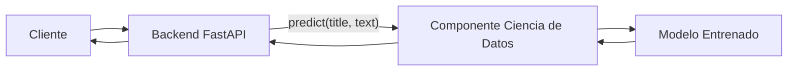

# 🚀 TechMind – Organización Inteligente del Conocimiento Técnico

> Sistema de clasificación inteligente de documentación técnica basado en Machine Learning, desarrollado para el **Hackathon Oracle Next Education (ONE)**.

---

# Estado del Proyecto

| Elemento       | Estado        |
| -------------- | ------------- |
| Versión        | MVP           |
| Estado         | En desarrollo |
| Arquitectura   | Aprobada      |
| Diseño Técnico | En desarrollo |
| Licencia       | MIT           |

---

# Descripción

TechMind es una aplicación diseñada para clasificar documentación técnica mediante técnicas tradicionales de Machine Learning.

El sistema recibe el título y contenido de un documento, procesa la información utilizando un modelo entrenado y devuelve la categoría más probable mediante una API REST.

La solución sigue una arquitectura monolítica modular, priorizando simplicidad, mantenibilidad y facilidad de evolución.

---

# Características

* Clasificación automática de documentación técnica.
* API REST desarrollada con FastAPI.
* Modelo de Machine Learning basado en Scikit-Learn.
* Extracción de características mediante TF-IDF.
* Clasificación mediante Regresión Logística.
* Arquitectura modular y desacoplada.
* Documentación técnica basada en estándares de ingeniería.

---

# Arquitectura General



El Backend representa el único punto de acceso público del sistema.

El componente de Ciencia de Datos ejecuta localmente el modelo de Machine Learning y no expone servicios HTTP.

---

# Stack Tecnológico

## Backend

* Python
* FastAPI
* Uvicorn
* Pydantic

## Ciencia de Datos

* Pandas
* NumPy
* Scikit-Learn
* TF-IDF
* Logistic Regression
* Cosine Similarity
* Joblib

## Infraestructura

* Oracle Cloud Infrastructure (OCI)
* OCI Object Storage
* OCI Compute (Opcional)

---

# Estructura del Proyecto

```text
TechMind/
│
├── docs/
│   ├── ADR/
│   ├── Architecture/
│   ├── Roadmap/
│   ├── SDS/
│   └── Standards/
│
├── src/
│
├── tests/
│
├── datasets/
│
├── artifacts/
│
├── README.md
├── CHANGELOG.md
├── LICENSE
└── requirements.txt
```

La organización completa del repositorio se encuentra documentada en **docs/Architecture/RepositoryStructure.md**.

---

# Requisitos

* Python 3.12 o superior
* pip
* Git

---

# Instalación

## 1. Clonar el repositorio

```bash
git clone <URL_DEL_REPOSITORIO>
```

## 2. Ingresar al proyecto

```bash
cd TechMind
```

## 3. Crear un entorno virtual

```bash
python -m venv .venv
```

## 4. Activar el entorno virtual

### Windows

```bash
.venv\Scripts\activate
```

### Linux / macOS

```bash
source .venv/bin/activate
```

## 5. Instalar dependencias

```bash
pip install -r requirements.txt
```

---

# Configuración

La configuración del proyecto se gestiona mediante archivos de configuración y variables de entorno cuando corresponda.

Las dependencias del proyecto se encuentran definidas en:

```text
requirements.txt
```

---

# Ejecución

Iniciar el servidor FastAPI:

```bash
uvicorn src.api.main:app --reload
```

Por defecto, la aplicación estará disponible en:

```text
http://localhost:8000
```

Documentación automática:

* Swagger UI: `http://localhost:8000/docs`
* ReDoc: `http://localhost:8000/redoc`

---

# Entrenamiento del Modelo

El entrenamiento del modelo se realiza desde el componente de Ciencia de Datos utilizando los conjuntos de datos almacenados en el directorio:

```text
datasets/
```

Los artefactos generados durante el entrenamiento se almacenan en:

```text
artifacts/
```

---

# Ejecución de Pruebas

Ejecutar todas las pruebas del proyecto:

```bash
pytest
```

---

# Documentación

La documentación oficial del proyecto se encuentra organizada en el directorio `docs/`.

| Documento    | Descripción                                            |
| ------------ | ------------------------------------------------------ |
| SDS          | Especificación del Diseño de Software.                 |
| ADR          | Registro de Decisiones Arquitectónicas.                |
| Architecture | Arquitectura del Sistema y estructura del repositorio. |
| Roadmap      | Evolución planificada del proyecto.                    |
| Standards    | Estándares de desarrollo y documentación.              |

---

# Roadmap

La evolución del proyecto se gestiona mediante el **Technical Roadmap**, donde se documentan las fases, hitos y objetivos de desarrollo.

---

# Contribución

Las contribuciones deberán respetar:

* La arquitectura definida en el SDS.
* Los Architecture Decision Records (ADR).
* Los Engineering Standards.
* La estructura oficial del repositorio.

Antes de proponer cambios arquitectónicos, deberán justificarse técnicamente y ser aprobados por el equipo.

---

# Licencia

Este proyecto se distribuye bajo la licencia **MIT**.

Consultar el archivo **LICENSE** para más información.
