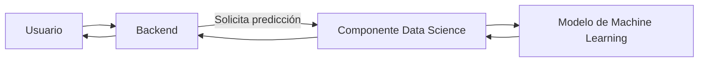

# 🚀 TechMind – Organización Inteligente del Conocimiento Técnico

> Plataforma inteligente para la organización, clasificación y consulta de documentación técnica mediante Inteligencia Artificial y Machine Learning.

Desarrollado por el equipo **G9 – LATAM Team 16** para el **Hackathon Oracle Next Education (ONE)**.

---

# Estado del Proyecto

| Elemento | Estado |
|----------|:------:|
| Versión | MVP |
| Estado General | 🚧 En desarrollo |
| Arquitectura | ✅ Aprobada |
| Backend | 🚧 En desarrollo |
| Ciencia de Datos | 🚧 En desarrollo |
| Licencia | MIT |

# Descripción

TechMind es una plataforma diseñada para centralizar, organizar y clasificar documentación técnica proveniente de diferentes fuentes de información.

El objetivo del proyecto es facilitar el acceso al conocimiento técnico mediante técnicas de Machine Learning, permitiendo clasificar documentos y servir como base para futuras funcionalidades de búsqueda inteligente y asistencia técnica.

La solución está organizada en componentes independientes que facilitan el desarrollo colaborativo, la mantenibilidad y la evolución del sistema.

# Arquitectura General



El Backend constituye el único punto de acceso al sistema y coordina la comunicación con el componente de Ciencia de Datos, responsable del procesamiento y clasificación de documentos.

# Componentes del Proyecto

## Backend

El componente Backend es responsable de:

- Exponer la API REST.
- Gestionar las solicitudes de los usuarios.
- Validar la información recibida.
- Integrar el componente de Ciencia de Datos.
- Documentar la API mediante Swagger/OpenAPI.

📄 Documentación específica:

- `src/backend/README.md`

---

## Ciencia de Datos

El componente de Ciencia de Datos es responsable de:

- Construcción del dataset.
- Preprocesamiento de datos.
- Entrenamiento del modelo.
- Evaluación.
- Predicción de categorías.

📄 Documentación específica:

- `src/data_science/README.md`

# Estructura del Repositorio

```text
TechMind/
│
├── docs/
│   ├── ADR/
│   ├── Architecture/
│   ├── Roadmap/
│   ├── SDS/
│   └── Standards/
│
├── src/
│   ├── backend/
│   └── data_science/
│
├── tests/
│
├── datasets/
│
├── artifacts/
│
├── README.md
├── CHANGELOG.md
├── LICENSE
└── requirements.txt
```

La estructura detallada del proyecto se encuentra documentada en:

- `docs/Architecture/RepositoryStructure.md`

# Stack Tecnológico

## Backend

- Python
- FastAPI
- Pydantic
- Uvicorn

## Ciencia de Datos

- Pandas
- NumPy
- Scikit-Learn
- Joblib

## DevOps y Herramientas

- Git
- GitHub
- GitHub Projects
- GitHub Actions *(próximamente)*

## Infraestructura

- Oracle Cloud Infrastructure (OCI)

# Instalación

## Clonar el repositorio

```bash
git clone <URL_DEL_REPOSITORIO>
```

## Ingresar al proyecto

```bash
cd TechMind
```

## Crear un entorno virtual

```bash
python -m venv .venv
```

## Activar el entorno virtual

### Windows

```bash
.venv\Scripts\activate
```

### Linux / macOS

```bash
source .venv/bin/activate
```

## Instalar dependencias

```bash
pip install -r requirements.txt
```

# Testing

Ejecutar todas las pruebas del proyecto:

```bash
python -m pytest
```

Generar el reporte de cobertura:

```bash
python -m pytest --cov=src --cov-report=term-missing
```

## Estado actual

| Métrica | Valor |
|----------|------:|
| Tests automatizados | 61 |
| Cobertura del componente Data Science | 98% |

> La cobertura corresponde al módulo de adquisición de datos del componente de Ciencia de Datos.

# Documentación

La documentación del proyecto está organizada para facilitar la navegación y el mantenimiento.

| Documento | Descripción |
|------------|-------------|
| `README.md` | Visión general del proyecto. |
| `src/backend/README.md` | Documentación del componente Backend. |
| `src/data_science/README.md` | Documentación del componente de Ciencia de Datos. |
| `docs/Architecture/` | Arquitectura del sistema y del repositorio. |
| `docs/SDS/` | Software Design Specification. |
| `docs/ADR/` | Architecture Decision Records. |
| `docs/Roadmap/` | Plan de evolución del proyecto. |
| `docs/Standards/` | Estándares de desarrollo y documentación. |

# Roadmap

## Arquitectura

- ✅ Arquitectura General
- ✅ Diseño Técnico

## Backend

- 🚧 API REST
- 🚧 Integración con Ciencia de Datos
- ⏳ Persistencia
- ⏳ Despliegue

## Ciencia de Datos

- ✅ DS-01 – Arquitectura
- ✅ DS-02 – Readers
- ✅ DS-03 – Construcción del Dataset
- ⏳ DS-04 – Preprocesamiento
- ⏳ DS-05 – Entrenamiento del Modelo
- ⏳ DS-06 – Evaluación
- ⏳ DS-07 – Integración con Backend

# Contribución

Las contribuciones al proyecto deberán respetar:

- La arquitectura definida para el sistema.
- Los estándares de desarrollo del equipo.
- La documentación técnica vigente.
- El flujo de trabajo basado en Git y Pull Requests.

Antes de proponer cambios arquitectónicos, estos deberán ser discutidos y aprobados por el equipo.

# Licencia

Este proyecto se distribuye bajo la licencia **MIT**.

Para más información, consultar el archivo `LICENSE`.