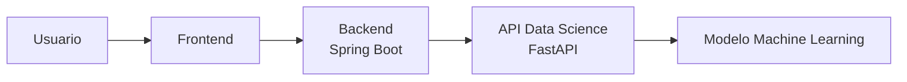
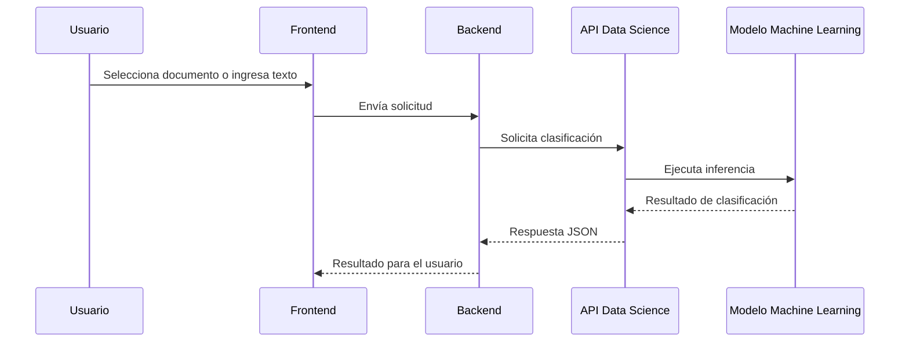
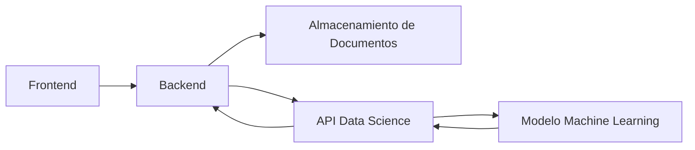
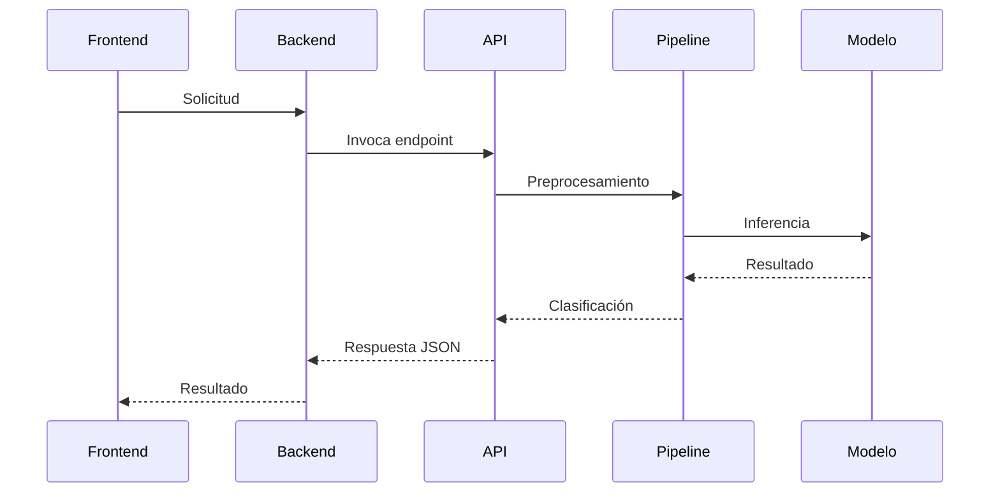
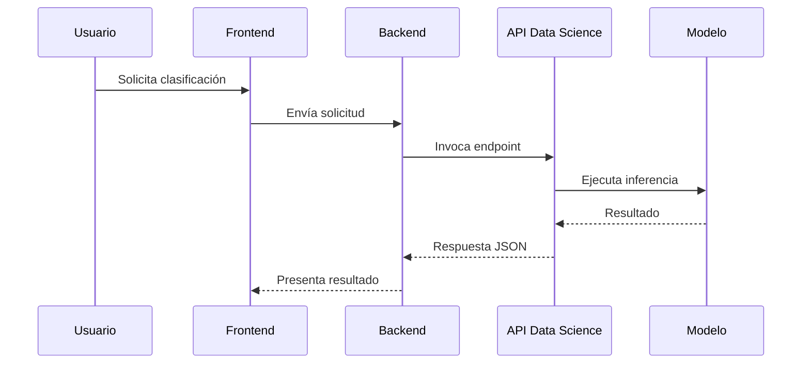

| Proyecto | AyniKortex |
|-----------|------------|
| Documento | Backend-Data-Contract |
| Versión | 2.0 |
| Estado | En Diseño |
| Responsable | Equipo Data Science |
| Consumidor | Equipo Backend |

---

# Control de Cambios

| Versión | Fecha | Autor | Descripción |
|----------|-------|--------|-------------|
| 1.0 | 2026-07-21 | Equipo Data Science | Versión inicial del contrato de integración entre Backend y Data Science. |
| 2.0 | 2026-07-22 | Equipo Data Science | Actualización del contrato para la arquitectura basada en API REST (FastAPI), incorporación de clasificación documental y extracción de palabras clave como funcionalidades principales del MVP. |

---

# Tabla de Contenido

1. Introducción
2. Objetivo
3. Alcance
4. Referencias
5. Arquitectura de Integración
6. Modelo de Colaboración entre Componentes
7. API REST del Componente Data Science
8. Flujo General de Integración
9. Responsabilidades
10. Reglas Generales
11. Manejo de Errores
12. Compatibilidad y Versionado
13. Funcionalidades Fuera del Alcance del MVP
14. Anexos

---

# 1. Introducción

Este documento define el **Contrato de Integración** entre los componentes **Backend** y **Data Science** del proyecto **AyniKortex**.

Su propósito es establecer las reglas funcionales y técnicas que regirán la comunicación entre ambos componentes mediante una **API REST desarrollada en FastAPI**, permitiendo que cada equipo implemente y evolucione su solución de manera independiente sin afectar la interoperabilidad del sistema.

El contrato especifica las capacidades expuestas por el componente Data Science, las estructuras de intercambio de información y las responsabilidades asociadas a cada componente durante el proceso de integración.

> [!IMPORTANT]
>
> Este documento describe exclusivamente el contrato de integración entre Backend y Data Science.
>
> No documenta la implementación interna del modelo de Machine Learning, los algoritmos de clasificación, las técnicas de preprocesamiento ni los detalles de entrenamiento del modelo.

---

# 2. Objetivo

Definir un contrato de integración estable entre los componentes **Backend** y **Data Science** que permita:

- Establecer una interfaz única de comunicación mediante API REST.
- Permitir el desarrollo paralelo entre ambos equipos.
- Reducir el acoplamiento entre tecnologías.
- Definir claramente las responsabilidades de cada componente.
- Garantizar la compatibilidad entre versiones del servicio.
- Facilitar la integración con el Frontend y futuras extensiones del sistema.

---

# 3. Alcance

El presente documento define:

- La arquitectura de integración entre Backend y Data Science.
- Las responsabilidades de cada componente.
- Los endpoints expuestos por la API de Data Science.
- Las reglas generales de comunicación.
- Los contratos de entrada y salida de cada operación.
- Las políticas de validación y manejo de errores.
- Las reglas de compatibilidad y versionado.

Para la versión **MVP**, el componente Data Science ofrecerá las siguientes capacidades:

- Clasificación de documentos técnicos.
- Clasificación de texto libre.
- Extracción de palabras clave.
- Consulta del estado del servicio (Health Check).

Las siguientes funcionalidades quedan fuera del alcance del MVP y podrán incorporarse en versiones posteriores:

- Búsqueda semántica.
- Chat sobre documentos.
- Recuperación aumentada de información (RAG).
- Recomendación de contenido.
- Similitud documental.
- Procesamiento asíncrono.

---

# 4. Referencias

| Documento | Descripción |
|-----------|-------------|
| Software Design Specification (SDS) | Arquitectura general del sistema. |
| Architecture Decision Record (ADR) | Decisiones arquitectónicas aprobadas. |
| Backend-Data-Model.md | Modelos de intercambio entre Backend y Data Science. |
| Engineering Standards | Estándares de desarrollo del proyecto. |
| Bases del Hackathon TechMind | Requisitos funcionales del MVP y criterios de evaluación. |

---

# 5. Arquitectura de Integración

## 5.1 Visión General

La solución **AyniKortex** adopta una arquitectura desacoplada basada en servicios, donde cada componente mantiene responsabilidades claramente definidas y se comunica mediante interfaces bien establecidas.

El componente **Backend**, desarrollado en **Java con Spring Boot**, actúa como el orquestador principal de la aplicación. Es responsable de la lógica de negocio, la autenticación, la gestión de usuarios, la persistencia de la información y la exposición de la API principal consumida por el Frontend.

El componente **Data Science**, desarrollado en **Python con FastAPI**, encapsula todas las capacidades relacionadas con el procesamiento de documentos, el preprocesamiento de texto, la ejecución del modelo de Machine Learning y la generación de los resultados de clasificación.

La comunicación entre ambos componentes se realizará exclusivamente mediante solicitudes **HTTP REST**, utilizando estructuras de datos definidas en el documento **Backend-Data-Model.md**.

> [!IMPORTANT]
>
> Backend no accede directamente al modelo de Machine Learning ni al pipeline de procesamiento.
>
> Data Science no implementa lógica de negocio, autenticación, persistencia ni gestión de usuarios.
>
> Toda interacción entre ambos componentes deberá realizarse únicamente mediante la API REST definida en este contrato.

---

## 5.2 Arquitectura General



---

## 5.3 Flujo General de Comunicación

El siguiente diagrama describe el flujo general de procesamiento para una solicitud de clasificación documental.



---

## 5.4 Principios de Integración

La integración entre Backend y Data Science se basa en los siguientes principios arquitectónicos.

### Desacoplamiento

Backend y Data Science evolucionan de forma independiente.

Los cambios internos realizados en cualquiera de los componentes no deberán afectar al otro siempre que se mantenga la compatibilidad del contrato de integración.

---

### Responsabilidad Única

Cada componente implementa únicamente las capacidades correspondientes a su dominio funcional.

Backend administra la aplicación y el flujo de negocio.

Data Science administra el procesamiento inteligente de la información.

---

### Comunicación mediante API REST

La comunicación entre ambos componentes se realizará mediante solicitudes HTTP REST.

Todas las operaciones deberán intercambiar información utilizando estructuras JSON definidas en el documento **Backend-Data-Model.md**.

---

### Encapsulamiento

Backend desconoce completamente la implementación interna del componente Data Science.

No accede directamente a:

- Modelos de Machine Learning.
- Algoritmos de clasificación.
- Pipeline de preprocesamiento.
- Técnicas de extracción de características.
- Modelos serializados.
- Bibliotecas utilizadas durante la inferencia.

De igual forma, Data Science no administra:

- Usuarios.
- Autenticación.
- Autorización.
- Persistencia.
- Reglas de negocio.
- Gestión de proyectos.

---

### Escalabilidad

La separación entre Backend y Data Science permitirá evolucionar el modelo de Machine Learning, incorporar nuevas versiones del servicio o reemplazar la implementación interna sin afectar al resto del sistema, siempre que se mantenga el contrato definido en este documento.

---

### Compatibilidad

Toda modificación realizada sobre la API deberá preservar la compatibilidad con las versiones soportadas.

Los cambios incompatibles requerirán una nueva versión mayor del contrato de integración.

---

# 6. Modelo de Colaboración entre Componentes

## 6.1 Propósito

El Modelo de Colaboración define la distribución de responsabilidades entre los componentes **Backend** y **Data Science**, estableciendo los límites funcionales de cada uno y el mecanismo oficial de comunicación entre ambos.

El objetivo es garantizar que cada equipo pueda desarrollar su componente de manera independiente, reduciendo el acoplamiento y evitando la duplicidad de responsabilidades.

La comunicación entre ambos componentes se realizará exclusivamente mediante la **API REST del componente Data Science**, consumida por el Backend mediante solicitudes HTTP.

---

## 6.2 Responsabilidades del Backend

El componente **Backend**, implementado en **Java con Spring Boot**, actúa como el orquestador principal de la aplicación.

Es responsable de administrar el flujo funcional del sistema y de coordinar la interacción entre el Frontend y el componente Data Science.

Entre sus responsabilidades se encuentran:

- Gestión de usuarios.
- Autenticación y autorización.
- Administración de proyectos.
- Recepción de solicitudes del Frontend.
- Recepción de documentos.
- Almacenamiento de archivos.
- Validación funcional de las solicitudes.
- Consumo de la API REST de Data Science.
- Persistencia de los resultados de clasificación.
- Presentación de resultados al usuario.
- Auditoría y trazabilidad.

> [!NOTE]
>
> Backend no ejecuta procesos de Machine Learning, preprocesamiento de texto, clasificación documental ni extracción de palabras clave.

---

## 6.3 Responsabilidades del Componente Data Science

El componente **Data Science**, implementado en **Python con FastAPI**, es responsable de ejecutar el procesamiento inteligente de la información.

Entre sus responsabilidades se encuentran:

- Recepción de solicitudes provenientes del Backend.
- Validación técnica de los datos recibidos.
- Lectura y procesamiento de documentos soportados.
- Procesamiento de texto libre.
- Limpieza y normalización del contenido.
- Ejecución del pipeline de inferencia.
- Clasificación automática del contenido.
- Extracción de palabras clave.
- Cálculo de la probabilidad de clasificación.
- Generación de la respuesta JSON.
- Exposición de la API REST.

La entrega del componente incluirá:

- Modelo entrenado y serializado.
- Pipeline de inferencia.
- API REST desarrollada en FastAPI.
- Documentación del contrato de integración.

> [!NOTE]
>
> Data Science no administra usuarios, autenticación, autorización, almacenamiento de documentos, persistencia de datos ni reglas de negocio de la aplicación.

---

## 6.4 Matriz de Responsabilidades

| Funcionalidad | Backend | Data Science |
|---------------|:-------:|:------------:|
| Gestión de usuarios | ✅ | ❌ |
| Autenticación | ✅ | ❌ |
| Gestión de proyectos | ✅ | ❌ |
| Recepción de solicitudes | ✅ | ❌ |
| Recepción de archivos | ✅ | ❌ |
| Almacenamiento de documentos | ✅ | ❌ |
| Validación funcional | ✅ | ❌ |
| Consumo de API REST | ✅ | ❌ |
| Lectura de documentos | ❌ | ✅ |
| Procesamiento de PDF | ❌ | ✅ |
| Procesamiento de DOCX | ❌ | ✅ |
| Procesamiento de TXT | ❌ | ✅ |
| Procesamiento de Markdown | ❌ | ✅ |
| Procesamiento de texto libre | ❌ | ✅ |
| Limpieza y normalización | ❌ | ✅ |
| Clasificación documental | ❌ | ✅ |
| Extracción de palabras clave | ❌ | ✅ |
| Cálculo de probabilidad | ❌ | ✅ |
| Generación de respuesta JSON | ❌ | ✅ |
| Persistencia del resultado | ✅ | ❌ |
| Presentación al usuario | ✅ | ❌ |

---

## 6.5 Modelo de Comunicación

La interacción entre Backend y Data Science seguirá el siguiente flujo de colaboración.



---

## 6.6 Principios de Colaboración

Para garantizar una integración consistente entre ambos componentes se establecen los siguientes principios.

### Separación de responsabilidades

Cada componente implementa únicamente las responsabilidades correspondientes a su dominio funcional.

No deberá existir duplicidad de lógica entre Backend y Data Science.

---

### Comunicación desacoplada

Backend nunca accederá directamente al modelo de Machine Learning.

Toda interacción deberá realizarse mediante la API REST definida en este contrato.

---

### Independencia tecnológica

Backend y Data Science podrán evolucionar de forma independiente siempre que mantengan la compatibilidad del contrato de integración.

---

### Reutilización

El componente Data Science podrá ser consumido por otros clientes o servicios distintos al Backend, siempre que respeten el contrato definido en este documento.

---

### Escalabilidad

La arquitectura permitirá incorporar nuevas capacidades del componente Data Science mediante nuevos endpoints sin afectar la compatibilidad de las operaciones existentes.

---

## 6.7 Funcionalidades del MVP

Para la versión MVP del proyecto, el componente Data Science ofrecerá únicamente las siguientes capacidades:

- Clasificación de documentos.
- Clasificación de texto libre.
- Extracción de palabras clave.
- Consulta del estado del servicio.

Estas capacidades constituyen el alcance oficial del MVP y serán las únicas garantizadas por la versión 2.0 del contrato.

---

## 6.8 Funcionalidades Futuras

Las siguientes capacidades quedan fuera del alcance del MVP y podrán incorporarse en versiones posteriores:

- Chat sobre documentos.
- Búsqueda semántica.
- Recuperación aumentada de información (RAG).
- Recomendación de documentos.
- Similitud documental.
- Clasificación multietiqueta.
- Reentrenamiento automático del modelo.

La incorporación de estas funcionalidades deberá realizarse mediante nuevos endpoints y manteniendo la compatibilidad con las versiones anteriores del contrato.

---

# 7. API REST del Componente Data Science

## 7.1 Objetivo

El componente **Data Science** expondrá una API REST que permitirá al componente **Backend** acceder a las capacidades de clasificación documental del sistema.

La API constituye el único mecanismo oficial de comunicación entre ambos componentes y encapsula completamente la lógica de Machine Learning, el pipeline de preprocesamiento y el modelo de inferencia.

Todas las solicitudes y respuestas deberán cumplir los modelos definidos en el documento **Backend-Data-Model.md**.

> [!IMPORTANT]
>
> Backend nunca accederá directamente al modelo de Machine Learning.
>
> Toda interacción deberá realizarse mediante los endpoints definidos en este capítulo.

---

## 7.2 Endpoints Disponibles

| Método | Endpoint | Descripción |
|---------|----------|-------------|
| POST | /api/v1/predict/file | Clasifica un documento enviado como archivo. |
| POST | /api/v1/predict/text | Clasifica contenido enviado como texto libre. |
| GET | /api/v1/health | Verifica la disponibilidad del servicio. |

---

# 7.3 Endpoint de Clasificación por Archivo

## Objetivo

Permitir al Backend enviar un documento para ser procesado y clasificado por el modelo de Machine Learning.

El servicio realizará:

- Lectura del documento.
- Extracción del contenido.
- Preprocesamiento.
- Clasificación.
- Extracción de palabras clave.
- Cálculo de probabilidad.

---

## Método

```text
POST
```

---

## Endpoint

```text
/api/v1/predict/file
```

---

## Tipo de contenido

```text
multipart/form-data
```

---

## Entrada

El cuerpo de la solicitud deberá cumplir el modelo:

```text
FileClassificationRequest
```

Definido en:

```text
Backend-Data-Model.md
```

---

## Respuesta Exitosa

La respuesta deberá cumplir el modelo:

```text
ClassificationResponse
```

---

## Código HTTP

| Código | Descripción |
|---------|-------------|
| 200 | Clasificación realizada correctamente. |
| 400 | Solicitud inválida. |
| 415 | Tipo de archivo no soportado. |
| 422 | No fue posible procesar el documento. |
| 500 | Error interno del servicio. |

---

## Observaciones

El componente Backend podrá enviar documentos en cualquiera de los formatos soportados por Data Science.

Los formatos admitidos se definen en el documento **Backend-Data-Model.md**.

---

# 7.4 Endpoint de Clasificación por Texto

## Objetivo

Permitir la clasificación de contenido enviado directamente como texto libre.

Este endpoint facilitará:

- Integraciones futuras.
- Pruebas automatizadas.
- Validaciones funcionales.
- Consumo desde aplicaciones externas.

---

## Método

```text
POST
```

---

## Endpoint

```text
/api/v1/predict/text
```

---

## Tipo de contenido

```text
application/json
```

---

## Entrada

La solicitud deberá cumplir el modelo:

```text
TextClassificationRequest
```

---

## Respuesta Exitosa

La respuesta deberá cumplir el modelo:

```text
ClassificationResponse
```

---

## Código HTTP

| Código | Descripción |
|---------|-------------|
| 200 | Clasificación realizada correctamente. |
| 400 | Solicitud inválida. |
| 422 | El contenido no pudo procesarse. |
| 500 | Error interno del servicio. |

---

## Observaciones

El contenido recibido será procesado utilizando el mismo pipeline de inferencia empleado para la clasificación documental.

De esta forma se garantiza consistencia entre ambos mecanismos de entrada.

---

# 7.5 Endpoint de Estado del Servicio

## Objetivo

Permitir verificar la disponibilidad del componente Data Science.

Este endpoint será utilizado por Backend para:

- Health Check.
- Monitoreo.
- Diagnóstico.
- Validaciones durante el despliegue.

---

## Método

```text
GET
```

---

## Endpoint

```text
/api/v1/health
```

---

## Entrada

No requiere parámetros.

---

## Respuesta Exitosa

La respuesta deberá cumplir el modelo:

```text
HealthResponse
```

---

## Código HTTP

| Código | Descripción |
|---------|-------------|
| 200 | Servicio disponible. |
| 503 | Servicio no disponible. |

---

# 7.6 Flujo General de Invocación



---

# 7.7 Garantías del Servicio

La API REST del componente Data Science garantiza:

- Compatibilidad con el contrato definido en este documento.
- Respuestas en formato JSON.
- Independencia de la implementación interna.
- Consistencia entre los distintos mecanismos de entrada.
- Versionado de la API mediante el prefijo **/api/v1/**.

---

# 7.8 Restricciones

La API no será responsable de:

- Gestión de usuarios.
- Autenticación.
- Persistencia.
- Administración de proyectos.
- Almacenamiento de documentos.
- Presentación de resultados.

Estas responsabilidades pertenecen exclusivamente al componente Backend.

---

# 8. Flujo General de Integración

## 8.1 Objetivo

Este capítulo describe la secuencia de interacción entre los componentes **Backend** y **Data Science** durante la ejecución de cada una de las capacidades expuestas por la API REST.

Su propósito es establecer claramente las responsabilidades de cada componente en cada etapa del procesamiento, facilitando el desarrollo, la integración y las pruebas del sistema.

---

# 8.2 Flujo General



---

# 8.3 Flujo de Clasificación por Archivo

## Descripción

Este flujo corresponde al procesamiento de documentos enviados por el usuario mediante archivos soportados por el sistema.

---

### Secuencia de actividades

| Paso | Backend | Data Science |
|------|---------|--------------|
| 1 | Recibe el archivo desde el Frontend. | |
| 2 | Valida la solicitud y los datos obligatorios. | |
| 3 | Envía el archivo mediante el endpoint `/api/v1/predict/file`. | |
| 4 | | Valida el formato del archivo recibido. |
| 5 | | Extrae el contenido del documento. |
| 6 | | Ejecuta el preprocesamiento del texto. |
| 7 | | Ejecuta el modelo de Machine Learning. |
| 8 | | Calcula la categoría, probabilidad y palabras clave. |
| 9 | | Genera la respuesta JSON. |
| 10 | Recibe la respuesta del servicio. | |
| 11 | Persiste el resultado de clasificación. | |
| 12 | Devuelve la respuesta al Frontend. | |

---

# 8.4 Flujo de Clasificación por Texto

## Descripción

Este flujo permite clasificar contenido enviado directamente como texto libre.

---

### Secuencia de actividades

| Paso | Backend | Data Science |
|------|---------|--------------|
| 1 | Recibe el texto desde el Frontend. | |
| 2 | Valida la solicitud. | |
| 3 | Envía el contenido mediante `/api/v1/predict/text`. | |
| 4 | | Valida el contenido recibido. |
| 5 | | Ejecuta el pipeline de preprocesamiento. |
| 6 | | Ejecuta la inferencia del modelo. |
| 7 | | Extrae palabras clave. |
| 8 | | Calcula la probabilidad de clasificación. |
| 9 | | Genera la respuesta JSON. |
| 10 | Recibe la respuesta. | |
| 11 | Persiste el resultado. | |
| 12 | Devuelve la información al Frontend. | |

---

# 8.5 Flujo de Verificación del Servicio

## Descripción

Este flujo permite verificar la disponibilidad del componente Data Science.

---

### Secuencia de actividades

| Paso | Backend | Data Science |
|------|---------|--------------|
| 1 | Envía una solicitud GET al endpoint `/api/v1/health`. | |
| 2 | | Verifica el estado del servicio. |
| 3 | | Genera la respuesta de disponibilidad. |
| 4 | Recibe el estado del servicio. | |
| 5 | Registra el resultado cuando corresponda. | |

---

# 8.6 Consideraciones Generales

Durante todos los flujos definidos en este documento se deberán respetar las siguientes reglas:

- Backend es el único responsable de la lógica de negocio.
- Data Science es el único responsable del procesamiento inteligente.
- Toda comunicación deberá realizarse mediante HTTP REST.
- Las solicitudes y respuestas deberán cumplir los modelos definidos en **Backend-Data-Model.md**.
- Backend será responsable de persistir los resultados obtenidos desde Data Science.
- Data Science no almacenará información funcional de la aplicación.

> [!IMPORTANT]
>
> La implementación interna del componente Data Science podrá evolucionar sin afectar estos flujos, siempre que se mantenga el contrato de integración y la compatibilidad de la API.


# 9. Reglas Generales de Integración

## 9.1 Objetivo

Este capítulo establece las reglas generales que deberán cumplir los componentes **Backend** y **Data Science** durante el intercambio de información.

Su propósito es garantizar una integración consistente, segura y compatible, definiendo criterios comunes para el procesamiento de solicitudes, formatos soportados, tiempos de respuesta y evolución del servicio.

---

# 9.2 Protocolo de Comunicación

La comunicación entre Backend y Data Science deberá realizarse mediante el protocolo **HTTP** utilizando una **API REST**.

Las solicitudes y respuestas intercambiadas deberán utilizar el formato **JSON**, excepto en los endpoints destinados al envío de archivos, los cuales utilizarán el tipo de contenido **multipart/form-data**.

---

# 9.3 Formatos Soportados

Para el procesamiento documental, el componente Data Science aceptará los siguientes formatos de archivo.

| Formato | Extensión | Soportado |
|----------|-----------|:---------:|
| PDF | .pdf | Sí |
| Microsoft Word | .docx | Sí |
| Texto Plano | .txt | Sí |
| Markdown | .md | Sí |

La incorporación de nuevos formatos deberá realizarse mediante una nueva versión del contrato o una actualización compatible del servicio.

---

# 9.4 Codificación de Caracteres

Todo el contenido textual intercambiado entre Backend y Data Science deberá utilizar la codificación **UTF-8**.

Esta regla aplica tanto para archivos procesados como para solicitudes enviadas en formato JSON.

---

# 9.5 Versionado de la API

Todos los endpoints expuestos por el componente Data Science deberán incluir un identificador de versión en la ruta.

Ejemplo:

```text
/api/v1/predict/text
```

La incorporación de cambios incompatibles requerirá la publicación de una nueva versión de la API.

---

# 9.6 Disponibilidad del Servicio

El componente Data Science deberá exponer un endpoint de verificación del estado del servicio.

Este endpoint permitirá al Backend validar la disponibilidad de la API antes de realizar solicitudes de clasificación.

---

# 9.7 Tiempos de Respuesta

Como objetivo para la versión MVP, el componente Data Science deberá responder las solicitudes dentro de los siguientes tiempos estimados.

| Operación | Tiempo Objetivo |
|------------|----------------|
| Clasificación de texto | Menor a 2 segundos |
| Clasificación de documentos | Menor a 10 segundos |
| Consulta de estado | Menor a 500 milisegundos |

Estos valores constituyen objetivos de rendimiento y podrán ajustarse durante la evolución del proyecto.

---

# 9.8 Validación de Solicitudes

Antes de procesar una solicitud, el componente Data Science deberá verificar como mínimo:

- Presencia de los campos obligatorios.
- Formato válido del archivo cuando corresponda.
- Contenido no vacío.
- Tipo de contenido esperado.
- Integridad del cuerpo de la solicitud.

Las validaciones funcionales relacionadas con usuarios, permisos y reglas de negocio corresponden exclusivamente al componente Backend.

---

# 9.9 Compatibilidad

Toda modificación realizada sobre la API deberá preservar la compatibilidad con las versiones soportadas.

Cuando sea posible:

- Los nuevos atributos deberán ser opcionales.
- Los modelos existentes no deberán eliminar atributos obligatorios.
- Los endpoints existentes deberán mantener su comportamiento.

---

# 9.10 Seguridad

El componente Data Science asumirá que todas las solicitudes recibidas provienen de un Backend previamente autenticado.

Por esta razón, la API de Data Science no implementará mecanismos propios de autenticación o autorización.

La protección de la API será responsabilidad de la infraestructura y del componente Backend.

---

# 9.11 Registro de Errores

El componente Data Science podrá registrar información técnica necesaria para facilitar el diagnóstico de incidentes.

Los mensajes enviados al Backend no deberán exponer información sensible relacionada con:

- Implementación interna.
- Modelo de Machine Learning.
- Dependencias utilizadas.
- Estructuras internas del sistema.
- Configuración de infraestructura.

---

# 9.12 Evolución del Servicio

El componente Data Science podrá incorporar nuevas capacidades mediante nuevos endpoints sin afectar las operaciones existentes.

Las funcionalidades adicionales deberán mantener la compatibilidad con las versiones soportadas del contrato de integración.

> [!IMPORTANT]
>
> Todas las reglas definidas en este capítulo deberán ser respetadas por ambos componentes durante el desarrollo, las pruebas y la operación del sistema.

---

# 10. Manejo de Errores

## 10.1 Objetivo

Este capítulo define el modelo de manejo de errores utilizado por la API REST del componente Data Science.

Su propósito es proporcionar respuestas consistentes, facilitar la integración con Backend y permitir la identificación, registro y tratamiento uniforme de cualquier incidente ocurrido durante el procesamiento de las solicitudes.

Todas las respuestas de error deberán utilizar una estructura común definida en el documento **Backend-Data-Model.md**.

---

# 10.2 Principios

El manejo de errores deberá cumplir los siguientes principios.

- Todas las respuestas deberán utilizar una estructura uniforme.
- Los códigos HTTP deberán reflejar el resultado de la operación.
- Los mensajes deberán ser claros y comprensibles.
- No deberá exponerse información interna del modelo de Machine Learning.
- Todos los errores deberán poder ser registrados por Backend.
- Cada error deberá estar identificado mediante un código funcional único.

---

# 10.3 Modelo General de Error

Todas las respuestas de error deberán seguir la siguiente estructura.

```json
{
    "timestamp": "2026-07-22T18:35:42Z",
    "status": 422,
    "error": "DOCUMENT_PROCESSING_ERROR",
    "code": "DS-422-001",
    "message": "No fue posible procesar el documento enviado.",
    "path": "/api/v1/predict/file"
}
```

---

# 10.4 Códigos HTTP

| Código | Significado |
|---------|-------------|
| 200 | Operación ejecutada correctamente. |
| 400 | Solicitud inválida. |
| 404 | Recurso no encontrado. |
| 413 | Archivo demasiado grande. |
| 415 | Tipo de archivo no soportado. |
| 422 | Error durante el procesamiento del contenido. |
| 500 | Error interno del servicio. |
| 503 | Servicio temporalmente no disponible. |

---

# 10.5 Catálogo de Errores Funcionales

| Código | Error | Descripción |
|---------|-------|-------------|
| DS-400-001 | INVALID_REQUEST | La solicitud es inválida. |
| DS-400-002 | MISSING_REQUIRED_FIELD | Faltan campos obligatorios. |
| DS-413-001 | FILE_TOO_LARGE | El archivo excede el tamaño permitido. |
| DS-415-001 | UNSUPPORTED_FILE_TYPE | El formato del archivo no es soportado. |
| DS-422-001 | DOCUMENT_PROCESSING_ERROR | No fue posible procesar el documento. |
| DS-422-002 | EMPTY_CONTENT | El contenido está vacío. |
| DS-422-003 | TEXT_TOO_SHORT | El contenido es insuficiente para clasificar. |
| DS-500-001 | MODEL_NOT_AVAILABLE | El modelo no está disponible. |
| DS-500-002 | INTERNAL_ERROR | Error interno del componente Data Science. |
| DS-503-001 | SERVICE_UNAVAILABLE | El servicio no se encuentra disponible. |

---

# 10.6 Responsabilidades

## Backend

Backend será responsable de:

- Interpretar el código HTTP.
- Registrar el error.
- Persistir el incidente cuando corresponda.
- Informar el resultado al usuario.
- Implementar políticas de reintento cuando aplique.

---

## Data Science

Data Science será responsable de:

- Detectar el error.
- Generar el código funcional correspondiente.
- Registrar información técnica.
- Retornar una respuesta consistente.
- Evitar la exposición de información sensible.

---

# 10.7 Registro y Trazabilidad

Cada error deberá poder ser identificado de manera única mediante el campo **code**.

Esto permitirá:

- Facilitar el diagnóstico.
- Correlacionar registros entre Backend y Data Science.
- Simplificar el soporte técnico.
- Generar métricas sobre incidentes.

---

# 10.8 Consideraciones

Los mensajes devueltos al Backend deberán describir el problema detectado sin revelar detalles relacionados con:

- Arquitectura interna.
- Algoritmos de Machine Learning.
- Pipeline de procesamiento.
- Dependencias utilizadas.
- Configuración del servidor.

> [!IMPORTANT]
>
> El catálogo de errores definido en este capítulo constituye la referencia oficial para la integración entre Backend y Data Science.
>
> Todo nuevo error incorporado en futuras versiones deberá mantener la estructura definida en este documento y actualizar el catálogo correspondiente.

---

# 10.9 Convención de Códigos de Error

Con el fin de garantizar una identificación única y consistente de los errores del sistema, todos los componentes deberán utilizar una nomenclatura estandarizada para los códigos de error.

La estructura general será la siguiente:

```text
<COMPONENTE>-<HTTP>-<IDENTIFICADOR>

Ejemplo:

DS-422-001
│  │   │
│  │   └── Identificador secuencial del error
│  └────── Código HTTP asociado
└───────── Componente responsable
```

---

## Componentes

| Prefijo | Componente |
|----------|------------|
| BE | Backend |
| DS | Data Science |
| API | API REST |
| ML | Modelo de Machine Learning |

---

## Ejemplos

| Código | Significado |
|----------|-------------|
| DS-400-001 | Solicitud inválida recibida por Data Science. |
| DS-415-001 | Tipo de archivo no soportado. |
| DS-422-001 | Error durante el procesamiento del documento. |
| DS-500-001 | Modelo de Machine Learning no disponible. |
| BE-400-001 | Error de validación generado por Backend. |
| API-401-001 | Solicitud no autenticada. |
| API-403-001 | Acceso no autorizado. |

---

## Beneficios

La adopción de esta convención proporciona las siguientes ventajas:

- Identificación inmediata del componente responsable.
- Asociación directa con el código HTTP correspondiente.
- Trazabilidad entre Backend y Data Science.
- Simplificación del diagnóstico y soporte técnico.
- Compatibilidad con herramientas de monitoreo y observabilidad.
- Escalabilidad para incorporar nuevos componentes y funcionalidades.

> [!NOTE]
>
> Todo nuevo código de error deberá respetar la estructura definida en este capítulo y ser incorporado al catálogo oficial de errores antes de su utilización.

---

# 11. Compatibilidad y Versionado

## 11.1 Objetivo

Este capítulo establece las políticas de compatibilidad y versionado de la API REST del componente Data Science, con el fin de garantizar la estabilidad de la integración y facilitar la evolución del sistema sin afectar a los consumidores existentes.

---

## 11.2 Versionado de la API

Todos los endpoints deberán incluir explícitamente la versión de la API dentro de la ruta.

Ejemplo:

```text
/api/v1/predict/file

/api/v1/predict/text

/api/v1/health
```

La versión deberá mantenerse estable durante todo el ciclo de vida del MVP.

---

## 11.3 Compatibilidad hacia Atrás

Siempre que sea posible, las nuevas versiones deberán mantener compatibilidad con las versiones anteriores.

Se consideran cambios compatibles:

- Incorporación de nuevos endpoints.
- Adición de campos opcionales en las respuestas.
- Incorporación de nuevos códigos de error.
- Mejoras internas del modelo de Machine Learning.
- Optimizaciones del pipeline de procesamiento.

Estos cambios no requerirán modificaciones en los consumidores existentes.

---

## 11.4 Cambios Incompatibles

Se consideran cambios incompatibles aquellos que alteren el contrato de integración existente, tales como:

- Eliminación de endpoints.
- Cambio en la estructura de las solicitudes.
- Eliminación de atributos obligatorios.
- Modificación del significado de los campos existentes.
- Cambio del formato de respuesta.

Ante cualquiera de estos cambios será obligatoria la publicación de una nueva versión de la API.

---

## 11.5 Estrategia de Evolución

La evolución del componente Data Science deberá realizarse siguiendo los siguientes principios:

- Mantener la estabilidad del contrato vigente.
- Minimizar el impacto sobre Backend.
- Preservar la interoperabilidad entre versiones.
- Documentar todas las modificaciones antes de su liberación.

---

## 11.6 Gestión de Versiones

Cada versión del contrato deberá registrar como mínimo:

- Número de versión.
- Fecha de publicación.
- Responsable.
- Resumen de cambios.
- Estado del documento.

---

## 11.7 Vigencia

La presente especificación corresponde a la versión **2.0** del contrato de integración y será la referencia oficial para el desarrollo del MVP.

Las futuras versiones deberán mantener este documento como línea base para la evolución del sistema.

> [!IMPORTANT]
>
> Ninguna modificación del contrato podrá implementarse sin la correspondiente actualización de la documentación técnica y la aprobación de los equipos involucrados.

---

# 11. Compatibilidad y Versionado

## 11.1 Objetivo

Este capítulo establece las políticas de compatibilidad y versionado de la API REST del componente Data Science, con el fin de garantizar la estabilidad de la integración y facilitar la evolución del sistema sin afectar a los consumidores existentes.

---

## 11.2 Versionado de la API

Todos los endpoints deberán incluir explícitamente la versión de la API dentro de la ruta.

Ejemplo:

```text
/api/v1/predict/file

/api/v1/predict/text

/api/v1/health
```

La versión deberá mantenerse estable durante todo el ciclo de vida del MVP.

---

## 11.3 Compatibilidad hacia Atrás

Siempre que sea posible, las nuevas versiones deberán mantener compatibilidad con las versiones anteriores.

Se consideran cambios compatibles:

- Incorporación de nuevos endpoints.
- Adición de campos opcionales en las respuestas.
- Incorporación de nuevos códigos de error.
- Mejoras internas del modelo de Machine Learning.
- Optimizaciones del pipeline de procesamiento.

Estos cambios no requerirán modificaciones en los consumidores existentes.

---

## 11.4 Cambios Incompatibles

Se consideran cambios incompatibles aquellos que alteren el contrato de integración existente, tales como:

- Eliminación de endpoints.
- Cambio en la estructura de las solicitudes.
- Eliminación de atributos obligatorios.
- Modificación del significado de los campos existentes.
- Cambio del formato de respuesta.

Ante cualquiera de estos cambios será obligatoria la publicación de una nueva versión de la API.

---

## 11.5 Estrategia de Evolución

La evolución del componente Data Science deberá realizarse siguiendo los siguientes principios:

- Mantener la estabilidad del contrato vigente.
- Minimizar el impacto sobre Backend.
- Preservar la interoperabilidad entre versiones.
- Documentar todas las modificaciones antes de su liberación.

---

## 11.6 Gestión de Versiones

Cada versión del contrato deberá registrar como mínimo:

- Número de versión.
- Fecha de publicación.
- Responsable.
- Resumen de cambios.
- Estado del documento.

---

## 11.7 Vigencia

La presente especificación corresponde a la versión **2.0** del contrato de integración y será la referencia oficial para el desarrollo del MVP.

Las futuras versiones deberán mantener este documento como línea base para la evolución del sistema.

> [!IMPORTANT]
>
> Ninguna modificación del contrato podrá implementarse sin la correspondiente actualización de la documentación técnica y la aprobación de los equipos involucrados.

---

# 12. Funcionalidades Fuera del Alcance del MVP

## 12.1 Objetivo

Este capítulo identifica las funcionalidades previstas para futuras versiones del proyecto que no forman parte del alcance definido para el Producto Mínimo Viable (MVP).

Su inclusión tiene como propósito proporcionar una visión de evolución del sistema sin comprometer la implementación actual.

---

## 12.2 Funcionalidades Planificadas

Las siguientes capacidades han sido identificadas como parte de la evolución futura del proyecto:

| Funcionalidad | Estado |
|-------------------------------|-----------|
| Chat sobre documentos | Futuro |
| Recuperación Aumentada de Información (RAG) | Futuro |
| Búsqueda semántica | Futuro |
| Recomendación de documentos | Futuro |
| Clasificación multietiqueta | Futuro |
| Clasificación jerárquica | Futuro |
| Reentrenamiento automático del modelo | Futuro |
| Integración con bases vectoriales | Futuro |
| Procesamiento asíncrono | Futuro |
| Procesamiento distribuido | Futuro |
| Versionado automático de modelos | Futuro |
| Monitoreo de desempeño del modelo | Futuro |

---

## 12.3 Consideraciones

Las funcionalidades descritas en este capítulo no forman parte de la versión 2.0 del contrato de integración.

Su incorporación requerirá:

- Revisión del alcance.
- Actualización del contrato.
- Definición de nuevos modelos de datos cuando corresponda.
- Publicación de una nueva versión de la API.

---

## 12.4 Alcance Oficial del MVP

La versión MVP del componente Data Science comprende únicamente las siguientes capacidades:

- Clasificación de documentos.
- Clasificación de texto libre.
- Extracción de palabras clave.
- Cálculo de probabilidad de clasificación.
- Verificación del estado del servicio.

Cualquier funcionalidad distinta a las anteriores será considerada una evolución posterior al MVP.

> [!NOTE]
>
> La inclusión de funcionalidades futuras no implica un compromiso de implementación dentro del alcance del hackathon.

---


# 13. Anexos

## 13.1 Anexo A – Glosario de Términos

| Término | Definición |
|----------|------------|
| API REST | Interfaz basada en HTTP utilizada para la comunicación entre Backend y Data Science. |
| Backend | Componente encargado de la lógica de negocio, persistencia e integración con el Frontend. |
| Data Science | Componente responsable del procesamiento inteligente y la inferencia del modelo. |
| Endpoint | Ruta específica de la API que expone una funcionalidad del servicio. |
| Pipeline | Conjunto de etapas de procesamiento ejecutadas antes de la inferencia del modelo. |
| Inferencia | Proceso mediante el cual el modelo predice la categoría de un documento o texto. |
| Clasificación | Resultado generado por el modelo de Machine Learning. |
| Palabras clave | Términos relevantes extraídos automáticamente del contenido procesado. |
| Probabilidad | Nivel de confianza asociado a la clasificación obtenida. |
| DTO | Objeto utilizado para intercambiar información entre Backend y Data Science. |
| Health Check | Endpoint utilizado para verificar la disponibilidad del servicio. |
| MVP | Producto Mínimo Viable definido para el hackathon. |
| UTF-8 | Codificación estándar utilizada para representar texto. |

---

## 13.2 Anexo B – Acrónimos

| Acrónimo | Significado |
|-----------|-------------|
| API | Application Programming Interface |
| DTO | Data Transfer Object |
| HTTP | HyperText Transfer Protocol |
| JSON | JavaScript Object Notation |
| ML | Machine Learning |
| MVP | Minimum Viable Product |
| PDF | Portable Document Format |
| REST | Representational State Transfer |
| SLA | Service Level Agreement |
| UTF | Unicode Transformation Format |

---

## 13.3 Anexo C – Referencias Normativas

La elaboración del presente documento se fundamenta en las siguientes referencias:

- Software Design Specification (SDS) del proyecto.
- Architecture Decision Records (ADR).
- Engineering Standards del proyecto.
- Backend-Data-Model v2.0.
- Especificación HTTP/REST.
- OpenAPI Specification (como referencia conceptual).
- Documentación oficial de FastAPI.
- Documentación oficial de Spring Boot.

---

## 13.4 Documento Relacionado

El presente contrato se complementa con el documento **Backend-Data-Model v2.0**, en el cual se definen los modelos de datos, estructuras JSON, DTOs, respuestas, validaciones y restricciones utilizadas por la API REST del componente Data Science.

> [!IMPORTANT]
>
> Cualquier modificación realizada sobre los modelos de datos deberá mantenerse alineada con las definiciones establecidas en este contrato de integración.