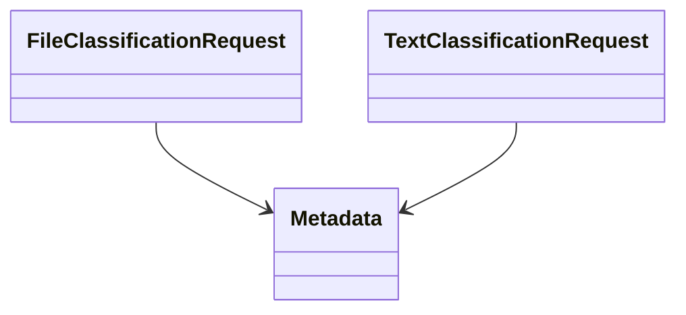
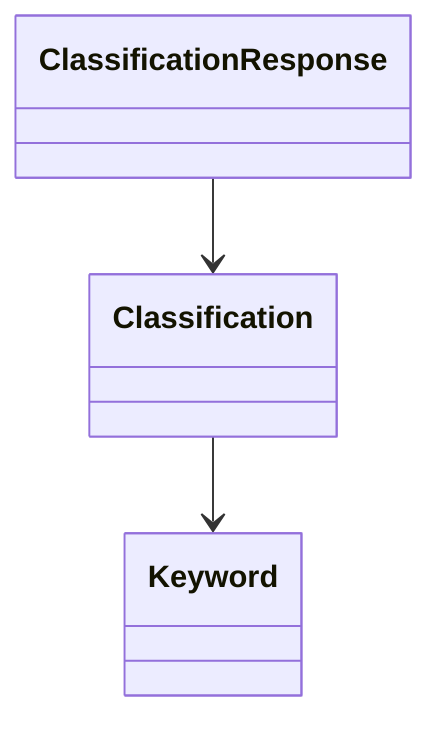
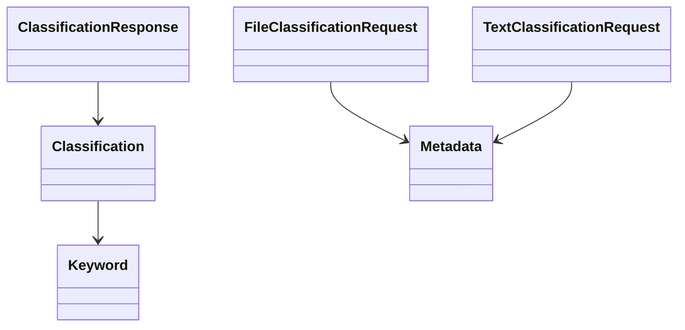
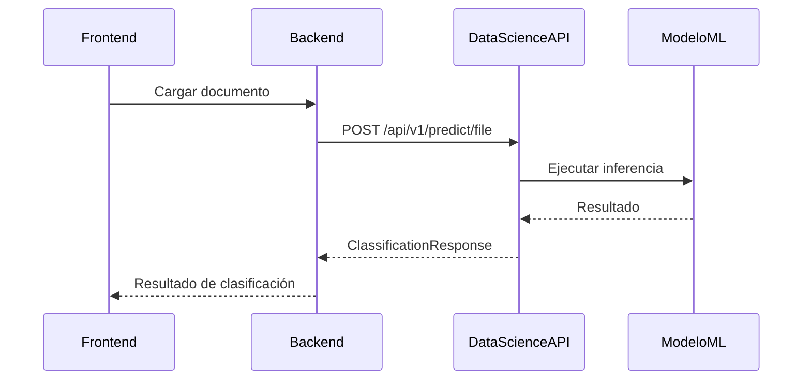
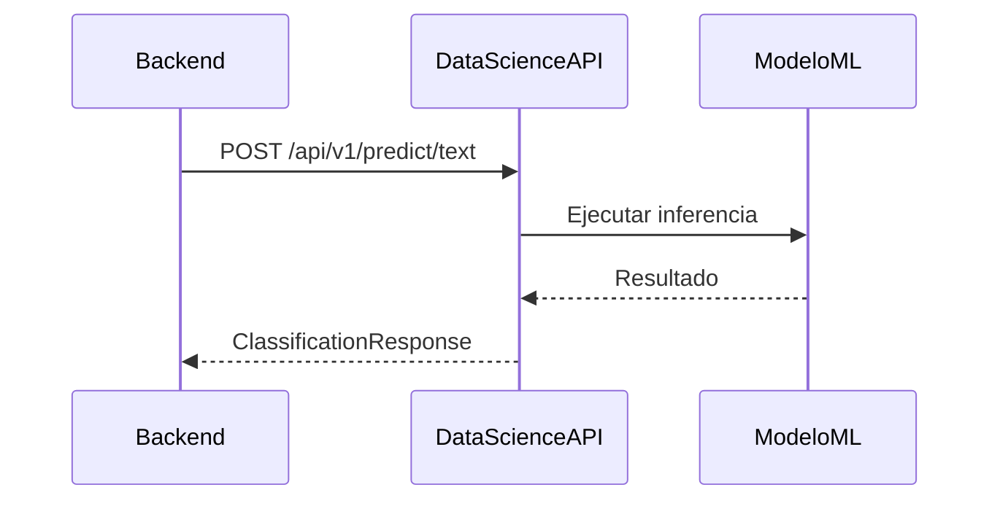
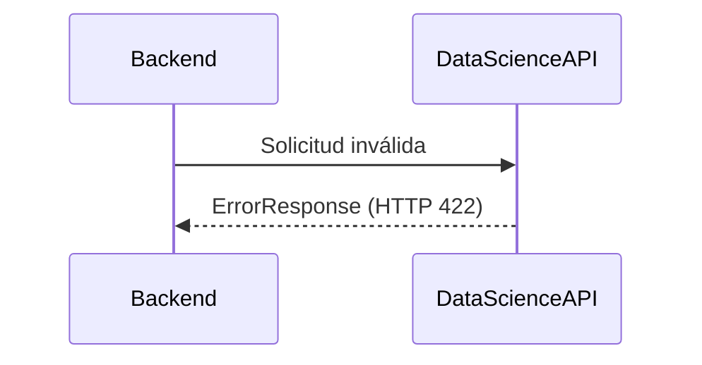
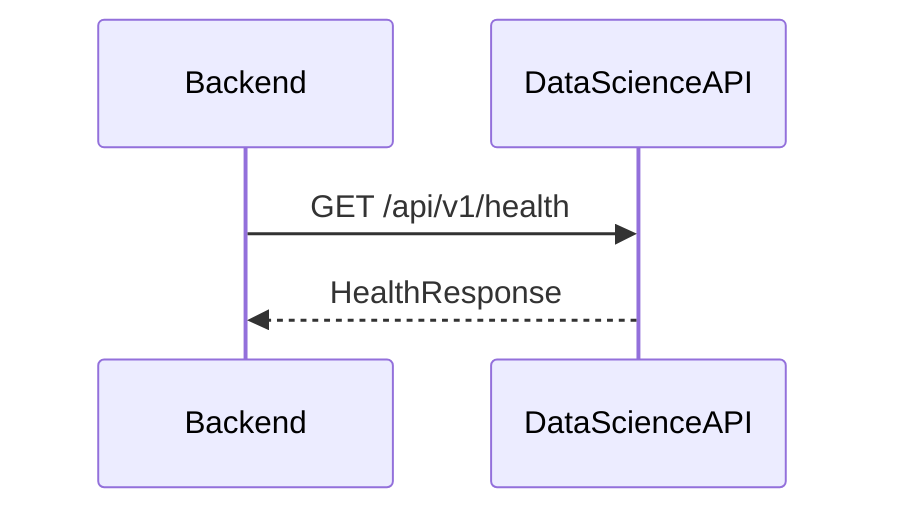

# Backend-Data-Model

| Proyecto | AyniKortex |
|-----------|------------|
| Documento | Backend-Data-Model |
| Versión | 2.0 |
| Estado | En Diseño |
| Responsable | Equipo Data Science |
| Consumidor | Equipo Backend |

---

# Control de Cambios

| Versión | Fecha | Autor | Descripción |
|----------|-------|--------|-------------|
| 1.0 | 2026-07-21 | Equipo Data Science | Versión inicial basada en la arquitectura de Base de Conocimiento. |
| 2.0 | 2026-07-22 | Equipo Data Science | Rediseño completo del modelo de datos para la arquitectura REST de clasificación documental mediante Machine Learning. |

---

# Índice

1. Introducción

2. Objetivo

3. Alcance

4. Convenciones

4.1 Convenciones Generales

4.2 Mapeo de Tipos de Datos

4.3 Convenciones de Enumeraciones

4.4 Convenciones para Fechas

4.5 Convenciones para Identificadores

4.6 Convenciones para Campos Opcionales

4.7 Convenciones para Versionado de Modelos

4.8 Restricciones Generales de los Datos

5. Modelos de Solicitud

6. Modelos de Respuesta

7. Modelos Compartidos

8. Escenarios de Integración

9. Compatibilidad y Versionado

10. Anexos

---

# 1. Introducción

El presente documento define los modelos de datos utilizados para el intercambio de información entre los componentes **Backend** y **Data Science** del proyecto **AyniKortex**.

Su propósito es establecer una estructura común para las solicitudes y respuestas intercambiadas a través de la API REST del componente Data Science, garantizando una integración consistente, desacoplada e independiente de las tecnologías utilizadas por cada equipo.

Los modelos descritos en este documento representan exclusivamente las estructuras de datos intercambiadas entre componentes. Los aspectos relacionados con la implementación de la API REST, protocolos de comunicación, flujos operativos y responsabilidades funcionales se encuentran definidos en el documento **Backend-Data-Contract v2.0**.

> [!IMPORTANT]
>
> Este documento constituye la referencia oficial para la definición de los modelos de datos utilizados por la API REST del componente Data Science.
>
> Toda modificación realizada sobre estos modelos deberá mantenerse alineada con el contrato de integración vigente.

---

# 2. Objetivo

Definir los modelos de datos que utilizarán los componentes **Backend** y **Data Science** para intercambiar información durante la clasificación de documentos y texto libre.

Este documento constituye la referencia oficial para:

- Definir las estructuras de solicitud (Request).
- Definir las estructuras de respuesta (Response).
- Establecer modelos reutilizables compartidos.
- Garantizar la compatibilidad entre versiones del contrato.
- Facilitar el desarrollo paralelo entre Backend y Data Science.

---

# 3. Alcance

Los modelos definidos en este documento cubren exclusivamente las capacidades incluidas en el MVP del proyecto:

- Clasificación de documentos.
- Clasificación de texto libre.
- Extracción de palabras clave.
- Cálculo del nivel de confianza de la clasificación.
- Consulta del estado del servicio.

No forman parte del alcance de esta versión los modelos relacionados con:

- Chat sobre documentos.
- Recuperación Aumentada de Información (RAG).
- Búsqueda semántica.
- Gestión de conversaciones.
- Recomendación de documentos.

Estas funcionalidades podrán incorporarse en futuras versiones mediante la evolución del contrato de integración.

---

# 4. Convenciones

Las siguientes convenciones aplican a todos los modelos definidos en este documento.

| Convención | Valor |
|------------|-------|
| Codificación | UTF-8 |
| Formato de Fechas | ISO-8601 |
| Zona Horaria | UTC |
| Identificadores | UUID |
| Enumeraciones | MAYÚSCULAS |
| Formato de intercambio | JSON |
| Tipo de contenido | application/json o multipart/form-data |

> [!IMPORTANT]
>
> Backend y Data Science deberán respetar estas convenciones para garantizar la compatibilidad del contrato de integración.

---

# 4.1 Convenciones Generales

Las siguientes reglas deberán aplicarse en todos los modelos definidos en este documento.

- Todos los atributos obligatorios deberán estar presentes en la solicitud o respuesta correspondiente.
- Los atributos opcionales podrán omitirse cuando no exista información disponible.
- No deberán enviarse atributos con valores nulos cuando puedan omitirse.
- Todos los nombres de atributos utilizarán **camelCase**.
- Los nombres de las enumeraciones utilizarán letras mayúsculas.
- Las fechas deberán expresarse utilizando el estándar ISO-8601 en UTC.
- Los identificadores únicos utilizarán UUID versión 4.
- Los mensajes intercambiados entre Backend y Data Science deberán codificarse utilizando UTF-8.

---

# 4.2 Mapeo de Tipos de Datos

Con el fin de garantizar una implementación consistente entre los diferentes lenguajes utilizados en el proyecto, los tipos definidos en este documento deberán interpretarse de acuerdo con la siguiente equivalencia.

| Tipo del Contrato | Java (Spring Boot) | Python (FastAPI) | JSON | Descripción |
|-------------------|--------------------|------------------|------|-------------|
| UUID | UUID | uuid.UUID | string | Identificador único universal. |
| String | String | str | string | Cadena de texto UTF-8. |
| Integer | Integer | int | integer | Número entero. |
| Decimal | BigDecimal | float | number | Valor decimal para probabilidades y puntajes. |
| Boolean | Boolean | bool | boolean | Valor lógico. |
| DateTime | OffsetDateTime | datetime | string | Fecha y hora en formato ISO-8601 UTC. |
| Binary | MultipartFile | UploadFile | binary | Archivo enviado mediante multipart/form-data. |
| Array | List<T> | list[T] | array | Colección ordenada de elementos. |
| Object | Clase / DTO | Pydantic Model | object | Modelo compuesto por múltiples atributos. |

---

# 4.3 Convenciones de Enumeraciones

Todas las enumeraciones definidas en este documento deberán cumplir las siguientes reglas.

- Los valores deberán escribirse completamente en mayúsculas.
- No deberán contener espacios.
- Cuando sea necesario separar palabras se utilizará el carácter guion bajo (_).

### Ejemplos

```text
SUCCESS

FAILED

PDF

DOCX

TXT

MD
```

---

# 4.4 Convenciones para Fechas

Todas las fechas intercambiadas entre Backend y Data Science deberán utilizar el estándar ISO-8601 en horario UTC.

### Ejemplo

```text
2026-07-22T15:48:35Z
```

No se permitirá el intercambio de fechas utilizando formatos locales.

---

# 4.5 Convenciones para Identificadores

Todos los identificadores deberán utilizar UUID versión 4.

### Ejemplo

```text
550e8400-e29b-41d4-a716-446655440000
```

No deberán utilizarse identificadores secuenciales como parte del contrato de integración.

---

# 4.6 Convenciones para Campos Opcionales

Cuando un atributo sea opcional:

- podrá omitirse completamente;
- no será obligatorio enviar el valor `null`;
- Backend no deberá asumir la existencia del atributo.

Esta regla permite mantener la compatibilidad entre versiones del contrato.

---

# 4.7 Convenciones para Versionado de Modelos

Toda modificación realizada sobre un modelo deberá respetar las siguientes reglas.

- No eliminar atributos obligatorios.
- Agregar nuevos atributos únicamente como opcionales cuando sea posible.
- Mantener la compatibilidad hacia atrás.
- Actualizar el historial de cambios del documento.

> [!NOTE]
>
> Estas convenciones constituyen la base para la implementación de los modelos de datos en los componentes Backend y Data Science y deberán respetarse durante todo el ciclo de vida del proyecto.

---

# 4.8 Restricciones Generales de los Datos

Con el fin de garantizar la consistencia de los modelos de datos y evitar ambigüedades durante la implementación, todos los atributos definidos en este documento deberán cumplir las restricciones descritas en esta sección.

Estas reglas aplican a todos los modelos de solicitud, respuesta y objetos compartidos, salvo que un modelo indique explícitamente una restricción adicional.

---

## 4.8.1 Restricciones para Identificadores

| Atributo | Restricción |
|-----------|-------------|
| projectId | UUID versión 4 válido. |
| requestId | Cadena alfanumérica única generada por Backend. |
| correlationId *(futuras versiones)* | Identificador único para trazabilidad distribuida. |

### Observaciones

- Todos los identificadores deberán ser únicos dentro del contexto de la operación.
- Data Science no generará ni modificará los identificadores enviados por Backend.

---

## 4.8.2 Restricciones para Texto

| Atributo | Restricción |
|-----------|-------------|
| title | Máximo 200 caracteres. |
| text | Máximo 50 000 caracteres. |
| category | Máximo 100 caracteres. |
| subcategory | Máximo 100 caracteres. |
| keyword.term | Máximo 100 caracteres. |
| message | Máximo 500 caracteres. |

### Observaciones

- Todo el contenido deberá utilizar codificación UTF-8.
- No deberán enviarse cadenas vacías para atributos obligatorios.

---

## 4.8.3 Restricciones para Valores Numéricos

| Campo | Restricción |
|---------|-------------|
| confidence | Valor entre 0.0 y 1.0. |
| keyword.score | Valor entre 0.0 y 1.0. |
| processingTime | Mayor o igual a 0 milisegundos. |

### Observaciones

Los valores decimales deberán representarse utilizando punto (`.`) como separador decimal.

Ejemplo:

```text
0.95
```

---

## 4.8.4 Restricciones para Colecciones

| Campo | Restricción |
|---------|-------------|
| keywords | Máximo 10 elementos. |

### Observaciones

- La lista podrá estar vacía cuando no existan palabras clave relevantes.
- No deberán existir elementos duplicados.

---

## 4.8.5 Restricciones para Archivos

Los archivos enviados al endpoint de clasificación documental deberán cumplir las siguientes condiciones.

| Restricción | Valor |
|--------------|-------|
| Formatos permitidos | PDF, DOCX, TXT, MD |
| Tamaño máximo | Configurable por el servicio |
| Contenido | No vacío |
| Codificación de texto | UTF-8 cuando aplique |

### Observaciones

El tamaño máximo podrá modificarse mediante configuración sin requerir cambios en el contrato de integración.

---

## 4.8.6 Restricciones para Fechas

Todas las fechas deberán expresarse utilizando el estándar ISO-8601 en horario UTC.

Ejemplo:

```text
2026-07-22T16:35:42Z
```

No se admitirán formatos regionales.

---

## 4.8.7 Restricciones para Enumeraciones

Todos los atributos definidos como enumeraciones deberán utilizar exclusivamente los valores documentados en este contrato.

No deberán enviarse valores distintos a los especificados.

Ejemplo:

```text
SUCCESS

FAILED

PDF

DOCX

TXT

MD
```

---

## 4.8.8 Restricciones para Versiones

Las versiones de la API y del modelo de Machine Learning deberán seguir el esquema de Versionado Semántico (Semantic Versioning).

Formato:

```text
MAJOR.MINOR.PATCH
```

Ejemplo:

```text
1.0.0

2.1.3

3.0.0
```

---

## 4.8.9 Validación de Datos

Antes de procesar cualquier solicitud, el componente Data Science deberá verificar que todos los atributos cumplan las restricciones definidas en esta sección.

Cuando alguna validación falle, la API deberá responder utilizando el modelo **ErrorResponse** definido en este documento y el catálogo de errores especificado en **Backend-Data-Contract v2.0**.

> [!IMPORTANT]
>
> Las restricciones descritas en esta sección constituyen la referencia oficial para la validación de datos intercambiados entre Backend y Data Science. Cualquier modificación deberá reflejarse tanto en este documento como en el contrato de integración correspondiente.

---

# 5. Modelos de Solicitud

Este capítulo define los modelos de datos utilizados por el componente **Backend** para invocar las capacidades expuestas por la API REST del componente **Data Science**.

Cada modelo representa la estructura esperada por un endpoint específico y deberá respetar las convenciones establecidas en este documento.

Los modelos de solicitud contienen únicamente la información necesaria para ejecutar el proceso de clasificación, evitando el intercambio de datos ajenos al propósito del servicio.

---

## Relación entre Modelos



---

## 5.1 FileClassificationRequest

### Objetivo

Representa la solicitud enviada por Backend para clasificar un documento mediante el endpoint:

```text
POST /api/v1/predict/file
```

El documento será procesado por el componente Data Science para obtener su clasificación automática.

---

### Atributos

| Campo | Tipo | Obligatorio | Descripción |
|--------|------|-------------|-------------|
| file | Binary | Sí | Archivo que será procesado. |
| projectId | UUID | Sí | Identificador del proyecto asociado. |
| metadata | Metadata | No | Información complementaria de la solicitud. |

---

### Restricciones

- El archivo deberá enviarse mediante **multipart/form-data**.
- El archivo no podrá estar vacío.
- El tipo de archivo deberá corresponder a uno de los formatos soportados.
- El tamaño máximo permitido será definido por la configuración del servicio.

---

### Formatos Soportados

| Formato | Extensión |
|----------|-----------|
| PDF | .pdf |
| Word | .docx |
| Texto Plano | .txt |
| Markdown | .md |

---

### Ejemplo

```text
multipart/form-data

file=documentacion.pdf

projectId=550e8400-e29b-41d4-a716-446655440000
```

---

### Observaciones

Backend será responsable de validar la solicitud antes de enviarla al componente Data Science.

El contenido del archivo será procesado exclusivamente durante la ejecución de la solicitud y no será almacenado por el componente Data Science.

---

## 5.2 TextClassificationRequest

### Objetivo

Representa la solicitud utilizada para clasificar contenido enviado como texto libre mediante el endpoint:

```text
POST /api/v1/predict/text
```

---

### Atributos

| Campo | Tipo | Obligatorio | Descripción |
|--------|------|-------------|-------------|
| title | String | No | Título asociado al contenido. |
| text | String | Sí | Texto que será clasificado. |
| projectId | UUID | Sí | Identificador del proyecto. |
| metadata | Metadata | No | Información complementaria de la solicitud. |

---

### Restricciones

- El contenido no podrá ser vacío.
- El texto deberá utilizar codificación UTF-8.
- El tamaño máximo del contenido será definido por la configuración del servicio.

---

### Ejemplo

```json
{
    "title": "Manual de Arquitectura",
    "text": "Este documento describe la arquitectura del sistema...",
    "projectId": "550e8400-e29b-41d4-a716-446655440000",
    "metadata": {
        "source": "WEB",
        "language": "es"
    }
}
```

---

### Observaciones

El componente Data Science aplicará el mismo pipeline de preprocesamiento utilizado para la clasificación documental.

Esto garantiza consistencia entre ambos mecanismos de entrada.

---

# 6. Modelos de Respuesta

Este capítulo define los modelos de datos utilizados por el componente **Data Science** para responder las solicitudes realizadas por **Backend**.

Todos los modelos de respuesta deberán cumplir las convenciones establecidas en este documento y mantener compatibilidad con el contrato de integración definido en **Backend-Data-Contract v2.0**.

Los modelos descritos en este capítulo representan exclusivamente la información intercambiada entre componentes y no exponen detalles internos de la implementación del modelo de Machine Learning.

---

## Relación entre Modelos



---

## 6.1 ClassificationResponse

### Objetivo

Representa la respuesta generada por el componente Data Science después de procesar una solicitud de clasificación.

Este modelo será utilizado por los endpoints:

- POST /api/v1/predict/file
- POST /api/v1/predict/text

---

### Atributos

| Campo | Tipo | Obligatorio | Descripción |
|--------|------|-------------|-------------|
| requestId | String | No | Identificador de la solicitud recibido desde Backend. |
| status | Status | Sí | Estado general de la operación. |
| classification | Classification | Sí | Resultado de la clasificación realizada. |
| processingTime | Integer | Sí | Tiempo de procesamiento en milisegundos. |
| modelVersion | String | Sí | Versión del modelo de Machine Learning utilizada para generar la inferencia. Sigue el esquema de Versionado Semántico (MAJOR.MINOR.PATCH). |
| timestamp | DateTime | Sí | Fecha y hora de generación de la respuesta. |

---

### Ejemplo

### Ejemplo

```json
{
    "requestId": "REQ-20260722-000001",
    "status": "SUCCESS",
    "classification": {
        "category": "Arquitectura",
        "subcategory": "Microservicios",
        "confidence": 0.97,
        "keywords": [
            {
                "term": "docker",
                "score": 0.96
            },
            {
                "term": "kubernetes",
                "score": 0.93
            },
            {
                "term": "api",
                "score": 0.89
            }
        ]
    },
    "processingTime": 624,
    "modelVersion": "1.0.0",
    "timestamp": "2026-07-22T15:40:18Z"
}
```

---

### Observaciones

El objeto **classification** concentra toda la información funcional generada por el modelo.

Esto facilita la evolución futura del contrato sin afectar la estructura principal de la respuesta.

---

## 6.2 ErrorResponse

### Objetivo

Representa la estructura estándar utilizada para responder cualquier error producido por la API REST del componente Data Science.

Este modelo será utilizado independientemente del endpoint invocado.

---

### Atributos

| Campo | Tipo | Obligatorio | Descripción |
|--------|------|-------------|-------------|
| requestId | String | No | Identificador de la solicitud. |
| timestamp | DateTime | Sí | Fecha y hora del error. |
| status | Integer | Sí | Código HTTP asociado. |
| error | String | Sí | Nombre del error. |
| code | String | Sí | Código funcional definido en el contrato. |
| message | String | Sí | Descripción del error. |
| path | String | Sí | Endpoint donde ocurrió el error. |

---

### Ejemplo

```json
{
    "requestId": "REQ-20260722-000001",
    "timestamp": "2026-07-22T15:42:01Z",
    "status": 422,
    "error": "DOCUMENT_PROCESSING_ERROR",
    "code": "DS-422-001",
    "message": "No fue posible procesar el documento.",
    "path": "/api/v1/predict/file"
}
```

---

### Observaciones

Todos los errores deberán respetar la estructura definida en este modelo para garantizar un tratamiento uniforme por parte del componente Backend.

---

## 6.3 HealthResponse

### Objetivo

Representa la respuesta generada por el endpoint de verificación del estado del servicio.

---

### Atributos

| Campo | Tipo | Obligatorio | Descripción |
|--------|------|-------------|-------------|
| serviceStatus | String | Sí | Estado actual del servicio. |
| service | String | Sí | Nombre del servicio. |
| version | String | Sí | Versión de la API REST. |
| uptime | Integer | No | Tiempo de disponibilidad del servicio expresado en segundos. |
| timestamp | DateTime | Sí | Fecha y hora de generación de la respuesta. |

---

### Ejemplo

```json
{
    "serviceStatus": "UP",
    "service": "Data Science API",
    "version": "2.0.0",
    "uptime": 54127,
    "timestamp": "2026-07-22T15:45:12Z"
}
```

---

### Observaciones

Este modelo será utilizado exclusivamente por el endpoint:

```text
GET /api/v1/health
```

El atributo **serviceStatus** representa el estado operativo del servicio y no debe confundirse con la enumeración **Status**, utilizada para indicar el resultado de las operaciones de clasificación.

---

# 7. Modelos Compartidos

Los modelos definidos en este capítulo representan estructuras reutilizables empleadas por múltiples solicitudes y respuestas del contrato de integración.

Su propósito es evitar la duplicidad de definiciones, facilitar el mantenimiento del contrato y garantizar la consistencia entre los diferentes endpoints expuestos por la API REST del componente Data Science.

---

## Relación entre Modelos



---

## 7.1 Classification

### Objetivo

Representa el resultado funcional generado por el modelo de Machine Learning.

Este modelo concentra toda la información relacionada con la clasificación obtenida durante la inferencia.

---

### Atributos

| Campo | Tipo | Obligatorio | Descripción |
|--------|------|-------------|-------------|
| category | String | Sí | Categoría principal asignada al documento. |
| subcategory | String | No | Subcategoría detectada. |
| confidence | Decimal | Sí | Nivel de confianza de la clasificación. |
| keywords | Keyword[] | Sí | Palabras clave relevantes extraídas del contenido. |

---

### Restricciones

- El valor de **confidence** deberá estar comprendido entre **0.0 y 1.0**.
- La lista de palabras clave podrá estar vacía cuando no se detecten términos relevantes.
- Las categorías deberán corresponder al catálogo oficial utilizado por el modelo.

---

### Ejemplo

```json
{
    "category": "Arquitectura",
    "subcategory": "Microservicios",
    "confidence": 0.97,
    "keywords": [
        {
            "term": "docker",
            "score": 0.96
        },
        {
            "term": "kubernetes",
            "score": 0.93
        }
    ]
}
```

---

## 7.2 Keyword

### Objetivo

Representa una palabra clave identificada durante el proceso de clasificación.

---

### Atributos

| Campo | Tipo | Obligatorio | Descripción |
|--------|------|-------------|-------------|
| term | String | Sí | Término identificado. |
| score | Decimal | No | Nivel de relevancia del término. |

---

### Restricciones

Cuando el atributo **score** sea informado deberá encontrarse entre **0.0 y 1.0**.

---

### Ejemplo

```json
{
    "term": "docker",
    "score": 0.96
}
```

---

## 7.3 Metadata

### Objetivo

Representa información adicional enviada por Backend para complementar una solicitud.

Su contenido es completamente opcional y podrá evolucionar sin afectar la compatibilidad del contrato.

---

### Atributos

| Campo | Tipo | Obligatorio | Descripción |
|--------|------|-------------|-------------|
| source | String | No | Origen de la solicitud. |
| language | String | No | Idioma esperado del contenido. |
| client | String | No | Cliente consumidor de la API. |

---

### Ejemplo

```json
{
    "source": "WEB",
    "language": "es",
    "client": "Backend"
}
```

---

### Observaciones

El objeto **Metadata** está diseñado para ser extensible y proporcionar información contextual adicional sobre la solicitud.

La incorporación de nuevos atributos opcionales no deberá afectar la compatibilidad del contrato de integración ni modificar el comportamiento esperado de los modelos existentes.

Backend podrá utilizar este objeto para enviar información adicional requerida por futuras versiones del sistema sin necesidad de modificar los modelos principales.

---

## 7.4 Status

### Objetivo

Representa el estado general de una operación ejecutada por el componente Data Science.

---

### Valores Permitidos

| Valor | Descripción |
|--------|-------------|
| SUCCESS | La operación finalizó correctamente. |
| FAILED | La operación no pudo completarse. |

---

### Observaciones

Todos los modelos de respuesta reutilizarán esta enumeración para indicar el resultado general de la operación.

La incorporación de nuevos estados deberá mantener la compatibilidad con las versiones anteriores del contrato.

---

# 8. Escenarios de Integración

Este capítulo presenta los principales escenarios de interacción entre el componente Backend y la API REST del componente Data Science.

Los diagramas y ejemplos aquí descritos ilustran el uso esperado de los modelos definidos en este documento.

---

## 8.1 Clasificación de Documento

### Descripción

Backend envía un documento para ser clasificado automáticamente.

### Flujo



---

## 8.2 Clasificación de Texto

### Descripción

Backend envía contenido textual directamente para obtener una clasificación.

### Flujo



---

## 8.3 Error de Validación

### Descripción

La solicitud contiene información inválida y no puede ser procesada.

### Flujo



---

## 8.4 Estado del Servicio

### Descripción

Backend verifica la disponibilidad del servicio antes de realizar solicitudes de clasificación.

### Flujo



---

# 9. Compatibilidad y Versionado

La evolución de este contrato deberá preservar la compatibilidad entre las diferentes versiones de Backend y Data Science.

## 9.1 Compatibilidad

Se consideran cambios compatibles:

- Incorporar nuevos atributos opcionales.
- Agregar nuevos endpoints.
- Incorporar nuevos valores de enumeraciones cuando no afecten el comportamiento existente.
- Mejorar la documentación.

No se consideran compatibles:

- Eliminar atributos obligatorios.
- Cambiar el tipo de datos de un atributo existente.
- Modificar el significado funcional de un atributo.
- Cambiar la estructura de los modelos de respuesta.

---

## 9.2 Versionado

El contrato utilizará Versionado Semántico (Semantic Versioning).

Formato:

MAJOR.MINOR.PATCH

Donde:

- **MAJOR**: cambios incompatibles.
- **MINOR**: nuevas funcionalidades compatibles.
- **PATCH**: correcciones sin impacto funcional.

---

## 9.3 Política de Deprecación

Cuando un atributo o endpoint sea reemplazado:

- deberá marcarse como **Deprecated**;
- permanecerá disponible durante el período definido por el equipo de arquitectura;
- la documentación deberá indicar la alternativa recomendada.

---

# 10. Anexos

## 10.1 Acrónimos

| Acrónimo | Descripción |
|----------|-------------|
| API | Application Programming Interface |
| DTO | Data Transfer Object |
| HTTP | Hypertext Transfer Protocol |
| JSON | JavaScript Object Notation |
| ML | Machine Learning |
| REST | Representational State Transfer |
| UUID | Universally Unique Identifier |
| UTF-8 | Unicode Transformation Format - 8 bits |
| UTC | Coordinated Universal Time |

---

## 10.2 Glosario

| Término | Definición |
|----------|------------|
| Clasificación | Resultado generado por el modelo de Machine Learning. |
| Confianza | Probabilidad asociada a la predicción realizada por el modelo. |
| Inferencia | Proceso mediante el cual el modelo genera una predicción a partir de una entrada. |
| Keyword | Palabra clave relevante identificada durante el procesamiento del contenido. |
| Metadata | Información adicional utilizada para contextualizar una solicitud. |

---

## 10.3 Referencias

- IEEE 830 – Recommended Practice for Software Requirements Specifications.
- IEEE 1016 – Software Design Description.
- OpenAPI Specification 3.1.
- RFC 8259 – The JavaScript Object Notation (JSON) Data Interchange Format.
- ISO 8601 – Date and Time Format.
- Semantic Versioning 2.0.0.
