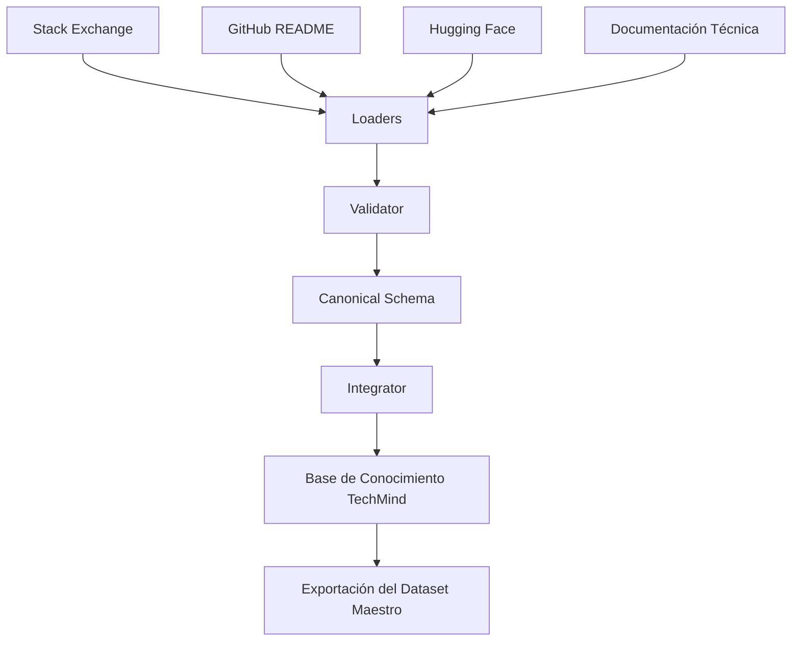

# Data Science Pipeline

## Objetivo

Definir la arquitectura del pipeline encargado de construir la **Base de Conocimiento TechMind** mediante la integración de múltiples fuentes de datos.

El resultado del pipeline será un **Dataset Maestro** unificado, reproducible y trazable, que servirá como base para el entrenamiento y evaluación del modelo de Machine Learning.

---

# Arquitectura General



---

# Fuentes de Datos

La primera versión del pipeline integrará las siguientes fuentes de información.

| Fuente | Descripción |
|---------|-------------|
| Stack Exchange | Preguntas y respuestas técnicas |
| GitHub README | Documentación técnica de proyectos |
| Hugging Face | Datasets públicos relacionados con desarrollo de software |
| Documentación Técnica | Documentos PDF, Markdown y HTML |

La arquitectura permitirá incorporar nuevas fuentes sin modificar el flujo principal del pipeline.

---

# Componentes

| Componente | Responsabilidad |
|------------|-----------------|
| `loaders.py` | Cargar las fuentes de datos |
| `validator.py` | Validar la estructura de los datos |
| `schema.py` | Definir el Canonical Schema |
| `integrator.py` | Integrar todas las fuentes |
| `builder.py` | Orquestar el pipeline completo |

---

# Canonical Schema

Todos los loaders deberán generar un DataFrame con una estructura común antes de integrarse.

| Campo | Descripción |
|--------|-------------|
| document_id | Identificador único del documento |
| source | Fuente de origen |
| source_id | Identificador original (cuando exista) |
| title | Título del documento |
| text | Contenido principal |
| category | Categoría principal |
| language | Idioma |
| tags | Etiquetas |
| author | Autor |
| created_date | Fecha de creación |
| url | Enlace al documento original |

---

# Flujo del Pipeline

El pipeline ejecutará las siguientes etapas:

1. Carga de las fuentes de datos.
2. Validación de la estructura.
3. Normalización al Canonical Schema.
4. Integración de todas las fuentes.
5. Construcción de la Base de Conocimiento TechMind.
6. Exportación del Dataset Maestro.

---

# Salidas

El pipeline generará los siguientes artefactos.

```text
datasets/

├── raw/
├── interim/
└── processed/
    └── master_dataset.csv
```

En futuras versiones también podrá generarse:

- `master_dataset.parquet`

---

# Consumidores

La Base de Conocimiento TechMind será utilizada por el componente de Ciencia de Datos para:

- Limpieza y validación.
- Análisis exploratorio.
- Ingeniería de características.
- Entrenamiento del modelo.
- Evaluación.

El componente Backend consumirá únicamente los artefactos generados durante el entrenamiento del modelo.

---

# Evolución

La arquitectura fue diseñada para permitir la incorporación de nuevas fuentes de datos sin modificar el flujo principal del pipeline.

Las siguientes fuentes podrán integrarse en futuras versiones:

- Base de Conocimiento Interna TechMind.
- Wikis técnicas.
- Blogs especializados.
- APIs públicas.