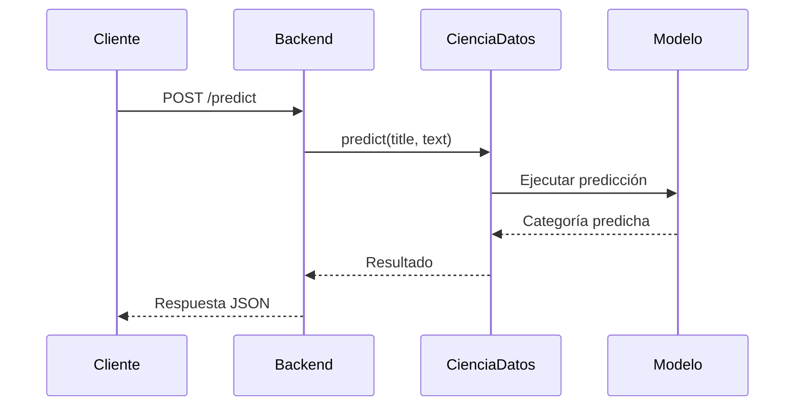
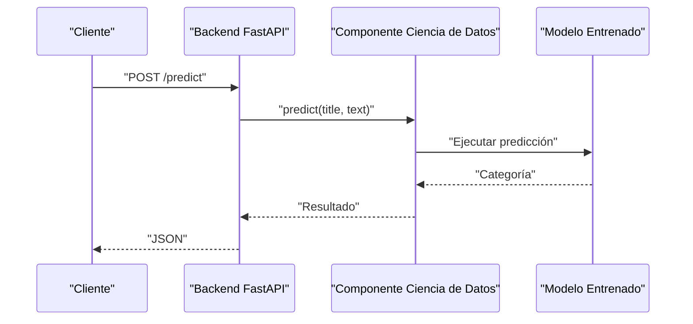

# Arquitectura del Sistema

**Proyecto:** TechMind – Organización Inteligente del Conocimiento Técnico

**Versión:** 1.0

**Estado:** Aprobado

---

# 1. Propósito

Este documento presenta una visión técnica de alto nivel de la arquitectura del sistema **TechMind**.

Su objetivo es describir los componentes principales del sistema, sus responsabilidades y la forma en que interactúan durante el procesamiento de una solicitud.

Los detalles de implementación, las decisiones arquitectónicas, los estándares de desarrollo y la organización del repositorio se documentan por separado para evitar duplicidad y mantener una única fuente de verdad.

---

# 2. Visión General del Sistema

TechMind es una aplicación monolítica compuesta por dos módulos lógicos:

* Backend
* Componente de Ciencia de Datos

El Backend expone una API REST que recibe las solicitudes de los clientes y delega la clasificación de documentos al componente de Ciencia de Datos mediante una función pública.

El componente de Ciencia de Datos ejecuta localmente el modelo de Machine Learning y devuelve la predicción al Backend.

Únicamente el Backend es accesible desde el exterior.

---

# 3. Principios Arquitectónicos

La arquitectura del sistema sigue los principios definidos en el **Software Design Specification (SDS)**.

| Principio                       | Descripción                                                                                 |
| ------------------------------- | ------------------------------------------------------------------------------------------- |
| KISS                            | Priorizar la solución más simple que cumpla con los objetivos del proyecto.                 |
| Bajo Acoplamiento               | Los componentes se comunican mediante interfaces bien definidas.                            |
| Alta Cohesión                   | Cada componente posee una única responsabilidad claramente definida.                        |
| Separación de Responsabilidades | Las responsabilidades del Backend y del componente de Ciencia de Datos permanecen aisladas. |
| Desarrollo Incremental          | El sistema evoluciona mediante iteraciones pequeñas y controladas.                          |
| Documentación Ligera            | La documentación complementa la implementación sin generar redundancias.                    |

---

# 4. Arquitectura de Alto Nivel

El sistema está compuesto por cuatro componentes principales.

```mermaid
flowchart LR

```mermaid
flowchart LR

    client["Cliente"]

    backend["Backend FastAPI"]

    ds["Componente Ciencia de Datos"]

    model["Modelo Entrenado"]

    client --> backend

    backend -->|"predict(title, text)"| ds

    ds --> model

    model --> ds

    ds --> backend

    backend --> client
```

El Backend constituye el único punto de entrada público del sistema.

El componente de Ciencia de Datos se ejecuta internamente y no expone servicios HTTP propios.

---

# 5. Responsabilidades de los Componentes

| Componente                     | Responsabilidad                                                                                                    |
| ------------------------------ | ------------------------------------------------------------------------------------------------------------------ |
| Cliente                        | Envía solicitudes de clasificación y recibe los resultados.                                                        |
| Backend FastAPI                | Expone la API REST, valida las solicitudes, invoca la función de predicción y devuelve respuestas en formato JSON. |
| Componente de Ciencia de Datos | Preprocesa la información de entrada, carga el modelo entrenado y ejecuta la predicción.                           |
| Modelo Entrenado               | Genera la categoría predicha utilizando el modelo de Regresión Logística previamente entrenado.                    |

---

# 6. Flujo de una Solicitud

El siguiente diagrama muestra el recorrido completo de una solicitud de clasificación.



Proceso de ejecución:

1. El cliente envía una solicitud de clasificación.
2. El Backend valida la información recibida.
3. El Backend invoca la función `predict(title, text)`.
4. El componente de Ciencia de Datos procesa la solicitud.
5. El modelo entrenado genera la predicción.
6. El resultado se devuelve al Backend.
7. El Backend responde al cliente en formato JSON.

---

# 7. Vista de Despliegue

El despliegue del sistema consiste en una única aplicación Backend que carga localmente el modelo entrenado.



Solo el Backend es accesible desde el exterior.

El modelo entrenado es cargado internamente durante la ejecución de la aplicación.

OCI Object Storage puede utilizarse para almacenar conjuntos de datos, modelos entrenados o artefactos del proyecto.

---

# 8. Stack Tecnológico

| Capa                          | Tecnología          |
| ----------------------------- | ------------------- |
| Lenguaje de Programación      | Python              |
| Framework Backend             | FastAPI             |
| Servidor ASGI                 | Uvicorn             |
| Validación de Datos           | Pydantic            |
| Machine Learning              | Scikit-Learn        |
| Procesamiento de Datos        | Pandas              |
| Computación Numérica          | NumPy               |
| Extracción de Características | TF-IDF              |
| Clasificación                 | Regresión Logística |
| Similitud de Documentos       | Cosine Similarity   |
| Serialización del Modelo      | Joblib              |
| Almacenamiento                | OCI Object Storage  |
| Cómputo (Opcional)            | OCI Compute         |

---

# 9. Límites del Sistema

## Componentes Incluidos

* Backend FastAPI
* API REST
* Componente de Ciencia de Datos
* Modelo de Machine Learning
* Extracción de características mediante TF-IDF
* Clasificador basado en Regresión Logística
* OCI Object Storage (opcional)

## Componentes Excluidos

Las siguientes tecnologías quedan explícitamente fuera del alcance del proyecto:

* Modelos de Lenguaje de Gran Escala (LLM)
* Inteligencia Artificial Generativa
* Retrieval-Augmented Generation (RAG)
* LangChain
* LangGraph
* CrewAI
* AutoGen
* Bases de Datos Vectoriales
* Agentes de IA
* n8n
* Arquitectura de Microservicios

Estas exclusiones están definidas en los **Architecture Decision Records (ADR)** aprobados.

---

# 10. Referencias

Este documento complementa, pero no reemplaza, la documentación oficial del proyecto.

Para obtener información detallada sobre decisiones de diseño e implementación, consultar:

* Software Design Specification (SDS)
* Architecture Decision Records (ADR)
* Technical Roadmap
* Engineering Standards

