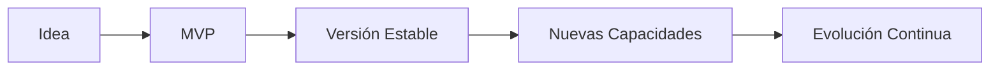

# Technical Roadmap

# TechMind – Organización Inteligente del Conocimiento Técnico

| Campo | Valor |
|--------|-------|
| **Proyecto** | TechMind – Organización Inteligente del Conocimiento Técnico |
| **Documento** | Technical Roadmap |
| **Clasificación** | Documentación Técnica |
| **Versión** | 1.0 |
| **Estado** | Aprobado |
| **Fecha** | Julio 2026 |

---

# Control de Versiones

| Versión | Fecha | Autor(es) | Descripción |
|----------|-------|-----------|-------------|
| 1.0 | Julio 2026 | Equipo TechMind | Primera versión del Technical Roadmap. |

---

# Tabla de Contenido

1. Objetivo
2. Alcance
3. Visión General
4. Roadmap del MVP
5. Evolución del Producto
6. Capacidades Futuras
7. Exclusiones
8. Referencias

---

# 1. Objetivo

El presente documento describe la evolución técnica prevista para TechMind desde la construcción del Producto Mínimo Viable (MVP) hasta futuras versiones del sistema.

Su propósito es proporcionar una visión de largo plazo sobre la evolución funcional y tecnológica del proyecto, manteniendo la coherencia con la arquitectura definida en el Software Design Specification (SDS).

Este documento no constituye un cronograma de desarrollo ni un plan de gestión del proyecto.

---

# 2. Alcance

El Technical Roadmap incluye:

- Evolución prevista del MVP.
- Evolución funcional del producto.
- Capacidades esperadas para futuras versiones.
- Visión técnica de crecimiento del sistema.

No forman parte de este documento:

- Arquitectura del sistema.
- Decisiones arquitectónicas.
- Planificación de tareas.
- Cronogramas.
- Gestión del proyecto.

---

# 3. Visión General

TechMind evoluciona mediante incrementos funcionales que permiten ampliar las capacidades del sistema sin modificar los principios arquitectónicos definidos para el MVP.

Cada nueva versión incorpora funcionalidades adicionales manteniendo una arquitectura simple, modular y preparada para crecer de forma controlada.

---

## 4. Roadmap del MVP

El desarrollo del MVP se organiza en cuatro sprints principales, cada uno con objetivos específicos para avanzar de forma incremental hasta una versión funcional y documentada.

| Sprint | Objetivo | Estado |
|---------|----------|:------:|
| Sprint 0 | Arquitectura, planificación y preparación del entorno | ✅ |
| Sprint 1 | Desarrollo de los componentes Backend y Ciencia de Datos | 🚧 |
| Sprint 2 | Integración entre componentes y validación funcional | ⏳ |
| Sprint 3 | Pruebas finales, despliegue y presentación del MVP | ⏳ |

---

# 5. Evolución del Producto

## MVP v1.0

Objetivo:

Construir una plataforma funcional capaz de clasificar documentación técnica mediante un modelo de Machine Learning integrado a una API REST.

Capacidades previstas:

- API REST para clasificación de documentos.
- Procesamiento de solicitudes desde Backend.
- Construcción y preprocesamiento del dataset.
- Entrenamiento del modelo de Machine Learning.
- Predicción de categorías.
- Documentación técnica completa.
- Despliegue inicial en Oracle Cloud Infrastructure (OCI).

---

## Versión 1.1

Objetivo:

Incrementar la calidad del modelo y mejorar el rendimiento general del sistema.

Capacidades previstas:

- Optimización del entrenamiento.
- Ajuste de hiperparámetros.
- Incorporación de nuevas métricas.
- Mejoras en la calidad de clasificación.

---

## Versión 2.0

Objetivo:

Consolidar una plataforma preparada para escenarios de mayor escala.

Capacidades previstas:

- Versionado de modelos.
- Automatización del entrenamiento.
- Monitoreo del desempeño.
- Administración de múltiples modelos.
- Mejoras en el proceso de recomendación.

---

# 6. Capacidades Futuras

Las siguientes capacidades podrán evaluarse para futuras versiones del proyecto:

| Capacidad | Estado |
|------------|--------|
| Nuevos algoritmos de Machine Learning | Futuro |
| Reentrenamiento programado | Futuro |
| Versionado de modelos | Futuro |
| Métricas avanzadas | Futuro |
| Dashboard administrativo | Futuro |
| Versionado de API | Futuro |
| Automatización del pipeline | Futuro |

La incorporación de estas capacidades deberá evaluarse de acuerdo con los objetivos del proyecto y las decisiones arquitectónicas vigentes.

---

# 7. Exclusiones

No forman parte del alcance definido por este Roadmap:

- Inteligencia Artificial Generativa.
- Modelos de Lenguaje de Gran Escala (LLM).
- Arquitecturas Retrieval-Augmented Generation (RAG).
- Agentes de Inteligencia Artificial.
- Bases de datos vectoriales.
- Frameworks orientados a IA Generativa.

La incorporación de cualquiera de estas tecnologías requerirá una revisión arquitectónica y la actualización de los Architecture Decision Records (ADR).

---

# 8. Referencias

Este documento complementa la documentación técnica oficial del proyecto.

Documentos relacionados:

- Software Design Specification (SDS).
- Architecture Decision Records (ADR).
- Estándares de Desarrollo.
- Documentación de Arquitectura.
- README del proyecto.