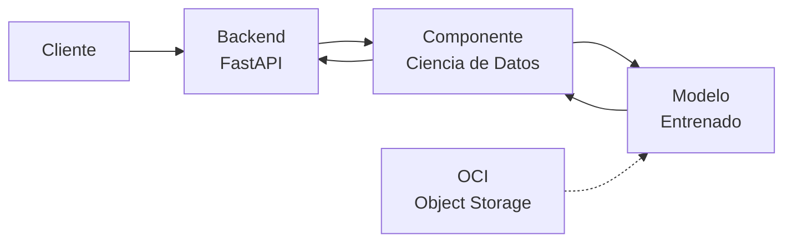
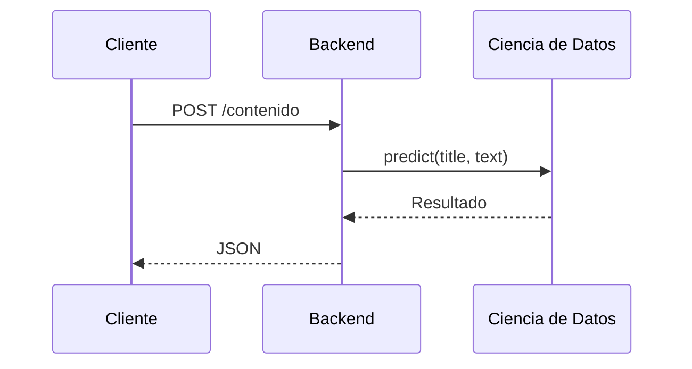
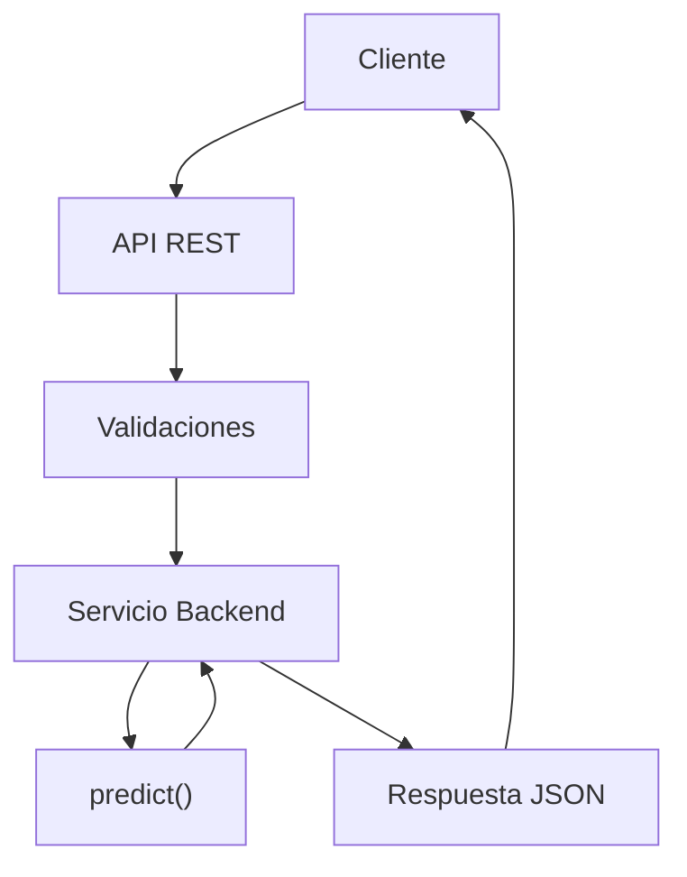
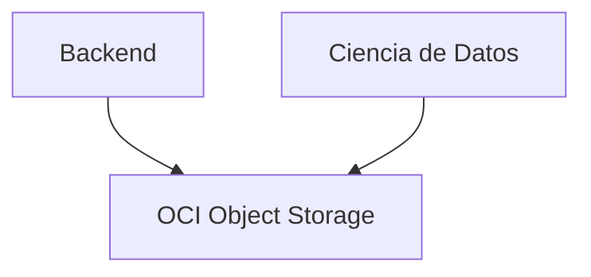
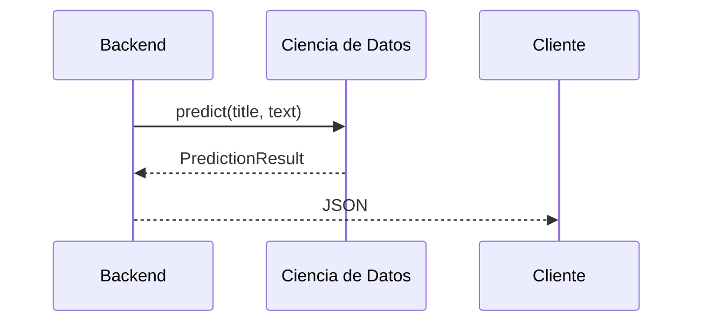

# Software Design Specification (SDS)

# TechMind – Organización Inteligente del Conocimiento Técnico

| Campo | Valor |
|-------|-------|
| **Versión** | **1.1** |
| **Estado** | Vigente |
| **Fecha** | Julio 2026 |
| **Proyecto** | Hackathon ONE – Oracle Next Education |
| **Tipo de documento** | Software Design Specification (SDS) |

---

# Control de Versiones

| Versión | Fecha | Autor(es) | Descripción |
|---------|-------|-----------|-------------|
| 0.1 | Julio 2026 | Equipo TechMind | Primera versión del documento. |
| 1.0 | Julio 2026 | Equipo TechMind | Arquitectura base aprobada. |
| **1.1** | **Julio 2026** | **Equipo TechMind** | **Actualización de la arquitectura tras la finalización de los Sprints DS-01, DS-02, DS-03 y DS-04 del componente de Ciencia de Datos.** |

---

# Tabla de Contenido

# Parte I - Fundamentos

────────────────────────

1. Información General
2. Filosofía del Proyecto
3. Introducción
4. Contexto del Proyecto
5. Alcance del MVP

────────────────────────

# Parte II - Arquitectura

────────────────────────

6. Arquitectura General

────────────────────────

# Parte III - Componentes del Sistema

────────────────────────

7. Componente Backend

8. Componente Ciencia de Datos

9. Infraestructura (OCI)

────────────────────────

# Parte IV - Integración

────────────────────────

10. Integración Backend ↔ Ciencia de Datos

────────────────────────

# Parte V - Gestión del Proyecto

────────────────────────

11. Evolución del MVP

12. Riesgos

13. Referencias y Anexos

14. Aprobación del Documento

---

# Parte I - Fundamentos

────────────────────────

# 1. Información General

## 1.1 Nombre del Proyecto

**TechMind – Organización Inteligente del Conocimiento Técnico**

---

## 1.2 Tipo de Proyecto

Desarrollo de un **Producto Mínimo Viable (MVP)** para el **Hackathon ONE – Oracle Next Education**, orientado a la organización automática de contenido técnico mediante técnicas de Ciencia de Datos y Machine Learning.

---

## 1.3 Objetivo del Proyecto

Desarrollar una plataforma capaz de recibir contenido técnico, procesarlo mediante técnicas de Ciencia de Datos y Machine Learning, clasificar automáticamente la información, extraer palabras clave relevantes y recomendar contenido similar, exponiendo estas funcionalidades a través de una API REST.

---

## 1.4 Objetivo del Documento

Este Software Design Specification describe la arquitectura del sistema TechMind y documenta las principales decisiones técnicas adoptadas durante su desarrollo.

Su propósito es servir como documento de referencia para los equipos de Backend, Ciencia de Datos e Infraestructura, proporcionando una visión unificada de la arquitectura, los componentes, las interfaces y la evolución del proyecto.

---

## 1.5 Alcance del Documento

Este documento incluye:

- Arquitectura general del sistema.
- Componentes principales.
- Responsabilidades de cada módulo.
- Flujo de información.
- Diseño del componente de Ciencia de Datos.
- Contrato de integración Backend ↔ Ciencia de Datos.
- Diseño de la API REST.
- Infraestructura propuesta.
- Evolución arquitectónica del proyecto.

No forman parte de este documento:

- Manual de usuario.
- Guía de instalación.
- Código fuente.
- Manual de operación.

---

## 1.6 Estado del Documento

El presente SDS corresponde a la versión vigente de la arquitectura del proyecto.

Su contenido evoluciona de forma incremental conforme se completan los Sprints del proyecto, incorporando las decisiones arquitectónicas y los componentes implementados.

Hasta la presente versión se encuentran documentados los avances correspondientes a los Sprints DS-01, DS-02, DS-03 y DS-04 del componente de Ciencia de Datos.

---

## 1.7 Roles del Proyecto

El proyecto se organiza mediante roles claramente definidos. Cada rol podrá ser desempeñado por uno o más integrantes del equipo.

| Rol | Responsabilidad Principal |
|------|---------------------------|
| Líder del Proyecto | Coordinar el proyecto, facilitar la comunicación entre los equipos, realizar el seguimiento del cronograma y asegurar el cumplimiento del alcance del MVP. |
| Backend Developer | Diseñar e implementar la API REST, validar las solicitudes e integrar el componente de Ciencia de Datos. |
| Data Science Developer | Diseñar el pipeline de procesamiento, construir el dataset, entrenar y evaluar el modelo de Machine Learning. |
| Cloud Engineer | Configurar los servicios de Oracle Cloud Infrastructure y apoyar el despliegue del sistema. |
| QA / Testing | Diseñar y ejecutar pruebas funcionales, unitarias y de integración. |

> **Nota:** La asignación de integrantes a cada rol podrá modificarse durante el desarrollo del proyecto sin afectar la arquitectura descrita en este documento.

---

## 1.8 Documento Vivo

El Software Design Specification (SDS) es un documento vivo.

Toda decisión arquitectónica relevante deberá incorporarse al presente documento conforme evolucione el proyecto.

Cada actualización quedará registrada en el historial de versiones con el fin de mantener la trazabilidad de la arquitectura y facilitar el mantenimiento del sistema.

---

# 2. Filosofía del Proyecto

## 2.1 Propósito

TechMind se desarrolla bajo una filosofía orientada a la simplicidad, la colaboración, la calidad técnica y la entrega incremental de valor.

Las decisiones arquitectónicas buscan mantener una solución modular, mantenible y alineada con los objetivos del Hackathon ONE.

---

## 2.2 Principios

### Simplicidad primero (KISS)

Siempre que dos soluciones satisfagan el mismo objetivo, se adoptará la alternativa de menor complejidad técnica.

---

### Separación de Responsabilidades

Cada componente del sistema posee responsabilidades claramente definidas y evita asumir funciones pertenecientes a otros módulos.

---

### Desarrollo Incremental

La arquitectura evoluciona mediante Sprints, incorporando nuevas capacidades sin comprometer la estabilidad del sistema.

---

### Documentación como parte del desarrollo

Toda decisión arquitectónica significativa debe reflejarse en la documentación oficial del proyecto.

La documentación constituye un entregable del desarrollo y evoluciona junto con el código fuente.

---

### Automatización con propósito

Las automatizaciones incorporadas al proyecto deben aportar un beneficio tangible y justificar su complejidad.

---

### Colaboración

Las interfaces entre Backend, Ciencia de Datos e Infraestructura deben permanecer claramente definidas para permitir el desarrollo paralelo de los distintos componentes.

---

## 2.3 Principio Rector

> Si una solución más simple cumple correctamente los objetivos del proyecto, esa será la solución adoptada.

---

# 3. Introducción

## 3.1 Descripción General

TechMind es una plataforma diseñada para organizar contenido técnico mediante técnicas de Ciencia de Datos y Machine Learning.

La solución está compuesta por un componente Backend, un componente de Ciencia de Datos y una infraestructura de apoyo basada en Oracle Cloud Infrastructure (OCI), los cuales trabajan de forma integrada para procesar documentos técnicos y generar información estructurada.

Actualmente, el componente de Ciencia de Datos dispone de una arquitectura modular para la adquisición, construcción y preprocesamiento del dataset, constituyendo la base para las siguientes etapas de Ingeniería de Características, entrenamiento y evaluación del modelo de Machine Learning.

---

## 3.2 Objetivo General

Construir un Producto Mínimo Viable (MVP) capaz de recibir contenido técnico, procesarlo mediante un modelo de Machine Learning y devolver información estructurada que facilite su clasificación, análisis y consulta.

---

## 3.3 Objetivos Específicos

- Clasificar contenido técnico automáticamente.
- Extraer palabras clave relevantes.
- Recomendar contenido similar mediante técnicas de similaridad textual.
- Exponer las funcionalidades mediante una API REST.
- Integrar la solución con Oracle Cloud Infrastructure.
- Mantener una arquitectura modular y desacoplada que facilite la evolución del sistema.

---

## 3.4 Usuarios del Sistema

Durante el Hackathon, el sistema está orientado principalmente a:

- Equipo de desarrollo.
- Mentores técnicos.
- Evaluadores del Hackathon.
- Jurado técnico.

La arquitectura propuesta permite que, en futuras versiones, la plataforma pueda ser utilizada por equipos técnicos y organizaciones que gestionen documentación especializada.

---

## 3.5 Audiencia del Documento

Este documento está dirigido a:

- Arquitectos de Software.
- Desarrolladores Backend.
- Desarrolladores de Ciencia de Datos.
- Ingenieros Cloud.
- Equipo de QA.
- Mentores técnicos.
- Evaluadores del Hackathon.

---

# 4. Contexto del Proyecto

## 4.1 Descripción del Hackathon

TechMind se desarrolla como respuesta al reto propuesto por el Hackathon ONE (Oracle Next Education), cuyo objetivo es aplicar técnicas de Ciencia de Datos para organizar contenido técnico de forma automática.

El proyecto se desarrolla mediante una estrategia incremental basada en Sprints, permitiendo construir y validar cada componente de manera independiente antes de su integración.

---

## 4.2 Problema

La información técnica suele encontrarse distribuida en múltiples documentos, formatos y fuentes de información.

La clasificación manual de este contenido consume tiempo, dificulta la búsqueda eficiente del conocimiento y limita la reutilización de la información dentro de los equipos de desarrollo.

---

## 4.3 Solución Propuesta

TechMind automatiza este proceso mediante una arquitectura compuesta por un Backend desacoplado y un componente especializado de Ciencia de Datos.

El componente de Ciencia de Datos construye un dataset unificado, aplica un pipeline de preprocesamiento y prepara la información para su posterior utilización por modelos de Machine Learning encargados de clasificar documentos, identificar palabras clave y recomendar contenido relacionado.

---

## 4.4 Restricciones

El proyecto se desarrolla bajo las siguientes restricciones:

- Arquitectura orientada a un MVP.
- Integración con al menos un servicio de Oracle Cloud Infrastructure.
- Uso de técnicas de Machine Learning clásico.
- Separación estricta entre Backend y Ciencia de Datos.

---

## 4.5 Exclusiones

El proyecto no contempla dentro del alcance del MVP:

- IA Generativa.
- Modelos LLM.
- Arquitecturas RAG.
- Agentes autónomos.
- Bases de datos vectoriales.
- Sistemas conversacionales.

Estas tecnologías podrán evaluarse en futuras versiones del proyecto, pero no forman parte de la arquitectura definida para el MVP.

---

# 5. Alcance del MVP

## 5.1 Funcionalidades Incluidas

El MVP será capaz de:

- Recibir contenido técnico mediante una API REST.
- Procesar el contenido utilizando un modelo de Machine Learning.
- Clasificar documentos técnicos.
- Calcular la probabilidad de clasificación.
- Extraer palabras clave relevantes.
- Recomendar contenido relacionado mediante similaridad textual.
- Devolver resultados en formato JSON.
- Integrarse con Oracle Cloud Infrastructure.

---

## 5.2 Funcionalidades Excluidas

No forman parte del alcance del MVP:

- Interfaces web avanzadas.
- Gestión de usuarios.
- Autenticación.
- Entrenamiento automático del modelo desde la API.
- IA Generativa.
- Chatbots.
- Arquitecturas RAG.
- Bases de datos vectoriales.

---

## 5.3 Criterios de Éxito

El MVP será considerado exitoso cuando:

- La API procese correctamente contenido técnico.
- El componente de Ciencia de Datos genere predicciones válidas.
- Se obtengan clasificaciones consistentes.
- Se generen palabras clave relevantes.
- Se recomiende contenido relacionado.
- La respuesta sea entregada correctamente en formato JSON.
- El sistema pueda desplegarse utilizando la infraestructura definida para el proyecto.

---

## 5.4 Fuera del Alcance

Las siguientes funcionalidades podrán incorporarse en versiones posteriores del sistema:

- Entrenamiento continuo.
- Versionamiento de modelos.
- Ingeniería avanzada de características.
- Múltiples modelos de Machine Learning.
- Analítica avanzada.
- Integración con nuevos servicios Cloud.

---

# Parte II - Arquitectura

────────────────────────

# 6. Arquitectura General

## 6.1 Objetivos de la Arquitectura

La arquitectura de TechMind ha sido diseñada para satisfacer los requerimientos funcionales del Hackathon ONE mediante una solución simple, modular, mantenible y escalable.

Los principales objetivos de la arquitectura son:

- Mantener una clara separación de responsabilidades entre los componentes del sistema.
- Permitir el desarrollo paralelo entre Backend y Ciencia de Datos.
- Facilitar la integración mediante interfaces estables y bien definidas.
- Reducir el acoplamiento entre componentes.
- Favorecer la reutilización de los artefactos generados por el componente de Ciencia de Datos.
- Facilitar el despliegue del MVP utilizando Oracle Cloud Infrastructure.
- Permitir la evolución incremental del sistema sin afectar la integración entre componentes.

---

## 6.2 Principios Arquitectónicos

La arquitectura del sistema se fundamenta en los siguientes principios.

### Simplicidad

Cada componente incorpora únicamente las responsabilidades necesarias para cumplir los objetivos del MVP, evitando complejidad innecesaria.

### Separación de Responsabilidades

Backend, Ciencia de Datos e Infraestructura mantienen responsabilidades claramente definidas y límites bien establecidos.

### Bajo Acoplamiento

La comunicación entre Backend y Ciencia de Datos se realiza mediante una interfaz pública estable (`predict()`), evitando dependencias sobre la implementación interna del componente de Ciencia de Datos.

### Alta Cohesión

Cada componente concentra funcionalidades relacionadas con un único propósito arquitectónico.

### Evolución Incremental

La arquitectura evoluciona Sprint tras Sprint incorporando nuevas capacidades sin modificar los contratos de integración existentes.

---

## 6.3 Arquitectura General

La solución está compuesta por tres componentes principales:

- Backend
- Ciencia de Datos
- Oracle Cloud Infrastructure (OCI)

El Backend constituye el único punto de entrada al sistema.

El componente de Ciencia de Datos se implementa como una biblioteca Python integrada directamente con el Backend y es responsable de todas las actividades relacionadas con el procesamiento de datos, preparación del dataset, entrenamiento del modelo y generación de predicciones.

OCI proporciona la infraestructura necesaria para almacenar los artefactos utilizados por el sistema.



---

## 6.4 Componentes del Sistema

La arquitectura se organiza en tres componentes principales.

| Componente | Propósito |
|------------|-----------|
| Backend | Exponer la API REST, validar solicitudes y coordinar el procesamiento. |
| Ciencia de Datos | Gestionar el ciclo completo del procesamiento de datos y generar predicciones mediante Machine Learning. |
| Oracle Cloud Infrastructure | Proporcionar almacenamiento y servicios necesarios para soportar el MVP. |

El cliente (Swagger, Streamlit u otros consumidores de la API) interactúa exclusivamente con el Backend y no accede directamente al componente de Ciencia de Datos.

---

## 6.5 Flujo General del Sistema

Durante la operación del sistema, el flujo principal es el siguiente:



Este flujo mantiene desacoplados ambos componentes y permite que la evolución interna del componente de Ciencia de Datos no afecte al Backend mientras se preserve el contrato de integración.

---

## 6.6 Estado Actual de la Arquitectura

Al finalizar el Sprint DS-04, la arquitectura del componente de Ciencia de Datos incorpora los siguientes módulos implementados:

- Adquisición de datos.
- Construcción del Dataset Maestro.
- Lectores de documentos.
- Cargadores de fuentes de información.
- Validación de documentos.
- Pipeline de preprocesamiento textual.
- Modelo de dominio para documentos procesados.

Las etapas correspondientes a Ingeniería de Características, Entrenamiento del Modelo, Evaluación e Inferencia continúan planificadas para los siguientes Sprints.

---

## 6.7 Decisiones Arquitectónicas

Las principales decisiones adoptadas durante el desarrollo del proyecto son:

- Arquitectura basada en Machine Learning clásico.
- Backend como único punto de acceso al sistema.
- Componente de Ciencia de Datos implementado como biblioteca Python.
- Integración mediante una única interfaz pública (`predict()`).
- Separación entre entrenamiento e inferencia.
- Pipeline modular para el procesamiento textual.
- Bajo acoplamiento entre Backend y Ciencia de Datos.
- Uso de Oracle Cloud Infrastructure para el almacenamiento de artefactos.
- Exclusión deliberada de IA Generativa, arquitecturas RAG y bases de datos vectoriales por no formar parte del alcance del MVP.

--- 

# Parte III - Componentes del Sistema
────────────────────────

# 7. Componente Backend

## 7.1 Objetivo

El componente Backend es responsable de exponer la API REST del sistema, recibir las solicitudes de los clientes, validar la información de entrada, coordinar la ejecución del componente de Ciencia de Datos y construir las respuestas en formato JSON.

El Backend constituye el único punto de acceso al sistema y centraliza la comunicación entre los diferentes componentes de la solución.

---

## 7.2 Responsabilidades

El componente Backend tiene las siguientes responsabilidades:

- Exponer los endpoints de la API REST.
- Validar los datos recibidos.
- Gestionar errores y excepciones.
- Invocar la función de predicción del componente de Ciencia de Datos.
- Construir las respuestas HTTP.
- Exponer información sobre el estado del sistema.

El Backend no realiza entrenamiento del modelo de Machine Learning ni procesamiento avanzado de texto.

---

## 7.3 Arquitectura Interna

El Backend se organiza en módulos independientes con responsabilidades claramente definidas.



---

## 7.4 Flujo de Trabajo

El procesamiento de una solicitud seguirá el siguiente flujo:

1. El cliente envía una solicitud HTTP.
2. El Backend valida la información recibida.
3. El Backend invoca la función `predict()`.
4. El componente de Ciencia de Datos procesa la solicitud.
5. El Backend recibe el resultado.
6. El Backend construye la respuesta HTTP.
7. El cliente recibe la respuesta en formato JSON.

---

## 7.5 Entradas

El Backend recibe solicitudes HTTP provenientes del cliente.

Las solicitudes incluyen información como:

| Campo | Tipo |
|--------|------|
| title | String |
| text | String |

---

## 7.6 Salidas

El Backend devuelve respuestas HTTP en formato JSON.

Ejemplo:

```json
{
  "categoria": "Backend",
  "probabilidad": 0.95,
  "keywords": [
    "FastAPI",
    "Python"
  ],
  "similares": [
    {
      "titulo": "Introducción a APIs REST",
      "score": 0.91
    }
  ]
}
```

---

## 7.7 Dependencias

El componente Backend depende de:

- Componente de Ciencia de Datos.
- Modelo entrenado (indirectamente).
- Oracle Cloud Infrastructure para el acceso a los artefactos del sistema cuando sea necesario.

---

## 7.8 Tecnologías

Las principales tecnologías utilizadas son:

| Tecnología | Propósito |
|------------|-----------|
| Python | Lenguaje de programación |
| FastAPI | API REST |
| Uvicorn | Servidor ASGI |
| Pydantic | Validación de datos |

---

## 7.9 Artefactos

El componente Backend estará compuesto, entre otros, por los siguientes elementos:

- API REST
- Endpoints
- Modelos de entrada y salida
- Servicios
- Validaciones
- Manejo de errores

La estructura física del código se definirá durante la fase de implementación y podrá evolucionar sin afectar la arquitectura descrita en este documento.

---

## 7.10 Consideraciones

El Backend constituye el único punto de entrada al sistema.

Ningún cliente interactuará directamente con el componente de Ciencia de Datos ni con Oracle Cloud Infrastructure.

Esta decisión simplifica la arquitectura, reduce el acoplamiento y facilita el mantenimiento del sistema.
---

# 8. Componente Ciencia de Datos

| Atributo | Valor |
|----------|-------|
| Nombre | Ciencia de Datos |
| Tipo | Componente |
| Responsable | Data Science Developer |
| Estado | Implementación Parcial (DS-04) |
| Interfaz Pública | `predict(title, text)` |
| Integración | Biblioteca Python integrada con Backend |

---

## 8.1 Objetivo

El componente de Ciencia de Datos es responsable de gestionar el ciclo completo de procesamiento de información técnica utilizado por TechMind.

Su alcance comprende la adquisición de datos, construcción del Dataset Maestro, validación, preprocesamiento textual, ingeniería de características, entrenamiento del modelo de Machine Learning y generación de predicciones utilizadas por el Backend.

El componente se implementa como una biblioteca Python desacoplada del protocolo HTTP, permitiendo su integración directa con el Backend mediante una interfaz pública estable.

---

## 8.2 Responsabilidades

El componente tiene las siguientes responsabilidades:

- Adquirir información desde diferentes fuentes.
- Construir el Dataset Maestro.
- Validar documentos.
- Ejecutar el pipeline de preprocesamiento.
- Generar representaciones para el modelo.
- Entrenar y evaluar modelos de Machine Learning.
- Exportar artefactos para producción.
- Ejecutar inferencias durante la operación del sistema.

---

## 8.3 Arquitectura Interna

El componente se organiza en módulos especializados que implementan responsabilidades independientes.

```text
Fuentes de Información
        │
        ▼
Readers / Loaders
        │
        ▼
Dataset Maestro
        │
        ▼
Validación
        │
        ▼
Pipeline de Preprocesamiento
        │
        ▼
Ingeniería de Características
        │
        ▼
Entrenamiento
        │
        ▼
Modelo Entrenado
        │
        ▼
Inferencia (predict)
```

---

## 8.4 Estado Actual del Componente

Al finalizar el Sprint DS-04 se encuentran implementados:

| Módulo | Estado |
|---------|---------|
| Readers | ✅ |
| Loaders | ✅ |
| Dataset Maestro | ✅ |
| Validación | ✅ |
| Pipeline de Preprocesamiento | ✅ |
| Modelo de Dominio | ✅ |
| Ingeniería de Características | Pendiente |
| Entrenamiento | Pendiente |
| Evaluación | Pendiente |
| Inferencia completa | Pendiente |

---

## 8.5 Pipeline de Adquisición y Preparación

La primera etapa del componente corresponde a la preparación de la información.

Comprende:

- Lectura de archivos.
- Integración de múltiples fuentes.
- Construcción del Dataset Maestro.
- Validación documental.
- Normalización del contenido.

Esta etapa fue desarrollada durante los Sprints DS-02, DS-03 y DS-04.

---

## 8.6 Pipeline de Machine Learning

Una vez preparado el dataset, el flujo continuará con:

- Ingeniería de Características.
- Vectorización.
- Entrenamiento.
- Evaluación.
- Persistencia del modelo.

Estas actividades serán desarrolladas en los siguientes Sprints.

---

## 8.7 Interfaz Pública

El Backend interactúa con el componente mediante una única interfaz pública:

```python
predict(title: str, text: str)
```

Esta interfaz constituye el contrato oficial entre Backend y Ciencia de Datos.

Las implementaciones internas pueden evolucionar sin afectar la integración siempre que dicho contrato permanezca estable.

---

## 8.8 Dependencias

Dependencias internas:

- Dataset Maestro.
- Pipeline de Preprocesamiento.
- Modelo Entrenado.

Dependencias externas:

| Tecnología | Propósito |
|------------|-----------|
| Python | Lenguaje principal |
| Pandas | Manipulación de datos |
| NumPy | Procesamiento numérico |
| NLTK | Procesamiento de lenguaje natural |
| Scikit-Learn | Machine Learning |
| Joblib | Persistencia de artefactos |

---

## 8.9 Artefactos

El componente genera o utiliza los siguientes artefactos:

- Dataset Maestro.
- DocumentRecord.
- ProcessedDocument.
- Modelo entrenado.
- Vectorizador.
- Configuración del modelo.
- Función pública `predict()`.

---

## 8.10 Evolución del Componente

La evolución del componente se planifica de manera incremental.

| Sprint | Resultado |
|---------|-----------|
| DS-01 | Arquitectura |
| DS-02 | Investigación del Dataset |
| DS-03 | Construcción del Dataset Maestro |
| DS-04 | Preprocesamiento |
| DS-05 | Ingeniería de Características |
| DS-06 | Entrenamiento del Modelo |
| DS-07 | Evaluación |
| DS-08 | Inferencia y Optimización |

---

## 8.11 Consideraciones Arquitectónicas

Las principales decisiones adoptadas para este componente son:

- Arquitectura modular.
- Separación entre adquisición, procesamiento e inferencia.
- Bajo acoplamiento con Backend.
- Contrato único mediante `predict()`.
- Evolución incremental por Sprints.
- Componentes reutilizables.
- Preparación para futuras mejoras sin modificar la interfaz pública.

---

# 9. Infraestructura (OCI)

| Atributo | Valor |
|----------|-------|
| Nombre | Oracle Cloud Infrastructure (OCI) |
| Tipo | Infraestructura |
| Responsable | Cloud Engineer |
| Estado | Diseño e Integración Progresiva |
| Dependencias | Backend y Ciencia de Datos |

---

## 9.1 Objetivo

El componente Oracle Cloud Infrastructure (OCI) proporciona los servicios de infraestructura necesarios para soportar el almacenamiento de los artefactos del proyecto y facilitar el despliegue del MVP.

Su incorporación responde tanto a los requerimientos del Hackathon ONE como a la necesidad de disponer de una plataforma centralizada para la gestión de recursos del sistema.

---

## 9.2 Responsabilidades

OCI tiene las siguientes responsabilidades:

- Almacenar los artefactos generados por el componente de Ciencia de Datos.
- Centralizar la documentación técnica del proyecto.
- Facilitar el despliegue del Backend cuando sea requerido.
- Servir como plataforma para la publicación del MVP.
- Proporcionar almacenamiento persistente para modelos y datasets.

OCI no participa en el procesamiento de solicitudes ni ejecuta lógica de negocio.

---

## 9.3 Arquitectura del Componente

La infraestructura actúa como un servicio de apoyo para los componentes principales del sistema.



---

## 9.4 Servicios Utilizados

Para el MVP se consideran los siguientes servicios:

| Servicio | Propósito | Estado |
|----------|-----------|--------|
| OCI Object Storage | Almacenamiento de modelos, datasets y documentación | Planificado |
| OCI Compute | Despliegue del Backend (opcional) | Evaluación |

La incorporación de servicios adicionales deberá justificarse técnicamente y mantenerse dentro del alcance del MVP.

---

## 9.5 Artefactos Gestionados

OCI podrá almacenar los siguientes recursos generados por el proyecto:

- Dataset Maestro.
- Modelo entrenado.
- Vectorizador.
- Configuración del modelo.
- Documentación técnica.
- Evidencias del Hackathon.

---

## 9.6 Interacción con los Componentes

La infraestructura interactúa con:

- Backend.
- Componente de Ciencia de Datos.

No existe comunicación directa entre el cliente y OCI.

Toda interacción se realiza a través de los componentes de la aplicación.

---

## 9.7 Tecnologías

| Tecnología | Propósito |
|------------|-----------|
| OCI Object Storage | Almacenamiento de artefactos |
| OCI Compute | Hospedaje del Backend (opcional) |

---

## 9.8 Consideraciones Arquitectónicas

Las principales decisiones relacionadas con la infraestructura son:

- Utilizar únicamente los servicios necesarios para cumplir el alcance del MVP.
- Mantener la infraestructura desacoplada de la lógica de negocio.
- Centralizar el almacenamiento de artefactos técnicos.
- Permitir la evolución de la infraestructura sin modificar la arquitectura del sistema.
- Favorecer una estrategia de despliegue simple y reproducible.

---

# Parte IV - Integración
────────────────────────

# Parte IV - Integración

────────────────────────

# 10. Integración Backend ↔ Ciencia de Datos

## 10.1 Objetivo

Este capítulo define el contrato de integración entre el componente Backend y el componente de Ciencia de Datos.

Su propósito es establecer una interfaz estable que permita el desarrollo independiente de ambos componentes, manteniendo un bajo acoplamiento y facilitando la evolución interna del componente de Ciencia de Datos sin afectar el funcionamiento del Backend.

---

## 10.2 Arquitectura de Integración

El Backend consume los servicios del componente de Ciencia de Datos mediante una única interfaz pública.

La comunicación se realiza mediante llamadas directas a funciones Python, sin utilizar protocolos HTTP internos ni arquitecturas de microservicios.



Esta arquitectura permite que ambos componentes evolucionen de forma independiente mientras se mantenga estable el contrato de integración.

---

## 10.3 Contrato de Integración

El componente de Ciencia de Datos expone una única interfaz pública.

### Firma de la función

```python
predict(title: str, text: str)
```

### Parámetros de entrada

| Campo | Tipo | Obligatorio | Descripción |
|--------|------|-------------|-------------|
| title | String | Sí | Título del documento. |
| text | String | Sí | Contenido completo del documento. |

---

### Resultado esperado

La función devolverá una estructura que contendrá, según la evolución del proyecto, la siguiente información:

| Campo | Tipo | Descripción |
|--------|------|-------------|
| categoria | String | Categoría predicha. |
| probabilidad | Float | Nivel de confianza de la clasificación. |
| keywords | Lista | Palabras clave extraídas del documento. |
| similares | Lista | Documentos relacionados. |

La estructura interna del resultado podrá ampliarse en futuras versiones sin modificar la firma de la función.

---

## 10.4 Flujo de Integración

El procesamiento de una solicitud sigue la siguiente secuencia:

1. El cliente envía una solicitud al Backend.
2. El Backend valida la información recibida.
3. El Backend invoca la función `predict(title, text)`.
4. El componente de Ciencia de Datos ejecuta internamente su pipeline de procesamiento.
5. Se obtiene el resultado de la inferencia.
6. El Backend transforma el resultado en una respuesta HTTP.
7. El cliente recibe la respuesta en formato JSON.

---

## 10.5 Responsabilidades de los Componentes

### Backend

Responsable de:

- Validar las solicitudes.
- Gestionar errores HTTP.
- Invocar el componente de Ciencia de Datos.
- Construir la respuesta JSON.
- Gestionar el ciclo de vida de la API.

### Ciencia de Datos

Responsable de:

- Procesar el contenido recibido.
- Ejecutar el pipeline interno.
- Aplicar el modelo de Machine Learning.
- Generar la predicción.
- Devolver el resultado al Backend.

Cada componente administra únicamente sus propias responsabilidades.

---

## 10.6 Manejo de Errores

El componente de Ciencia de Datos notificará errores mediante excepciones controladas.

El Backend será responsable de:

- Interpretar las excepciones.
- Registrar los errores.
- Traducirlos a respuestas HTTP apropiadas.
- Mantener la estabilidad de la API.

Esta separación evita dependencias entre el componente de Ciencia de Datos y el protocolo HTTP.

---

## 10.7 Principios de Integración

La integración entre Backend y Ciencia de Datos se basa en los siguientes principios:

- Interfaz pública única.
- Bajo acoplamiento.
- Alta cohesión.
- Independencia tecnológica.
- Evolución incremental.
- Compatibilidad hacia atrás del contrato de integración.

Estos principios permiten que ambos componentes evolucionen de forma independiente durante los siguientes Sprints.

---

## 10.8 Estado Actual de la Integración

Al finalizar el Sprint DS-04:

| Elemento | Estado |
|-----------|--------|
| Arquitectura de integración | ✅ Definida |
| Contrato `predict()` | ✅ Aprobado |
| Separación Backend ↔ DS | ✅ Implementada |
| Pipeline interno DS | ✅ Implementado parcialmente |
| Entrenamiento del modelo | ⏳ Pendiente |
| Inferencia completa | ⏳ Pendiente |

La integración funcional continuará evolucionando conforme se desarrollen las siguientes etapas del componente de Ciencia de Datos, manteniendo estable la interfaz pública definida en este capítulo.

---

# Parte V - Gestión del Proyecto
────────────────────────

# Parte V - Gestión del Proyecto

────────────────────────

# 11. Evolución del MVP

## 11.1 Objetivo

Este capítulo documenta la evolución arquitectónica del proyecto TechMind a lo largo de sus Sprints de desarrollo.

Su propósito es proporcionar trazabilidad entre la arquitectura definida en este Software Design Specification y las implementaciones realizadas durante el proyecto.

---

## 11.2 Evolución del Componente de Ciencia de Datos

El desarrollo del componente de Ciencia de Datos se realiza de manera incremental, incorporando capacidades funcionales en cada Sprint sin modificar la arquitectura general del sistema.

| Sprint | Resultado Principal | Estado |
|---------|--------------------|--------|
| DS-01 | Arquitectura del componente de Ciencia de Datos | ✅ |
| DS-02 | Investigación y selección de fuentes de información | ✅ |
| DS-03 | Construcción del Dataset Maestro | ✅ |
| DS-04 | Pipeline de Preprocesamiento | ✅ |
| DS-05 | Ingeniería de Características | Planificado |
| DS-06 | Entrenamiento del Modelo | Planificado |
| DS-07 | Evaluación del Modelo | Planificado |
| DS-08 | Inferencia y Optimización | Planificado |

---

## 11.3 Evolución Arquitectónica

La arquitectura de TechMind ha evolucionado manteniendo los principios definidos desde el inicio del proyecto.

Cada Sprint incorpora nuevos módulos especializados sin modificar la estructura general ni el contrato de integración entre Backend y Ciencia de Datos.

| Etapa | Evolución |
|---------|-----------|
| Arquitectura Base | Definición de componentes e interfaces. |
| Gestión del Dataset | Adquisición, integración y validación de datos. |
| Preprocesamiento | Normalización y preparación del contenido textual. |
| Ingeniería de Características | Generación de representaciones para Machine Learning. |
| Entrenamiento | Construcción del modelo de clasificación. |
| Inferencia | Integración completa con Backend. |

---

## 11.4 Estado Actual del Proyecto

Al finalizar el Sprint DS-04, el proyecto presenta el siguiente estado:

### Backend

- Arquitectura definida.
- Contrato de integración aprobado.

### Ciencia de Datos

- Arquitectura implementada.
- Dataset Maestro construido.
- Pipeline de preprocesamiento implementado.
- Modelo de dominio implementado.

### Infraestructura

- Arquitectura OCI definida.
- Estrategia de despliegue documentada.

---

# 12. Riesgos

## 12.1 Objetivo

Identificar los principales riesgos técnicos que pueden afectar la evolución del proyecto y definir estrategias generales de mitigación.

---

## 12.2 Riesgos Identificados

| ID | Riesgo | Impacto | Mitigación |
|----|---------|----------|------------|
| R-01 | Baja calidad del dataset | Alto | Validación y limpieza sistemática de los datos. |
| R-02 | Sobreajuste del modelo | Medio | Evaluación mediante métricas y validación cruzada. |
| R-03 | Cambios en el contrato Backend ↔ DS | Alto | Mantener estable la interfaz `predict()`. |
| R-04 | Limitaciones de tiempo del Hackathon | Alto | Priorizar funcionalidades críticas del MVP. |
| R-05 | Dependencia de servicios Cloud | Medio | Mantener una estrategia de despliegue alternativa. |

---

## 12.3 Estrategia General

Los riesgos serán revisados al cierre de cada Sprint.

Las decisiones técnicas priorizarán la estabilidad de la arquitectura, el cumplimiento del alcance del MVP y la evolución incremental del sistema.

---

# 13. Referencias y Anexos

## 13.1 Referencias Técnicas

- Documentación oficial del Hackathon ONE.
- FastAPI.
- Scikit-Learn.
- Oracle Cloud Infrastructure.
- Python.
- NLTK.

---

## 13.2 Documentación del Proyecto

La documentación oficial del proyecto incluye:

- Software Design Specification (SDS).
- Architecture Decision Records (ADR).
- Roadmap Técnico.
- Estándares de Desarrollo.
- Actas de Reunión.
- Documentación de Sprints.

### Sprints de Ciencia de Datos

- DS-01 — Arquitectura.
- DS-02 — Investigación del Dataset.
- DS-03 — Construcción del Dataset Maestro.
- DS-04 — Preprocesamiento del Dataset.

---

## 13.3 Glosario

| Término | Descripción |
|----------|-------------|
| API | Interfaz de Programación de Aplicaciones. |
| MVP | Producto Mínimo Viable. |
| OCI | Oracle Cloud Infrastructure. |
| Dataset Maestro | Conjunto unificado de documentos utilizado para el entrenamiento. |
| Pipeline | Secuencia organizada de procesamiento de datos. |

---

## 13.4 Historial del Documento

| Versión | Descripción |
|----------|-------------|
| 0.1 | Primera versión del SDS. |
| 1.0 | Arquitectura base aprobada. |
| 1.1 | Actualización tras los Sprints DS-01 a DS-04. |

---

# 14. Aprobación del Documento

El presente Software Design Specification constituye el documento oficial de arquitectura del proyecto TechMind.

Describe la arquitectura vigente, los componentes principales, las interfaces de integración y la evolución técnica del sistema al finalizar el Sprint DS-04.

Las modificaciones posteriores deberán mantener la coherencia arquitectónica descrita en este documento y registrarse en el historial de versiones correspondiente.

---

## Estado del Documento

| Campo | Valor |
|--------|-------|
| Estado | Vigente |
| Versión | 1.1 |
| Última actualización | Julio 2026 |
| Próxima revisión | Al finalizar el Sprint DS-05 |