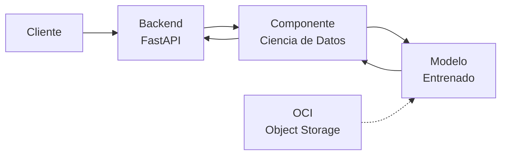
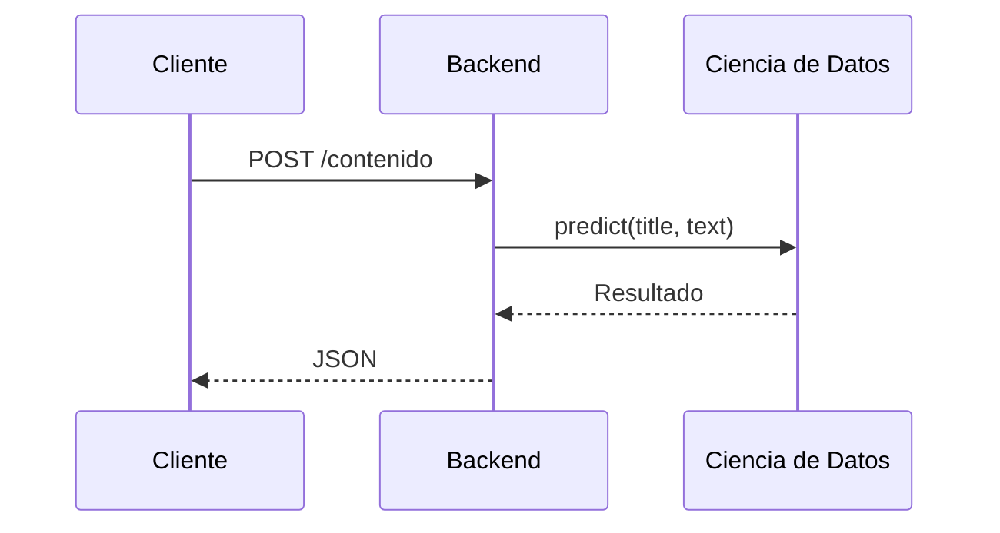
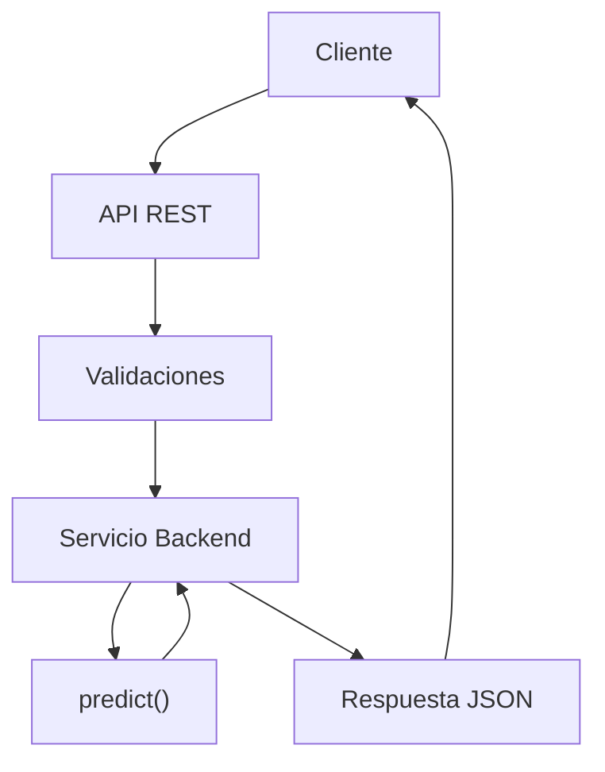
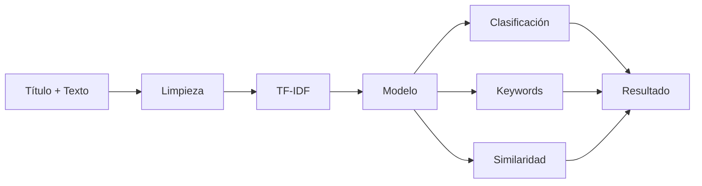
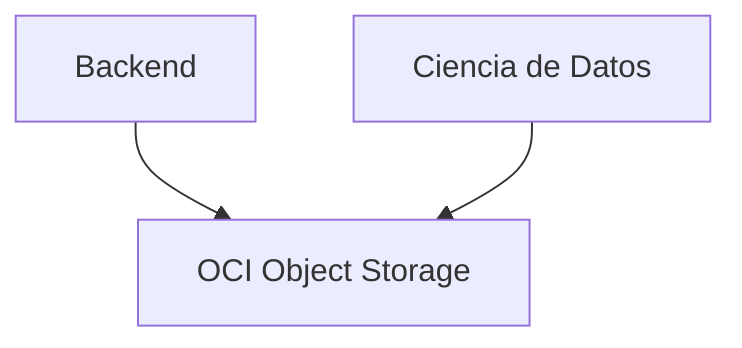
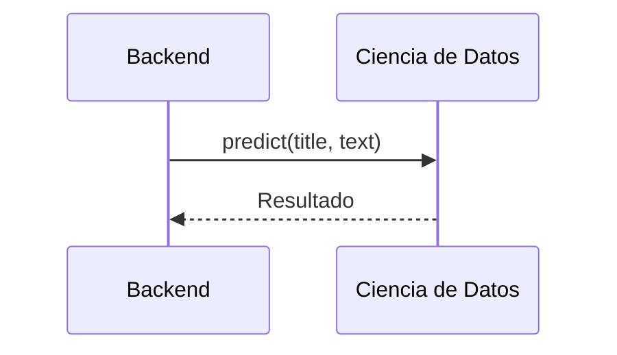

# Software Design Specification (SDS)

# TechMind – Organización Inteligente del Conocimiento Técnico

| Campo                 | Valor                                 |
| --------------------- | ------------------------------------- |
| **Versión**           | 1.0                                   |
| **Estado**            | Aprobado                              |
| **Fecha**             | Julio 2026                            |
| **Proyecto**          | Hackathon ONE – Oracle Next Education |
| **Tipo de documento** | Software Design Specification (SDS)   |

---

# Control de Versiones

| Versión | Fecha      | Autor(es)       | Descripción                    |
| ------- | ---------- | --------------- | ------------------------------ |
| 0.1     | Julio 2026 | Equipo TechMind | Primera versión del documento. |

---

# Tabla de Contenido

# Parte I - Fundamentos

────────────────────────

1. Información General
2. Filosofía del Proyecto
3. Introducción
4. Contexto del Proyecto
5. Alcance del MVP 

────────────────────────

# Parte II - Arquitectura 

────────────────────────

6. Arquitectura General

────────────────────────

# Parte III - Componentes del Sistema

────────────────────────

7. Componente Backend 

8. Componente Ciencia de Datos 

9. Infraestructura (OCI) 

────────────────────────

# Parte IV - Integración 

────────────────────────

10. Integración Backend ↔ Ciencia de Datos 

────────────────────────

# Parte V - Gestión del Proyecto 

────────────────────────

11. Evolución del MVP 

12. Riesgos 

13. Referencias y Anexos 

14. Aprobación del Documento 


****************************

---
# Parte I - Fundamentos
────────────────────────

# 1. Información General

## 1.1 Nombre del Proyecto

**TechMind – Organización Inteligente del Conocimiento Técnico**

---

## 1.2 Tipo de Proyecto

Desarrollo de un **Producto Mínimo Viable (MVP)** para el **Hackathon ONE – Oracle Next Education**, orientado a la organización automática de contenido técnico mediante técnicas de Ciencia de Datos y Machine Learning.

---

## 1.3 Objetivo del Proyecto

Desarrollar una plataforma capaz de recibir contenido técnico, clasificarlo automáticamente, extraer palabras clave relevantes y recomendar contenido similar mediante algoritmos de Machine Learning, exponiendo todas estas funcionalidades a través de una API REST.

---

## 1.4 Objetivo del Documento

Este documento describe el diseño de alto nivel del sistema TechMind.

Su propósito es establecer una visión compartida de la arquitectura, definir las responsabilidades de cada componente y documentar las principales decisiones técnicas adoptadas durante el desarrollo del proyecto.

El SDS servirá como referencia para el equipo durante todas las etapas del Hackathon.

---

## 1.5 Alcance del Documento

Este documento incluye:

* Arquitectura general del sistema.
* Componentes principales.
* Responsabilidades de cada módulo.
* Flujo de información.
* Modelo de Machine Learning.
* Contrato entre Backend y Ciencia de Datos.
* Diseño de la API REST.
* Infraestructura propuesta.
* Roadmap del proyecto.

No forma parte de este documento:

* Manual de usuario.
* Guía de instalación.
* Código fuente.
* Manual de operación.

---

## 1.6 Estado del Documento

Versión inicial en construcción.

El contenido evolucionará durante el desarrollo del proyecto y será actualizado conforme se complete cada Sprint.

---

## 1.7 Roles del Proyecto

El proyecto se organiza mediante roles claramente definidos. Cada rol podrá ser desempeñado por uno o más integrantes del equipo.

| Rol | Responsabilidad Principal |
|------|---------------------------|
| Líder del Proyecto | Coordinar el proyecto, facilitar la comunicación entre los equipos, realizar el seguimiento del cronograma y asegurar el cumplimiento del alcance del MVP. |
| Backend Developer | Diseñar e implementar la API REST, realizar validaciones, manejar errores e integrar el modelo de Machine Learning. |
| Data Science Developer | Construir el dataset, entrenar el modelo de Machine Learning, evaluar su desempeño y entregar los artefactos necesarios para producción. |
| Cloud Engineer | Configurar los servicios de Oracle Cloud Infrastructure y apoyar el despliegue del sistema. |
| QA / Testing | Diseñar y ejecutar pruebas funcionales y de integración para verificar el correcto funcionamiento del sistema. |

> **Nota:** La asignación de integrantes a cada rol se gestiona mediante la documentación del proyecto y podrá modificarse durante el desarrollo sin afectar el presente documento.
---

## 1.8 Documento Vivo

Este Software Design Specification (SDS) es un documento vivo.

Las decisiones arquitectónicas aquí registradas podrán evolucionar durante el desarrollo del proyecto siempre que exista una justificación técnica y el equipo apruebe el cambio correspondiente.

Todas las modificaciones relevantes deberán reflejarse en el historial de versiones del documento.

---


# 2. Filosofía del Proyecto

## 2.1 Propósito

TechMind se desarrolla bajo una filosofía orientada a la simplicidad, la colaboración y la entrega incremental de valor.

Las decisiones técnicas y organizacionales del proyecto buscarán mantener una arquitectura clara, fácil de entender y alineada con los objetivos del Hackathon ONE.

---

## 2.2 Principios

### Simplicidad primero (KISS)

Siempre que dos soluciones cumplan el mismo objetivo, se seleccionará la opción más simple.

El equipo evitará incorporar herramientas, frameworks o patrones de diseño que incrementen la complejidad sin aportar un beneficio claro para el MVP.

---

### Separación de responsabilidades

Cada componente del sistema tendrá responsabilidades claramente definidas.

- Backend gestionará la API REST.
- Ciencia de Datos desarrollará el modelo de Machine Learning.
- OCI proporcionará los servicios de infraestructura.
- El Frontend será únicamente un cliente de la API.

---

### Desarrollo incremental

El sistema evolucionará por Sprints.

Cada Sprint deberá entregar funcionalidades completas y verificables.

No se desarrollarán componentes que aún no sean necesarios para el Sprint actual.

---

### Documentación como parte del desarrollo

Toda decisión arquitectónica importante deberá reflejarse en la documentación oficial del proyecto.

La documentación será considerada un entregable del proyecto y no una actividad posterior.

---

### Automatización con propósito

Solo se automatizarán tareas que generen un beneficio claro para el equipo.

No se desarrollarán herramientas internas cuya complejidad sea mayor que el problema que resuelven.

---

### Colaboración

El proyecto será desarrollado de manera colaborativa.

Las interfaces entre componentes deberán estar claramente definidas para permitir que Backend y Ciencia de Datos trabajen de forma independiente.

---

## 2.3 Principio Rector

> Si una solución más simple cumple correctamente el objetivo del reto, esa será la solución elegida.

---


# 3. Introducción

## 3.1 Descripción General

TechMind es una plataforma diseñada para organizar contenido técnico mediante técnicas de Ciencia de Datos y Machine Learning.

El sistema recibe contenido técnico a través de una API REST, analiza el texto utilizando un modelo previamente entrenado y devuelve información estructurada que facilita su clasificación y consulta.

---

## 3.2 Objetivo General

Construir un Producto Mínimo Viable (MVP) que permita automatizar la clasificación de contenido técnico, la extracción de palabras clave y la recomendación de documentos relacionados.

---

## 3.3 Objetivos Específicos

- Clasificar contenido técnico automáticamente.
- Extraer palabras clave relevantes.
- Recomendar contenido similar mediante similaridad textual.
- Exponer las funcionalidades mediante una API REST.
- Integrar la solución con Oracle Cloud Infrastructure.

---

## 3.4 Usuarios del Sistema

Durante el Hackathon, el sistema será utilizado principalmente por:

- Equipo de desarrollo.
- Evaluadores del Hackathon.
- Jurado técnico.

---

## 3.5 Audiencia del Documento

Este documento está dirigido a:

- Integrantes del equipo.
- Revisores técnicos.
- Mentores.
- Jurado del Hackathon.

---


# 4. Contexto del Proyecto

## 4.1 Descripción del Hackathon

TechMind se desarrolla como respuesta al reto propuesto por el Hackathon ONE (Oracle Next Education), cuyo objetivo es aplicar técnicas de Ciencia de Datos para organizar contenido técnico de forma automática.

---

## 4.2 Problema

La información técnica suele encontrarse distribuida en múltiples documentos y formatos.

Su clasificación manual requiere tiempo y dificulta la consulta eficiente de la información.

---

## 4.3 Solución Propuesta

TechMind automatiza este proceso mediante un modelo de Machine Learning que clasifica documentos, identifica palabras clave relevantes y recomienda contenido relacionado utilizando técnicas de procesamiento de texto.

---

## 4.4 Restricciones

El proyecto se desarrollará bajo las siguientes restricciones:

- Tiempo limitado propio del Hackathon.
- Arquitectura orientada a un MVP.
- Integración con al menos un servicio de Oracle Cloud Infrastructure.
- Uso de técnicas de Machine Learning clásico.

---

## 4.5 Exclusiones

El proyecto no contempla:

- IA Generativa.
- Modelos LLM.
- Arquitecturas RAG.
- Agentes autónomos.
- Bases de datos vectoriales.
- Sistemas conversacionales.

---

# 5. Alcance del MVP

## 5.1 Funcionalidades Incluidas

El MVP deberá ser capaz de:

- Recibir contenido técnico mediante una API REST.
- Procesar texto utilizando un modelo de Machine Learning.
- Clasificar contenido técnico.
- Calcular la probabilidad de clasificación.
- Extraer palabras clave relevantes.
- Recomendar contenido relacionado mediante similaridad textual.
- Devolver resultados en formato JSON.
- Integrarse con Oracle Cloud Infrastructure.

---

## 5.2 Funcionalidades Excluidas

No forman parte del alcance del MVP:

- Interfaces web avanzadas.
- Autenticación de usuarios.
- Gestión de usuarios.
- Edición de documentos.
- Entrenamiento automático del modelo desde la API.
- IA Generativa.
- Chatbots.
- Arquitecturas RAG.
- Bases de datos vectoriales.

---

## 5.3 Criterios de Éxito

El MVP será considerado exitoso cuando:

- La API procese correctamente contenido técnico.
- El modelo clasifique el contenido.
- Se generen palabras clave relevantes.
- Se obtengan recomendaciones mediante similaridad textual.
- La respuesta sea entregada en formato JSON.
- El sistema se encuentre integrado con al menos un servicio de OCI.

---

## 5.4 Fuera del Alcance

Las siguientes funcionalidades podrán considerarse en futuras versiones del proyecto:

- Entrenamiento continuo.
- Panel administrativo.
- Gestión documental.
- Autenticación.
- Versionamiento de modelos.
- Múltiples modelos de Machine Learning.
- Analítica avanzada.


---


# Parte II -  Arquitectura 
────────────────────────

# 6. Arquitectura General

## 6.1 Objetivos de la Arquitectura

La arquitectura de TechMind ha sido diseñada para satisfacer los requerimientos funcionales del Hackathon ONE mediante una solución simple, modular y de fácil mantenimiento.

Los principales objetivos de la arquitectura son:

- Mantener una clara separación de responsabilidades entre los componentes del sistema.
- Permitir el desarrollo paralelo entre Backend y Ciencia de Datos.
- Facilitar la integración mediante interfaces bien definidas.
- Reducir el acoplamiento entre componentes.
- Favorecer la reutilización del modelo de Machine Learning.
- Facilitar el despliegue del MVP en Oracle Cloud Infrastructure.


## 6.2 Principios Arquitectónicos

La arquitectura del sistema se basa en los siguientes principios:

### Simplicidad

La solución prioriza componentes sencillos que cumplan con los objetivos del MVP sin introducir complejidad innecesaria.

### Separación de Responsabilidades

Cada componente posee una responsabilidad claramente definida y evita asumir funciones pertenecientes a otros módulos.

### Bajo Acoplamiento

La comunicación entre Backend y Ciencia de Datos se realiza mediante una interfaz estable, reduciendo las dependencias entre ambos componentes.

### Alta Cohesión

Cada componente concentra funcionalidades relacionadas con un mismo propósito.

### Evolución Incremental

La arquitectura permite incorporar nuevas funcionalidades sin modificar significativamente los componentes existentes.

## 6.3 Arquitectura General

La solución está compuesta por tres componentes principales:

- Backend
- Ciencia de Datos
- Oracle Cloud Infrastructure (OCI)

El cliente interactúa exclusivamente con el Backend mediante una API REST.

El Backend utiliza el componente de Ciencia de Datos para obtener predicciones y consume los recursos almacenados en OCI cuando es necesario.




## 6.4 Componentes del Sistema

La arquitectura se organiza en tres componentes principales.

| Componente | Propósito |
|------------|-----------|
| Backend | Exponer la API REST y coordinar el procesamiento de las solicitudes. |
| Ciencia de Datos | Entrenar el modelo de Machine Learning y generar predicciones. |
| Oracle Cloud Infrastructure | Proporcionar almacenamiento y servicios necesarios para el despliegue del MVP. |

El cliente (Swagger, Streamlit o HTML) actúa únicamente como consumidor de la API y no forma parte de la arquitectura principal del sistema.

---
## 6.5 Flujo General del Sistema

El procesamiento de una solicitud seguirá el siguiente flujo:



---

## 6.6 Decisiones Arquitectónicas

Las principales decisiones adoptadas para el diseño del sistema son:

- Arquitectura basada en Machine Learning clásico.
- Un único servicio REST implementado en Backend.
- Integración con Ciencia de Datos mediante una función de predicción.
- Separación clara entre entrenamiento y predicción.
- Uso de Oracle Cloud Infrastructure para almacenamiento de artefactos.
- Exclusión de IA Generativa, arquitecturas RAG y bases de datos vectoriales por no formar parte del alcance del MVP.

# Parte III - Componentes del Sistema
────────────────────────

# 7. Componente Backend

## 7.1 Objetivo

El componente Backend es responsable de exponer la API REST del sistema, recibir las solicitudes de los clientes, validar la información de entrada, coordinar la ejecución del componente de Ciencia de Datos y construir las respuestas en formato JSON.

El Backend constituye el único punto de acceso al sistema y centraliza la comunicación entre los diferentes componentes de la solución.

---

## 7.2 Responsabilidades

El componente Backend tiene las siguientes responsabilidades:

- Exponer los endpoints de la API REST.
- Validar los datos recibidos.
- Gestionar errores y excepciones.
- Invocar la función de predicción del componente de Ciencia de Datos.
- Construir las respuestas HTTP.
- Exponer información sobre el estado del sistema.

El Backend no realiza entrenamiento del modelo de Machine Learning ni procesamiento avanzado de texto.

---

## 7.3 Arquitectura Interna

El Backend se organiza en módulos independientes con responsabilidades claramente definidas.



---

## 7.4 Flujo de Trabajo

El procesamiento de una solicitud seguirá el siguiente flujo:

1. El cliente envía una solicitud HTTP.
2. El Backend valida la información recibida.
3. El Backend invoca la función `predict()`.
4. El componente de Ciencia de Datos procesa la solicitud.
5. El Backend recibe el resultado.
6. El Backend construye la respuesta HTTP.
7. El cliente recibe la respuesta en formato JSON.

---

## 7.5 Entradas

El Backend recibe solicitudes HTTP provenientes del cliente.

Las solicitudes incluyen información como:

| Campo | Tipo |
|--------|------|
| title | String |
| text | String |

---

## 7.6 Salidas

El Backend devuelve respuestas HTTP en formato JSON.

Ejemplo:

```json
{
  "categoria": "Backend",
  "probabilidad": 0.95,
  "keywords": [
    "FastAPI",
    "Python"
  ],
  "similares": [
    {
      "titulo": "Introducción a APIs REST",
      "score": 0.91
    }
  ]
}
```

---

## 7.7 Dependencias

El componente Backend depende de:

- Componente de Ciencia de Datos.
- Modelo entrenado (indirectamente).
- Oracle Cloud Infrastructure para el acceso a los artefactos del sistema cuando sea necesario.

---

## 7.8 Tecnologías

Las principales tecnologías utilizadas son:

| Tecnología | Propósito |
|------------|-----------|
| Python | Lenguaje de programación |
| FastAPI | API REST |
| Uvicorn | Servidor ASGI |
| Pydantic | Validación de datos |

---

## 7.9 Artefactos

El componente Backend estará compuesto, entre otros, por los siguientes elementos:

- API REST
- Endpoints
- Modelos de entrada y salida
- Servicios
- Validaciones
- Manejo de errores

La estructura física del código se definirá durante la fase de implementación y podrá evolucionar sin afectar la arquitectura descrita en este documento.

---

## 7.10 Consideraciones

El Backend constituye el único punto de entrada al sistema.

Ningún cliente interactuará directamente con el componente de Ciencia de Datos ni con Oracle Cloud Infrastructure.

Esta decisión simplifica la arquitectura, reduce el acoplamiento y facilita el mantenimiento del sistema.
---


# 8. Componente Ciencia de Datos

| Atributo | Valor |
|----------|-------|
| Nombre | Ciencia de Datos |
| Tipo | Componente |
| Responsable | Rol Data Science Developer |
| Estado | Diseño |
| Interfaces | Función `predict()` |
| Dependencias | Ninguna dependencia directa con Backend |

---

## 8.1 Objetivo

El componente de Ciencia de Datos es responsable del desarrollo, entrenamiento y utilización del modelo de Machine Learning encargado de procesar contenido técnico.

Su propósito es transformar texto no estructurado en información organizada que permita clasificar documentos, identificar palabras clave relevantes y recomendar contenido similar.

El componente funciona de manera independiente del Backend y expone una única función de predicción para su integración.

---

## 8.2 Responsabilidades

El componente tiene las siguientes responsabilidades:

- Construir el dataset de entrenamiento.
- Realizar el análisis exploratorio de datos (EDA).
- Limpiar y preparar el contenido textual.
- Generar representaciones vectoriales mediante TF-IDF.
- Entrenar el modelo de clasificación.
- Evaluar el desempeño del modelo.
- Exportar los artefactos necesarios para producción.
- Ejecutar predicciones durante la operación del sistema.

---

## 8.3 Pipeline de Entrenamiento

El entrenamiento del modelo se ejecuta de forma independiente al Backend.

Su resultado es un conjunto de artefactos reutilizables por el sistema.


---
## 8.4 Pipeline de Predicción

Durante la ejecución del sistema, el componente procesa las solicitudes enviadas por el Backend utilizando el modelo previamente entrenado.



---

## 8.5 Entradas

El componente recibe la siguiente información:

| Campo | Tipo |
|--------|------|
| title | String |
| text | String |

---

## 8.6 Salidas

El componente devuelve una estructura con la siguiente información:

- Categoría del contenido.
- Probabilidad de clasificación.
- Palabras clave.
- Lista de documentos similares.

La respuesta será utilizada por el Backend para construir la respuesta HTTP.

---

## 8.7 Dependencias

El componente depende de:

- Dataset de entrenamiento.
- Modelo entrenado.
- Vectorizador TF-IDF.

No existe dependencia directa con FastAPI ni con protocolos HTTP.

---

## 8.8 Tecnologías

| Tecnología | Propósito |
|------------|-----------|
| Python | Lenguaje de programación |
| Pandas | Manipulación de datos |
| NumPy | Procesamiento numérico |
| Scikit-Learn | Machine Learning |
| TF-IDF | Vectorización de texto |
| Logistic Regression | Clasificación |
| Cosine Similarity | Recomendación |
| Joblib | Persistencia del modelo |

---

## 8.9 Artefactos

El componente genera los siguientes artefactos:

- `modelo.joblib`
- `vectorizer.joblib`
- `config.json`
- `predict.py`

Estos artefactos serán utilizados por el Backend durante la ejecución del sistema.

---

## 8.10 Consideraciones

El entrenamiento del modelo es un proceso independiente del Backend y se ejecuta únicamente cuando es necesario actualizar el modelo.

Durante la operación normal del sistema, el Backend utiliza únicamente la función `predict()` y los artefactos previamente generados.

Esta separación reduce el acoplamiento entre componentes y facilita la evolución del modelo sin afectar el resto de la arquitectura.
---


# 9. Infraestructura (OCI)

| Atributo | Valor |
|----------|-------|
| Nombre | Oracle Cloud Infrastructure (OCI) |
| Tipo | Infraestructura |
| Responsable | Rol Cloud Engineer |
| Estado | Diseño |
| Dependencias | Backend y Ciencia de Datos |

---

## 9.1 Objetivo

El componente Oracle Cloud Infrastructure (OCI) proporciona los servicios de infraestructura necesarios para soportar el almacenamiento de los artefactos del proyecto y el despliegue del MVP.

Su utilización responde al requerimiento del Hackathon ONE de integrar la solución con al menos un servicio de Oracle Cloud Infrastructure.

---

## 9.2 Responsabilidades

El componente OCI tendrá las siguientes responsabilidades:

- Almacenar los modelos entrenados.
- Almacenar datasets utilizados durante el desarrollo.
- Almacenar documentación del proyecto.
- Facilitar el despliegue del Backend cuando sea requerido.
- Centralizar los artefactos utilizados por el sistema.

---

## 9.3 Arquitectura del Componente

La infraestructura propuesta utiliza Oracle Cloud Infrastructure como plataforma de almacenamiento para los recursos del proyecto.



---

## 9.4 Servicios Utilizados

Para el desarrollo del MVP se utilizarán los siguientes servicios de Oracle Cloud Infrastructure.

| Servicio | Propósito |
|----------|-----------|
| OCI Object Storage | Almacenamiento de modelos, datasets y documentación. |
| OCI Compute | Despliegue del Backend (opcional). |

El uso de servicios adicionales será evaluado únicamente si aportan valor al MVP.

---

## 9.5 Entradas

OCI almacenará información generada por los diferentes componentes del sistema.

Entre los principales artefactos se encuentran:

- Modelo entrenado.
- Vectorizador TF-IDF.
- Dataset.
- Documentación técnica.
- Evidencias del proyecto.

---

## 9.6 Salidas

OCI proporcionará acceso a los recursos necesarios para la ejecución y mantenimiento del sistema.

Dependiendo del escenario de despliegue, estos recursos podrán ser consumidos por el Backend o por el equipo de desarrollo.

---

## 9.7 Dependencias

El componente OCI interactúa con:

- Componente Backend.
- Componente Ciencia de Datos.

No participa directamente en el procesamiento de las solicitudes realizadas por el cliente.

---

## 9.8 Tecnologías

| Tecnología | Propósito |
|------------|-----------|
| OCI Object Storage | Almacenamiento de artefactos |
| OCI Compute (opcional) | Despliegue del Backend |

---

## 9.9 Artefactos

OCI almacenará principalmente los siguientes recursos:

- `modelo.joblib`
- `vectorizer.joblib`
- `config.json`
- Dataset de entrenamiento
- Documentación del proyecto
- Evidencias del Hackathon

---

## 9.10 Consideraciones

La arquitectura utiliza únicamente los servicios de Oracle Cloud Infrastructure necesarios para cumplir con los objetivos del MVP.

La incorporación de nuevos servicios deberá justificarse en función de los requerimientos del proyecto y del valor que aporten a la solución.

Esta decisión mantiene la arquitectura simple, reduce la complejidad operativa y facilita el desarrollo dentro del tiempo disponible para el Hackathon.

---

## 9.11 Vista de Integración de Componentes

La siguiente vista resume la interacción entre los tres componentes principales del sistema. Su objetivo es mostrar las dependencias y el flujo de información antes de describir el contrato de integración entre Backend y Ciencia de Datos.

                 Cliente
                    │
                    ▼
             ┌────────────┐
             │  Backend   │
             └────────────┘
                    │
            predict(title,text)
                    │
                    ▼
        ┌─────────────────────┐
        │ Ciencia de Datos    │
        └─────────────────────┘
               │
               │ Lee / Guarda
               ▼
     ┌─────────────────────────┐
     │ OCI Object Storage      │
     └─────────────────────────┘


# Parte IV - Integración
────────────────────────
# 10. Integración Backend ↔ Ciencia de Datos

## 10.1 Objetivo

Este capítulo describe la forma en que los componentes del sistema intercambian información durante la ejecución del MVP.

Su propósito es definir un contrato claro de integración que permita mantener un bajo acoplamiento entre el Backend y el componente de Ciencia de Datos.

La integración se realiza mediante una única interfaz pública, evitando que el Backend dependa de los detalles internos del modelo de Machine Learning.

## 10.2 Integración Backend ↔ Ciencia de Datos

El Backend utiliza el componente de Ciencia de Datos para obtener las predicciones del modelo de Machine Learning.

La comunicación se realiza mediante una llamada directa a la función pública `predict()`, sin utilizar protocolos HTTP ni servicios independientes.



## 10.3 Contrato de Integración

El componente de Ciencia de Datos expone una única función pública para ser utilizada por el Backend.

### Entrada

| Campo | Tipo | Obligatorio |
|--------|------|-------------|
| title | String | Sí |
| text | String | Sí |

---

### Salida

La función devuelve una estructura con la siguiente información:

| Campo | Tipo |
|--------|------|
| categoria | String |
| probabilidad | Float |
| keywords | Lista |
| similares | Lista |

## 10.4 Flujo de Integración

El flujo de integración entre ambos componentes es el siguiente:

1. El Backend recibe una solicitud del cliente.
2. Valida la información de entrada.
3. Invoca la función `predict(title, text)`.
4. El componente de Ciencia de Datos procesa la información.
5. Se obtiene el resultado de la predicción.
6. El Backend construye la respuesta HTTP.
7. El cliente recibe la respuesta en formato JSON.

## 10.5 Manejo de Errores

Cada componente será responsable de gestionar los errores asociados a sus propias responsabilidades.

El componente de Ciencia de Datos notificará errores de procesamiento mediante excepciones controladas.

El Backend interpretará dichas excepciones y generará las respuestas HTTP correspondientes.

Esta separación evita que el componente de Ciencia de Datos tenga conocimiento del protocolo HTTP o de la implementación del Backend.

## 10.6 Consideraciones

La integración entre Backend y Ciencia de Datos se basa en una interfaz estable y desacoplada.

Esta decisión permite que ambos componentes evolucionen de forma independiente, siempre que se mantenga el contrato de integración definido en este capítulo.

La incorporación de nuevos modelos o mejoras internas en el componente de Ciencia de Datos no requerirá modificaciones en el Backend mientras la interfaz pública permanezca sin cambios.


# Parte V - Gestión del Proyecto
────────────────────────
# 11. Evolución del MVP

## 11.1 Objetivo

Este capítulo describe la evolución técnica prevista del MVP durante su desarrollo incremental.

Su propósito es proporcionar una visión general del progreso esperado del sistema, alineando las actividades de Backend, Ciencia de Datos e Infraestructura con los objetivos definidos para cada Sprint.

Las fechas y la asignación de tareas forman parte de la documentación de gestión del proyecto y no de este documento.

## 11.2 Evolución del MVP

| Sprint | Objetivo | Componentes | Entregables |
|---------|----------|-------------|-------------|
| Sprint 0 | Definir la arquitectura del sistema y preparar el entorno de trabajo. | Arquitectura | SDS, estructura del repositorio, Git, acuerdos técnicos. |
| Sprint 1 | Construir la base del sistema. | Backend, Ciencia de Datos | Dataset inicial, EDA, API base, estructura del proyecto. |
| Sprint 2 | Implementar la funcionalidad principal del MVP. | Backend, Ciencia de Datos | Modelo entrenado, integración Backend ↔ Ciencia de Datos, endpoints principales. |
| Sprint 3 | Preparar la entrega del proyecto. | Backend, Ciencia de Datos, OCI | Despliegue, documentación, demostración y presentación final. |

Cada Sprint incorpora capacidades técnicas al sistema manteniendo la arquitectura definida en este documento. La evolución se realiza de forma incremental, preservando el contrato de integración entre el Backend y el componente de Ciencia de Datos. La planificación detallada de actividades, responsables y cronograma se documenta en los artefactos de gestión del proyecto y no forma parte del SDS.


## 11.3 Evolución de la Arquitectura

La arquitectura de TechMind evoluciona de forma incremental, incorporando nuevas capacidades en cada Sprint sin modificar la estructura general del sistema.

Desde el inicio del proyecto se mantiene una separación clara entre los componentes Backend, Ciencia de Datos e Infraestructura, permitiendo que cada uno evolucione de forma independiente mientras se conserva el contrato de integración definido en este documento.

La evolución arquitectónica prevista puede resumirse de la siguiente manera:

| Etapa             | Evolución Arquitectónica                                                                                  |
| ----------------- | --------------------------------------------------------------------------------------------------------- |
| Arquitectura Base | Definición de componentes, responsabilidades y contrato de integración.                                   |
| Base Funcional    | Desarrollo del Backend, construcción del pipeline de Ciencia de Datos y entrenamiento inicial del modelo. |
| MVP Integrado     | Integración Backend ↔ Ciencia de Datos, persistencia del modelo y exposición de la API REST.              |
| MVP Desplegado    | Publicación del sistema utilizando Oracle Cloud Infrastructure y documentación técnica completa.          |


La arquitectura fue diseñada para facilitar futuras extensiones del sistema sin afectar la integración entre componentes. La incorporación de nuevos algoritmos, mejoras en el preprocesamiento o cambios en la infraestructura podrá realizarse manteniendo estable la interfaz pública del componente de Ciencia de Datos.


# 12. Riesgos

## 12.1 Objetivo

Este capítulo identifica los principales riesgos técnicos que podrían afectar el desarrollo o la operación del MVP.

Su propósito es anticipar posibles inconvenientes y definir estrategias generales de mitigación durante el desarrollo del proyecto.

---

## 12.2 Riesgos Identificados

| ID | Riesgo | Impacto | Mitigación |
|----|---------|----------|------------|
| R-01 | Calidad insuficiente del dataset | Alto | Validar y depurar los datos antes del entrenamiento. |
| R-02 | Bajo desempeño del modelo | Medio | Evaluar diferentes configuraciones y métricas durante el entrenamiento. |
| R-03 | Problemas de integración entre Backend y Ciencia de Datos | Alto | Mantener estable el contrato de integración definido en el Capítulo 10. |
| R-04 | Limitaciones de tiempo del Hackathon | Alto | Priorizar las funcionalidades definidas dentro del alcance del MVP. |
| R-05 | Disponibilidad de servicios OCI | Medio | Mantener una estrategia de despliegue alternativa durante el desarrollo. |

---

## 12.3 Estrategia General

Los riesgos serán revisados al finalizar cada Sprint.

Las decisiones de mitigación deberán priorizar el cumplimiento del alcance del MVP, manteniendo la simplicidad de la arquitectura y evitando incorporar funcionalidades fuera del alcance definido.
---

# 13. Referencias y Anexos

## 13.1 Referencias

El desarrollo del proyecto se basa en los siguientes documentos y recursos:

- Documento oficial del Hackathon ONE.
- Documentación oficial de FastAPI.
- Documentación oficial de Scikit-Learn.
- Documentación oficial de Oracle Cloud Infrastructure.
- Documentación oficial de Python.

---

## 13.2 Glosario

| Término | Descripción |
|----------|-------------|
| API | Interfaz de Programación de Aplicaciones. |
| TF-IDF | Técnica de vectorización utilizada para representar texto. |
| Logistic Regression | Algoritmo de clasificación supervisada. |
| Cosine Similarity | Técnica para medir la similitud entre documentos. |
| MVP | Producto Mínimo Viable. |
| OCI | Oracle Cloud Infrastructure. |

---

## 13.3 Documentos Relacionados

La documentación oficial del proyecto incluye, entre otros:

- README
- ADR
- Actas de reunión
- Roadmap del proyecto
- Estándares de desarrollo
- Architecture Decision Records (ADR)

---

## 13.4 Historial del Documento

| Versión | Descripción |
|----------|-------------|
| 0.1 | Primera versión del Software Design Specification. |
| 1.0 | Software Design Specification Aprobado |


# 14. Aprobación del Documento

El presente Software Design Specification (SDS) representa la arquitectura objetivo del proyecto TechMind para el desarrollo del MVP del Hackathon ONE.

Las decisiones documentadas en esta versión constituyen la base para la implementación del sistema y podrán evolucionar mediante consenso del equipo cuando exista una justificación técnica que lo requiera.

La aprobación de este documento implica el compromiso del equipo de desarrollar la solución respetando los principios arquitectónicos y el alcance definidos en este SDS.


---

## Estado del Documento

Este documento corresponde a la versión **0.1** del Software Design Specification de TechMind.

Describe la arquitectura objetivo del MVP y servirá como guía durante el desarrollo del proyecto.

El contenido será actualizado de forma incremental conforme avance cada Sprint y se consoliden las decisiones técnicas del equipo.