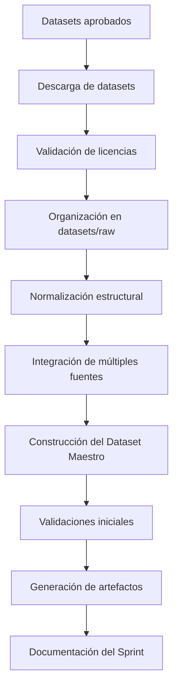
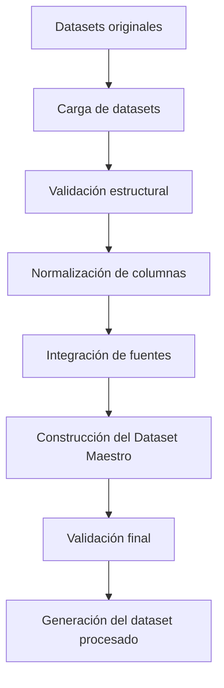

# Sprint DS-03
# Construcción e Integración del Dataset
# DS-03 — Construcción e Integración del Dataset Maestro

## Fase 1 — Análisis del Sprint

### Estado del Proyecto

Las fases anteriores ya fueron completadas:

- ✅ DS-01 — Arquitectura del Componente de Ciencia de Datos
- ✅ DS-02 — Investigación y Selección de Datasets

En este sprint comenzaremos la construcción del primer **Dataset Maestro** que será utilizado durante todo el pipeline de Machine Learning.

Este dataset constituirá la fuente oficial de datos para las etapas posteriores de limpieza, validación, entrenamiento y evaluación del modelo.

---

# Objetivo General

Construir la **Base de Conocimiento TechMind** mediante un pipeline reproducible que integre múltiples fuentes de datos y genere un Dataset Maestro unificado para las siguientes etapas del componente de Ciencia de Datos.

---

## Objetivos Específicos

Durante este sprint se realizarán las siguientes actividades:

- Organizar las fuentes de datos.
- Implementar los loaders.
- Validar la estructura de cada fuente.
- Definir el Canonical Schema.
- Integrar todas las fuentes.
- Construir la Base de Conocimiento TechMind.
- Exportar el Dataset Maestro.
- Documentar el proceso.

## Referencia de Arquitectura

La arquitectura del pipeline utilizada durante este sprint se encuentra documentada en:

- `docs/architecture/DataScience-Pipeline.md`

---

# Alcance

Este sprint incluye:

- Descarga de datasets.
- Organización del directorio `datasets/raw`.
- Creación del inventario de datos.
- Integración de múltiples fuentes.
- Construcción del Dataset Maestro.
- Validaciones estructurales.
- Reportes descriptivos.
- Documentación.

Este sprint **NO incluye**:

- Limpieza de datos.
- Eliminación de duplicados.
- Balanceo de clases.
- Ingeniería de características.
- Vectorización.
- Entrenamiento del modelo.

Estas actividades serán desarrolladas en los siguientes sprints.

---

# Dependencias

Para iniciar este sprint se requiere que:

- La arquitectura del componente DS esté aprobada.
- Los datasets hayan sido seleccionados en DS-02.
- El repositorio se encuentre sincronizado.
- La estructura del proyecto esté creada.

Todas estas condiciones ya se cumplen.

---

## Entregables

### Documentación

- DS-03 actualizado.
- DataScience-Pipeline.md.

### Implementación

- schema.py
- loaders.py
- validator.py
- integrator.py
- builder.py

### Datos

- Base de Conocimiento TechMind.
- Dataset Maestro.

---

# Criterios de Éxito

El Sprint se considerará exitoso cuando:

- Todas las fuentes estén documentadas.
- Exista trazabilidad de los datos.
- El Dataset Maestro pueda reconstruirse de forma reproducible.
- Los datos originales permanezcan inalterados.
- El repositorio quede preparado para DS-04.

---

# Riesgos

| Riesgo | Impacto | Mitigación |
|----------|----------|------------|
| Cambios en las fuentes originales | Alto | Mantener copia local en `raw/` |
| Licencias incompatibles | Alto | Validar antes de integrar |
| Estructuras diferentes | Medio | Definir esquema canónico |
| Diferentes codificaciones | Medio | Normalizar lectura |
| Datos incompletos | Medio | Detectar durante validaciones |
| Duplicados entre fuentes | Bajo | Registrar para DS-04 |

---

# Flujo General




---

# Definición de Done (DoD)

El Sprint DS-03 estará finalizado cuando:

- Exista un Dataset Maestro.
- El inventario esté actualizado.
- Los datasets originales estén organizados.
- Se hayan generado reportes descriptivos.
- Toda la documentación esté actualizada.
- El proyecto quede listo para iniciar DS-04.


# DS-03 — Fase 2: Diseño de la Solución

## Objetivo

Diseñar el proceso de construcción del **Dataset Maestro** del proyecto TechMind, definiendo la organización de los datos, el flujo de integración y los artefactos que se generarán durante el sprint.

El diseño deberá garantizar:

- Reproducibilidad.
- Trazabilidad.
- Escalabilidad.
- Mantenibilidad.
- Integridad de los datos originales.

---

# Principios de Diseño

La construcción del Dataset Maestro seguirá los siguientes principios:

## Inmutabilidad

Los datasets originales nunca serán modificados.

Todos los archivos descargados permanecerán almacenados en:

```text
datasets/raw/
```

Cualquier transformación se realizará sobre copias de trabajo.

---

## Reproducibilidad

El Dataset Maestro deberá poder reconstruirse completamente a partir de las fuentes originales mediante un proceso automatizado.

No se permitirán modificaciones manuales sobre el dataset final.

---

## Trazabilidad

Cada registro del Dataset Maestro deberá conservar información sobre su origen.

Como mínimo, se registrará:

- Fuente de datos.
- Categoría de origen.
- Fecha de integración (si aplica).
- Identificador del registro original (cuando exista).

---

## Esquema Canónico

Antes de integrar las distintas fuentes, todas deberán transformarse a una estructura común.

El esquema inicial será:

| Campo | Descripción |
|--------|-------------|
| source | Fuente del registro |
| source_id | Identificador original (si existe) |
| title | Título o resumen del problema |
| text | Contenido principal |
| label | Categoría objetivo |
| dataset | Nombre del dataset de origen |

Este esquema podrá ampliarse en futuros sprints sin romper la compatibilidad.

---

# Flujo de Construcción



---

# Organización de Directorios

```text
datasets/

├── raw/
├── external/
├── interim/
└── processed/
```

---
# Componentes del Pipeline

| Archivo | Responsabilidad |
|----------|-----------------|
| schema.py | Definir el Canonical Schema |
| loaders.py | Cargar las fuentes de datos |
| validator.py | Validar la estructura |
| integrator.py | Integrar los DataFrames |
| builder.py | Ejecutar el pipeline completo |

---

# Artefactos Generados

Durante este sprint se generarán los siguientes artefactos:

| Artefacto | Descripción |
|------------|-------------|
| inventory.md | Inventario de datasets |
| master_dataset.csv | Dataset Maestro integrado |
| dataset_summary.md | Resumen estadístico inicial |
| dataset_info.json | Información general del dataset |
| column_statistics.csv | Estadísticas descriptivas por columna |

---

# Validaciones Iniciales

Antes de considerar válido el Dataset Maestro, se verificarán:

- Lectura correcta de todos los archivos.
- Existencia de las columnas obligatorias.
- Codificación UTF-8.
- Cantidad de registros por fuente.
- Cantidad total de registros.
- Valores nulos por columna.
- Duplicados exactos.
- Tipos de datos consistentes.

Estas validaciones serán informativas y no modificarán los datos.

---

# Responsabilidades del Sprint

| Componente | Responsabilidad |
|------------|-----------------|
| datasets/raw | Almacenar datos originales |
| Pipeline de integración | Construir el Dataset Maestro |
| datasets/processed | Almacenar el dataset final |
| reports | Generar reportes descriptivos |
| inventory.md | Mantener el registro de las fuentes |

---

# Resultado Esperado

Al finalizar esta fase existirá un proceso claramente definido para construir el Dataset Maestro de forma automática, garantizando la trazabilidad de las fuentes, la conservación de los datos originales y la preparación del proyecto para el Sprint DS-04.