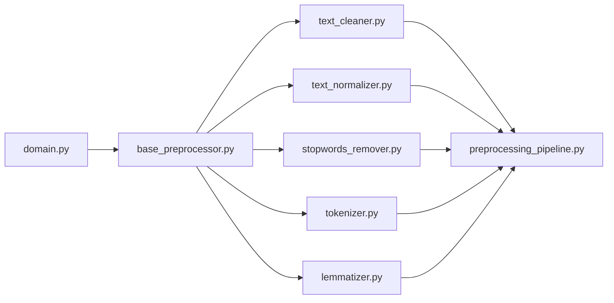

# Sprint DS-04 – Preprocesamiento del Dataset

| Atributo | Valor |
|----------|-------|
| Proyecto | TechMind – Organización Inteligente del Conocimiento Técnico |
| Componente | Data Science |
| Sprint | DS-04 |
| Estado | Implementado y Validado |
| Versión | 2.0 |
| Fecha | Julio 2026 |

## Tabla de Contenido

1. Introducción
2. Motivación
3. Arquitectura del Pipeline
4. Componentes
5. Modelo de Datos
6. Decisiones Arquitectónicas
7. Dependencias
8. Estrategia de Testing
9. Implementación
10. Restricciones
11. Riesgos y Consideraciones
12. Extensión Futura
13. Entregables
14. Conclusiones
15. Referencias

---

# 1. Introducción

## 1.1 Objetivo

El objetivo del Sprint DS-04 fue diseñar e implementar el módulo de preprocesamiento del dataset del componente de Ciencia de Datos de TechMind.

Como resultado del Sprint, se desarrolló un pipeline de procesamiento textual responsable de transformar los documentos obtenidos durante la etapa de adquisición en una representación limpia, consistente y preparada para las siguientes fases del pipeline de Machine Learning.

La implementación realizada permite estandarizar información proveniente de múltiples fuentes, reducir el ruido presente en los datos y mejorar la calidad de la información utilizada durante el entrenamiento del modelo de clasificación.

---

## 1.2 Contexto

Durante los Sprints anteriores se desarrolló la infraestructura necesaria para la adquisición y construcción del dataset.

Como resultado de este trabajo, el componente de Ciencia de Datos es capaz de obtener documentos técnicos desde diferentes fuentes, interpretarlos mediante *Readers* especializados y consolidarlos en una estructura común representada por `DocumentRecord`.

En el Sprint DS-04 se implementó la etapa de preprocesamiento textual, cuya finalidad es preparar el contenido de los documentos para las fases posteriores de Ingeniería de Características, Entrenamiento, Evaluación e Inferencia del modelo de Machine Learning.

---

## 1.3 Alcance

El Sprint DS-04 comprendió el diseño e implementación de un pipeline de preprocesamiento compuesto por etapas independientes, cada una responsable de una transformación específica del texto.

Las funcionalidades implementadas fueron:

- Limpieza del contenido textual.
- Normalización del texto.
- Eliminación de palabras vacías (*Stop Words*).
- Tokenización.
- Lematización.
- Orquestación del pipeline de preprocesamiento.

Las siguientes funcionalidades quedaron fuera del alcance de este Sprint y serán abordadas en etapas posteriores del proyecto:

- Ingeniería de características (TF-IDF, Embeddings u otras representaciones).
- Entrenamiento del modelo.
- Evaluación del modelo.
- Persistencia de artefactos de Machine Learning.
- Predicción y clasificación de documentos.

---

## 1.4 Estado del Proyecto

Al finalizar el Sprint DS-04, el componente de Ciencia de Datos dispone de las siguientes capacidades:

- Arquitectura general del componente.
- Readers especializados para múltiples formatos.
- Loaders para distintas fuentes de información.
- Construcción y validación del dataset.
- Modelo de dominio `DocumentRecord`.
- Modelo de dominio `ProcessedDocument`.
- Pipeline de preprocesamiento completamente implementado.
- Validación mediante pruebas unitarias e integración.

Con la finalización de este Sprint, el componente de Data Science cuenta con una base sólida para iniciar las siguientes etapas del proyecto, correspondientes a la Ingeniería de Características y al entrenamiento del modelo de clasificación.

---

# 2. Motivación

## 2.1 Problema

Los documentos recopilados desde distintas fuentes presentan diferencias de formato, estructura y calidad. Estas diferencias incluyen caracteres innecesarios, variaciones en el uso de mayúsculas y minúsculas, palabras de escaso valor semántico y otras inconsistencias que pueden afectar negativamente el desempeño de un modelo de Machine Learning.

Entrenar un modelo directamente sobre este contenido incrementa el ruido en los datos y reduce la capacidad del algoritmo para identificar patrones relevantes.

Por este motivo, fue necesario incorporar una etapa de preprocesamiento que transformara el contenido original en una representación textual homogénea y adecuada para las siguientes fases del pipeline de Machine Learning.

---

## 2.2 Objetivos Técnicos

El diseño e implementación del módulo de preprocesamiento persiguió los siguientes objetivos:

- Implementar una arquitectura modular basada en componentes independientes.
- Mantener una única responsabilidad por componente (SRP).
- Reducir el acoplamiento entre las etapas del pipeline.
- Facilitar las pruebas unitarias de cada transformación.
- Permitir la incorporación de nuevas etapas sin modificar la arquitectura existente.
- Preservar el contenido original del documento durante todo el proceso.

Todos estos objetivos fueron alcanzados durante el desarrollo del Sprint DS-04.

---

## 2.3 Principios Arquitectónicos

El módulo de preprocesamiento fue diseñado siguiendo los principios arquitectónicos definidos para el proyecto TechMind:

- Simplicidad (KISS).
- Separación de responsabilidades.
- Bajo acoplamiento.
- Alta cohesión.
- Reutilización de componentes.
- Evolución incremental.
- Arquitectura modular.

Estos principios guiaron tanto el diseño como la implementación del pipeline de preprocesamiento.

---

# 3. Arquitectura del Pipeline

## 3.1 Visión General

El módulo de preprocesamiento implementa el patrón arquitectónico **Pipeline**, donde cada transformación del texto es realizada por un componente independiente con una única responsabilidad.

Esta arquitectura desacopla las distintas etapas del procesamiento, facilitando su reutilización, mantenimiento y evolución sin afectar el resto del sistema.

Cada componente recibe un documento como entrada, aplica una transformación específica y entrega el resultado al siguiente componente del pipeline.

La coordinación de estas etapas es responsabilidad del componente `PreprocessingPipeline`, cuyo único propósito es definir y ejecutar el orden de procesamiento.

---

## 3.2 Arquitectura General


---

## 3.3 Flujo de Procesamiento

El procesamiento de un documento sigue la siguiente secuencia:

1. Recepción del documento (`DocumentRecord`).
2. Limpieza del contenido textual.
3. Normalización del texto.
4. Eliminación de palabras vacías.
5. Tokenización.
6. Lematización.
7. Construcción del objeto `ProcessedDocument`.

Cada etapa opera de forma independiente y ejecuta exclusivamente la transformación que le corresponde.

El `PreprocessingPipeline` no contiene lógica de procesamiento textual; únicamente coordina la ejecución secuencial de cada componente.

---

## 3.4 Componentes del Pipeline

El módulo está compuesto por los siguientes componentes:

| Componente | Responsabilidad |
|------------|-----------------|
| BasePreprocessor | Definir la interfaz común para todas las etapas del pipeline. |
| TextCleaner | Eliminar caracteres innecesarios y limpiar el texto. |
| TextNormalizer | Normalizar el contenido textual. |
| StopWordsRemover | Eliminar palabras vacías. |
| Tokenizer | Dividir el texto en tokens. |
| Lemmatizer | Obtener el lema de cada token. |
| PreprocessingPipeline | Coordinar la ejecución de todas las etapas. |

---

## 3.5 Principios del Pipeline

La arquitectura del módulo cumple los siguientes principios:

- Cada componente posee una única responsabilidad.
- Ningún componente conoce la implementación interna de los demás.
- Las etapas pueden reutilizarse de forma independiente.
- Es posible incorporar nuevas etapas sin modificar las existentes.
- El documento original permanece inmutable durante todo el procesamiento.
- El pipeline actúa únicamente como orquestador del flujo de procesamiento.

---

## 3.6 Beneficios de la Arquitectura

La arquitectura implementada proporciona los siguientes beneficios:

- Facilita las pruebas unitarias de cada componente.
- Favorece la reutilización del código.
- Reduce el acoplamiento entre módulos.
- Incrementa la mantenibilidad del componente.
- Permite incorporar nuevas transformaciones sin modificar el pipeline existente.
- Facilita la construcción de distintos flujos de procesamiento según las necesidades futuras del proyecto.

---

## 3.7 Estructura Física del Módulo

El modelo `ProcessedDocument` forma parte del archivo `domain.py`, manteniendo agrupados todos los modelos del dominio del componente.

La carpeta `preprocessing` contiene exclusivamente los componentes responsables del procesamiento textual, respetando el principio de responsabilidad única y la organización modular definida para el proyecto.


```text
src/
└── data_science/
    ├── preprocessing/
    │   ├── __init__.py
    │   ├── base_preprocessor.py
    │   ├── preprocessing_pipeline.py
    │   ├── text_cleaner.py
    │   ├── text_normalizer.py
    │   ├── stopwords_remover.py
    │   ├── tokenizer.py
    │   └── lemmatizer.py
    │
    └── data/
        └── domain.py
```



---

# 4. Componentes

El módulo de preprocesamiento está compuesto por un conjunto de componentes especializados, cada uno responsable de una única transformación dentro del pipeline de procesamiento textual.

Todos los componentes implementan una interfaz común definida por `BasePreprocessor`, lo que garantiza una arquitectura homogénea, extensible y de bajo acoplamiento.

---

## 4.1 BasePreprocessor

### Objetivo

Definir el contrato común que implementan todas las etapas del pipeline de preprocesamiento.

### Responsabilidades

- Establecer una interfaz uniforme para todas las transformaciones.
- Garantizar la interoperabilidad entre los componentes del pipeline.
- Facilitar la incorporación de nuevas etapas sin modificar la arquitectura existente.

### Entrada

- `DocumentRecord`

### Salida

- `ProcessedDocument`

### Implementación

`BasePreprocessor` actúa como clase base abstracta para todos los componentes del módulo de preprocesamiento.

Cada implementación concreta es responsable de ejecutar una única transformación sobre el contenido del documento, respetando el principio de responsabilidad única (SRP).


---

## 4.2 TextCleaner

### Objetivo

Eliminar elementos del texto que no aportan información relevante para el procesamiento posterior.

### Responsabilidades

- Eliminar espacios repetidos.
- Eliminar tabulaciones.
- Eliminar saltos de línea innecesarios.
- Normalizar la separación entre palabras.

### Entrada

- `DocumentRecord`

### Salida

- `ProcessedDocument`

### Implementación

El componente realiza la limpieza inicial del contenido textual preservando el significado semántico del documento.

Su implementación constituye la primera etapa del pipeline de preprocesamiento.

---

## 4.3 TextNormalizer

### Objetivo

Estandarizar el contenido textual para obtener una representación uniforme.

### Responsabilidades

- Aplicar normalización Unicode (NFKC).
- Convertir el texto a minúsculas.
- Mantener una representación consistente del contenido.

### Entrada

- `DocumentRecord`

### Salida

- `ProcessedDocument`

### Implementación

La normalización reduce diferencias de representación textual que podrían afectar las etapas posteriores del procesamiento lingüístico.

---

## 4.4 StopWordsRemover

### Objetivo

Eliminar palabras con bajo valor semántico para mejorar la representación textual del documento.

### Responsabilidades

- Identificar stop words según el idioma del documento.
- Eliminar únicamente las palabras vacías correspondientes al idioma soportado.
- Preservar el vocabulario técnico.

### Entrada

- `DocumentRecord`

### Salida

- `ProcessedDocument`

### Implementación

El componente utiliza los diccionarios de stop words proporcionados por NLTK para los idiomas soportados.

Las listas de palabras vacías se cargan una única vez durante la inicialización del módulo, optimizando el rendimiento del procesamiento.

---

## 4.5 Tokenizer

### Objetivo

Dividir el contenido textual en unidades léxicas (tokens).

### Responsabilidades

- Generar la secuencia de tokens.
- Preservar el orden original del texto.
- Almacenar los tokens en `ProcessedDocument`.

### Entrada

- `DocumentRecord`

### Salida

- `ProcessedDocument`

### Implementación

La tokenización se realiza utilizando `word_tokenize` de NLTK, generando la representación léxica utilizada por las siguientes etapas del pipeline.

---

## 4.6 Lemmatizer

### Objetivo

Reducir cada token a su forma canónica (lema).

### Responsabilidades

- Analizar cada token.
- Obtener su lema correspondiente.
- Almacenar los lemas en `ProcessedDocument`.

### Entrada

- `DocumentRecord`

### Salida

- `ProcessedDocument`

### Implementación

La lematización utiliza `WordNetLemmatizer` de NLTK para obtener una representación lingüística normalizada del contenido textual.


---

## 4.7 PreprocessingPipeline

### Objetivo

Orquestar la ejecución secuencial de todas las etapas del módulo de preprocesamiento.

### Responsabilidades

- Coordinar el flujo completo del procesamiento.
- Transferir los resultados entre componentes.
- Construir el objeto `ProcessedDocument` final.

### Entrada

- `DocumentRecord`

### Salida

- `ProcessedDocument`

### Implementación

El pipeline actúa exclusivamente como orquestador del flujo de procesamiento.

Durante la ejecución mantiene una copia de trabajo del documento para preservar la inmutabilidad de `DocumentRecord`, actualizando progresivamente el contenido procesado antes de construir el `ProcessedDocument` final.

---
# 5. Modelo de Datos

## 5.1 Visión General

El módulo de preprocesamiento introduce el modelo de dominio `ProcessedDocument`, encargado de representar el resultado generado por el pipeline de procesamiento textual.

Este modelo mantiene una referencia al documento original y almacena la información producida durante las distintas etapas del preprocesamiento.

---

## 5.2 DocumentRecord

`DocumentRecord` representa el documento original obtenido durante la construcción del dataset.

Este modelo contiene tanto el contenido textual como los metadatos asociados al documento y constituye la entrada del pipeline de preprocesamiento.

Durante todo el procesamiento permanece inmutable, garantizando la trazabilidad y reutilización del dataset original.

---

## 5.3 ProcessedDocument

`ProcessedDocument` representa el resultado generado por el módulo de preprocesamiento.

El modelo incorpora:

- Referencia al documento original.
- Texto procesado.
- Tokens generados durante la tokenización.
- Lemas obtenidos durante la lematización.

Este diseño permite desacoplar completamente el documento original de las representaciones derivadas utilizadas por los modelos de Machine Learning.


---

## 5.4 Relación entre Modelos


---

## 5.5 Decisiones de Diseño

Durante el desarrollo del Sprint DS-04 se adoptaron las siguientes decisiones arquitectónicas:

- `DocumentRecord` permanece inmutable durante todo el procesamiento.
- El pipeline genera un nuevo modelo de dominio (`ProcessedDocument`) sin modificar el documento original.
- Cada componente del pipeline trabaja sobre una copia de trabajo del documento.
- `ProcessedDocument` concentra toda la información derivada del preprocesamiento.
- Las etapas posteriores del componente de Ciencia de Datos consumirán exclusivamente `ProcessedDocument`.

Estas decisiones favorecen la reutilización del dataset, simplifican las pruebas unitarias y facilitan la evolución del pipeline en futuros Sprints.

---

# 6. Decisiones Arquitectónicas

Durante el diseño e implementación del módulo de preprocesamiento se analizaron distintas alternativas arquitectónicas. Las decisiones adoptadas buscaron mantener la coherencia con la arquitectura general del componente de Ciencia de Datos, favorecer la reutilización de componentes y facilitar la evolución del proyecto en los siguientes Sprints.

---

## 6.1 Arquitectura basada en Pipeline

Se adoptó una arquitectura basada en un Pipeline de procesamiento, donde cada transformación del texto es implementada por un componente independiente.

Esta decisión proporciona los siguientes beneficios:

- Desacoplar las distintas etapas del procesamiento.
- Reutilizar componentes en diferentes flujos.
- Facilitar las pruebas unitarias.
- Incorporar nuevas etapas sin modificar las existentes.
- Simplificar el mantenimiento del módulo.

---

## 6.2 Componentes con Responsabilidad Única

Cada etapa del pipeline implementa una única transformación sobre el contenido del documento.

Por ejemplo:

- `TextCleaner` realiza exclusivamente tareas de limpieza.
- `TextNormalizer` normaliza el contenido textual.
- `StopWordsRemover` elimina palabras vacías.
- `Tokenizer` genera la representación mediante tokens.
- `Lemmatizer` obtiene los lemas correspondientes.

Este enfoque reduce la complejidad de cada componente, facilita las pruebas unitarias y mejora la mantenibilidad del sistema.

---

## 6.3 Preservación del Documento Original

El objeto `DocumentRecord` permanece inmutable durante todo el procesamiento.

Para preservar el contenido original del dataset, el pipeline trabaja sobre una copia temporal del documento y genera un nuevo modelo de dominio (`ProcessedDocument`) como resultado del preprocesamiento.

Esta decisión permite:

- Repetir experimentos utilizando diferentes estrategias de preprocesamiento.
- Comparar documentos originales y procesados.
- Mantener la trazabilidad de los datos.
- Evitar efectos secundarios entre las distintas etapas del pipeline.

---

## 6.4 Orquestación Centralizada

El componente `PreprocessingPipeline` es responsable únicamente de coordinar la ejecución secuencial de las distintas etapas.

No implementa reglas de limpieza, normalización, tokenización o lematización.

Su única responsabilidad consiste en definir el flujo de procesamiento y coordinar la interacción entre los componentes especializados.


---

## 6.5 Extensibilidad

La arquitectura fue diseñada para permitir la incorporación de nuevas etapas sin modificar los componentes existentes.

Entre las posibles extensiones futuras se encuentran:

- Corrección ortográfica.
- Eliminación de emojis.
- Detección automática de idioma.
- Expansión de contracciones.
- Stemming.
- Análisis sintáctico.

Estas funcionalidades podrán incorporarse como nuevas etapas del pipeline respetando la arquitectura existente.

---

## 6.6 Independencia entre Componentes

Cada componente del pipeline opera de forma independiente y desconoce la implementación interna de los demás.

La comunicación entre ellos se realiza exclusivamente mediante las interfaces definidas por el módulo de preprocesamiento.

Este enfoque favorece:

- Bajo acoplamiento.
- Alta cohesión.
- Reutilización de componentes.
- Facilidad para realizar pruebas unitarias.

---

## 6.7 Preparación para los Siguientes Sprints

La implementación del módulo de preprocesamiento establece la base para las siguientes etapas del componente de Ciencia de Datos.

En los próximos Sprints, `ProcessedDocument` será utilizado por los módulos de:

- Ingeniería de Características.
- Entrenamiento del Modelo.
- Evaluación.
- Inferencia.

Con ello, el Sprint DS-04 marca la transición entre la construcción del dataset y el pipeline de Machine Learning.

---

## 6.8 Alternativas Evaluadas

Durante el diseño del Sprint se analizaron las siguientes alternativas arquitectónicas.

### Modificar directamente `DocumentRecord`

**Decisión:** Descartada.

**Motivo:**

Incrementaría el acoplamiento entre las distintas etapas del pipeline y dificultaría la reutilización del dataset original.


### Implementar funciones independientes sin un Pipeline

**Decisión:** Descartada.

**Motivo:**

Aunque reduce la cantidad inicial de código, dificulta la reutilización, la extensibilidad y la organización del flujo de procesamiento.

---

### Utilizar un Pipeline basado en componentes

**Decisión:** Adoptada.

**Motivo:**

Proporciona una arquitectura modular, escalable y alineada con los principios arquitectónicos definidos para el proyecto TechMind.

---

# 7. Dependencias

El módulo de preprocesamiento se construyó sobre componentes desarrollados en los Sprints anteriores, reutilizando la arquitectura existente del componente de Ciencia de Datos.

| Componente | Sprint | Propósito |
|------------|---------|-----------|
| DocumentRecord | DS-03 | Modelo de dominio del documento |
| Readers | DS-02 | Lectura de documentos |
| Loaders | DS-02 | Carga de documentos |
| Validator | DS-03 | Validación del dataset |


El módulo de preprocesamiento mantiene un bajo acoplamiento respecto a las etapas posteriores del pipeline y no depende de componentes relacionados con entrenamiento, evaluación o clasificación.

## 7.1 Dependencias Externas

Durante la implementación del Sprint DS-04 se incorporó la biblioteca **NLTK (Natural Language Toolkit)** para soportar las tareas de procesamiento de lenguaje natural.

Los recursos utilizados por el módulo son:

| Recurso | Propósito |
|----------|-----------|
| stopwords | Eliminación de palabras vacías |
| punkt | Tokenización de texto |
| punkt_tab | Soporte para tokenización |
| wordnet | Lematización |
| omw-1.4 | Base léxica multilingüe para WordNet |

La incorporación de estos recursos permitió implementar las etapas de eliminación de stop words, tokenización y lematización utilizando herramientas ampliamente utilizadas en proyectos de Procesamiento de Lenguaje Natural (NLP).

---

# 8. Estrategia de Testing

## 8.1 Objetivo

El módulo de preprocesamiento fue validado mediante una estrategia de pruebas compuesta por pruebas unitarias y pruebas de integración, con el objetivo de garantizar el correcto funcionamiento de cada componente del pipeline y de su ejecución completa.

La estrategia de testing permitió verificar que cada componente cumple una única responsabilidad y que la integración entre ellos produce resultados consistentes sin afectar el resto del componente de Data Science.

---

## 8.2 Pruebas Unitarias

Se implementaron pruebas unitarias para cada uno de los componentes del módulo de preprocesamiento.

| Componente | Casos de prueba |
|------------|----------------:|
| TextCleaner | 8 |
| TextNormalizer | 8 |
| StopWordsRemover | 8 |
| Tokenizer | 8 |
| Lemmatizer | 8 |

**Total:** 40 pruebas unitarias.

Las pruebas verifican el comportamiento individual de cada componente, incluyendo casos válidos, casos límite y escenarios de error controlado.


---

## 8.3 Pruebas de Integración

Se implementaron pruebas de integración para validar el funcionamiento del `PreprocessingPipeline`.

Estas pruebas verifican:

- La correcta ejecución secuencial del pipeline.
- La comunicación entre las distintas etapas.
- La generación correcta del objeto `ProcessedDocument`.
- La preservación del documento original.
- El procesamiento de documentos vacíos.
- El procesamiento de documentos en distintos idiomas.

| Componente | Casos de prueba |
|------------|----------------:|
| PreprocessingPipeline | 8 |

**Total:** 8 pruebas de integración.

---
## 8.4 Casos de Prueba Cubiertos

Durante el Sprint se validaron, entre otros, los siguientes escenarios.

### Limpieza y normalización

- Eliminación de espacios repetidos.
- Eliminación de tabulaciones.
- Eliminación de saltos de línea.
- Normalización Unicode.
- Conversión a minúsculas.

### Procesamiento lingüístico

- Eliminación de stop words en inglés.
- Eliminación de stop words en español.
- Conservación de vocabulario técnico.
- Tokenización de texto.
- Lematización de palabras.

### Casos límite

- Texto vacío.
- Documentos con una única palabra.
- Documentos con números.
- Documentos con signos de puntuación.
- Documentos con caracteres Unicode.
- Idiomas soportados.
- Ejecución completa del pipeline.

---

## 8.5 Resultados

Durante el Sprint DS-04 se incorporaron:

- **40 pruebas unitarias**
- **8 pruebas de integración**

**Total del Sprint:** **48 nuevas pruebas.**

Como validación final se ejecutó la suite completa del proyecto obteniendo el siguiente resultado:

```text
109 passed in 5.58s
```

No se detectaron regresiones ni errores derivados de la incorporación del módulo de preprocesamiento.

---

## 8.6 Conclusiones

La estrategia de pruebas permitió validar el correcto funcionamiento de todos los componentes del módulo de preprocesamiento, así como su integración dentro del pipeline.

Los resultados obtenidos proporcionan una base sólida para la siguiente etapa del proyecto, correspondiente a la Ingeniería de Características y al entrenamiento del modelo de Machine Learning.

---

# 9. Implementación

## 9.1 Estrategia de Implementación

La implementación del módulo se realizó de manera incremental, desarrollando y validando cada componente antes de avanzar al siguiente.

Cada etapa comprendió las siguientes actividades:

- Implementación del componente.
- Desarrollo de pruebas unitarias.
- Validación del comportamiento esperado.
- Integración con el pipeline.
- Actualización de la documentación técnica.

---

## 9.2 Proceso de Implementación

La implementación del Sprint DS-04 se llevó a cabo siguiendo las siguientes etapas:

1. Se definió la interfaz común (`BasePreprocessor`) para todos los componentes del pipeline.

2. Se implementó `TextCleaner` para realizar la limpieza inicial del contenido textual.

3. Se implementó `TextNormalizer` para estandarizar el contenido mediante normalización Unicode y conversión a minúsculas.

4. Se implementó `StopWordsRemover` utilizando los recursos de NLTK para eliminar palabras vacías.

5. Se implementó `Tokenizer` para dividir el texto en unidades léxicas.

6. Se implementó `Lemmatizer` para obtener la forma canónica de cada token.

7. Se desarrolló `PreprocessingPipeline` para coordinar la ejecución secuencial de todas las etapas.

8. Se incorporó el modelo `ProcessedDocument` para representar el resultado del procesamiento.

9. Se desarrollaron las pruebas unitarias para cada componente.

10. Se ejecutaron las pruebas de integración para validar el funcionamiento completo del pipeline.

11. Se actualizó la documentación técnica del Sprint y del Software Design Specification (SDS).

12. Se ejecutó la validación completa del proyecto, obteniendo como resultado:

```text
109 passed in 5.58s
```

---

## 9.3 Criterios de Finalización

El Sprint DS-04 se considera finalizado al haberse cumplido los siguientes criterios:

- Todos los componentes del pipeline fueron implementados.
- Todas las pruebas unitarias fueron ejecutadas satisfactoriamente.
- Las pruebas de integración validaron el funcionamiento del pipeline.
- La documentación técnica fue actualizada.
- La implementación quedó preparada para su integración con el componente Backend mediante Pull Request.

---

# 10. Restricciones

Durante el desarrollo del Sprint DS-04 se mantuvieron las restricciones arquitectónicas definidas para el componente de Ciencia de Datos del proyecto TechMind.

Las principales restricciones consideradas fueron:

- Mantener una arquitectura modular basada en componentes independientes.
- Evitar el acoplamiento entre las etapas del pipeline.
- Preservar la inmutabilidad de `DocumentRecord`.
- No modificar la interfaz pública del componente.
- Mantener compatibilidad con los módulos desarrollados en los Sprints anteriores.
- Utilizar únicamente librerías Open Source compatibles con el proyecto.

Estas restricciones garantizaron la coherencia del módulo con la arquitectura general del sistema y facilitarán su evolución en los siguientes Sprints.

---

# 11. Riesgos y Consideraciones

Durante el Sprint DS-04 se identificaron diversos riesgos técnicos asociados al procesamiento de lenguaje natural.

| Riesgo | Mitigación |
|---------|------------|
| Diferencias entre idiomas | Uso de recursos lingüísticos específicos por idioma. |
| Calidad variable de los documentos | Limpieza y normalización del contenido antes del procesamiento. |
| Cambios en librerías externas | Uso de dependencias ampliamente utilizadas y documentadas (NLTK). |
| Incorporación de nuevas etapas | Arquitectura modular basada en Pipeline. |
| Regresiones durante la evolución del módulo | Cobertura mediante pruebas unitarias e integración. |

La arquitectura implementada reduce significativamente estos riesgos y proporciona una base estable para las siguientes etapas del proyecto.

---

# 12. Extensión Futura

La arquitectura implementada fue diseñada para facilitar la incorporación de nuevas capacidades sin afectar los componentes existentes.

Entre las posibles extensiones se consideran:

- Corrección ortográfica.
- Detección automática de idioma.
- Eliminación de emojis.
- Expansión de contracciones.
- Stemming.
- Análisis sintáctico.
- Extracción de entidades (NER).
- Vectorización del texto.
- Generación de embeddings.
- Ingeniería de características.

Gracias a la arquitectura basada en Pipeline, estas funcionalidades podrán implementarse como nuevas etapas independientes reutilizando la infraestructura desarrollada durante el Sprint DS-04.

---

# 13. Entregables

## 13.1 Documentación

Durante el Sprint DS-04 se actualizaron los siguientes documentos técnicos:

| Documento | Estado |
|------------|:------:|
| Sprint DS-04 – Preprocesamiento del Dataset | ✅ |
| Software Design Specification (SDS) | ✅ |

---

## 13.2 Código Fuente

Se implementaron los siguientes componentes del módulo de preprocesamiento:

| Componente | Estado |
|------------|:------:|
| BasePreprocessor | ✅ |
| TextCleaner | ✅ |
| TextNormalizer | ✅ |
| StopWordsRemover | ✅ |
| Tokenizer | ✅ |
| Lemmatizer | ✅ |
| PreprocessingPipeline | ✅ |
| ProcessedDocument | ✅ |

---

## 13.3 Pruebas

Como parte del Sprint se desarrolló la siguiente cobertura de pruebas:

| Tipo | Cantidad |
|-------|---------:|
| Pruebas Unitarias | 40 |
| Pruebas de Integración | 8 |

Resultado final de validación:

```text
109 passed in 5.58s
```

---

## 13.4 Gestión del Proyecto

| Actividad | Estado |
|-----------|:------:|
| Implementación del Sprint | ✅ |
| Validación técnica | ✅ |
| Ejecución de pruebas | ✅ |
| Actualización de documentación | ✅ |
| Integración con Git | ✅ |
| Pull Request | ✅ |

---

# 14. Conclusiones

El Sprint DS-04 finalizó con la implementación completa del módulo de preprocesamiento del componente de Ciencia de Datos de TechMind.

Durante este Sprint se desarrolló un pipeline modular compuesto por los componentes `TextCleaner`, `TextNormalizer`, `StopWordsRemover`, `Tokenizer`, `Lemmatizer` y `PreprocessingPipeline`, incorporando además el modelo de dominio `ProcessedDocument` para representar el resultado del procesamiento textual.

La implementación fue validada mediante una estrategia de pruebas compuesta por **40 pruebas unitarias** y **8 pruebas de integración**, obteniendo como resultado final:

```text
109 passed in 5.58s
```

Los resultados obtenidos confirman el correcto funcionamiento del módulo y su integración con el resto del componente de Ciencia de Datos, sin introducir regresiones en la base de código existente.

Con la finalización de este Sprint, el proyecto dispone de una infraestructura sólida para iniciar las siguientes etapas relacionadas con la Ingeniería de Características, el entrenamiento, la evaluación y la inferencia del modelo de clasificación.

---

# 15. Referencias

- Martin Fowler. *Patterns of Enterprise Application Architecture.*
- Robert C. Martin. *Clean Architecture.*
- Robert C. Martin. *Clean Code.*
- Natural Language Toolkit (NLTK) Documentation.
- Python Software Foundation. *Python Documentation.*
- IEEE 1016 – Software Design Description.
- Software Design Specification (SDS) del proyecto TechMind.
- Documentación técnica de los Sprints DS-01, DS-02 y DS-03.