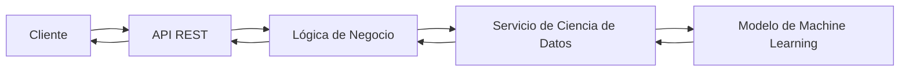

# 🚀 Backend – TechMind

> Componente responsable de exponer la API, gestionar las solicitudes de los usuarios e integrar el modelo de Ciencia de Datos.

---

# Objetivo

El componente Backend actúa como punto de entrada de la plataforma TechMind. Su responsabilidad es recibir las solicitudes de los usuarios, coordinar la lógica de negocio y comunicarse con el componente de Ciencia de Datos para obtener las predicciones del modelo de Machine Learning.

---

# Responsabilidades

- Exponer la API REST.
- Validar las solicitudes de los clientes.
- Gestionar la lógica de negocio.
- Integrar el componente de Ciencia de Datos.
- Gestionar errores y respuestas HTTP.
- Documentar la API mediante OpenAPI/Swagger.

---

# Arquitectura



El Backend desacopla la interacción de los clientes de la lógica de predicción, actuando como intermediario entre la API y el componente de Ciencia de Datos.

---

# Estructura del Componente

```text
backend/
│
├── api/
├── core/
├── services/
├── models/
├── schemas/
├── utils/
└── tests/
```

> La estructura podrá evolucionar conforme avance el desarrollo del proyecto.

---

# Tecnologías

- Python
- FastAPI
- Pydantic
- Uvicorn

---

# Estado Actual

| Funcionalidad | Estado |
|---------------|:------:|
| Arquitectura | ✅ |
| Diseño Técnico | ✅ |
| API REST | 🚧 |
| Integración con Data Science | ⏳ |
| Persistencia | ⏳ |
| Testing | 🚧 |
| Documentación | ✅ |

---

# Testing

Las pruebas del componente Backend se incorporarán progresivamente durante el desarrollo de cada sprint.

---

# Roadmap

- ✅ Diseño de la arquitectura.
- 🚧 Implementación de la API REST.
- ⏳ Integración con el componente de Ciencia de Datos.
- ⏳ Manejo de errores y validaciones.
- ⏳ Pruebas automatizadas.
- ⏳ Despliegue.

---

# Documentación Relacionada

- `README.md`
- `docs/Architecture/`
- `docs/SDS/`
- `docs/ADR/`
- `src/data_science/README.md`