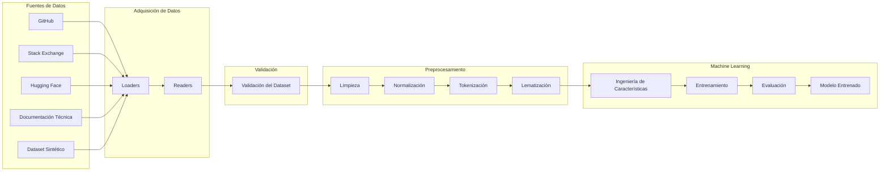

# 🧠 Componente Data Science

> Componente responsable de la adquisición, validación, preparación y procesamiento de datos para el entrenamiento, evaluación e inferencia de modelos de Machine Learning del proyecto **TechMind**.

---

# Objetivo

El componente **Data Science** tiene como objetivo desarrollar el ciclo completo de procesamiento de datos requerido para la clasificación automática de documentación técnica.

Su responsabilidad abarca desde la adquisición de información proveniente de múltiples fuentes hasta la generación de modelos de Machine Learning capaces de clasificar documentos técnicos de manera precisa y consistente.

El componente ha sido diseñado siguiendo una **arquitectura modular**, permitiendo la incorporación de nuevas fuentes de datos, técnicas de procesamiento, algoritmos de aprendizaje y modelos de clasificación sin afectar el resto del sistema.

Actualmente forma parte del proyecto **TechMind – Organización Inteligente del Conocimiento Técnico**, integrándose con el componente **Backend** mediante una interfaz estable para la realización de predicciones.

---

# Estado del Componente

| Área | Estado | Observaciones |
|------|:------:|---------------|
| Arquitectura | ✅ | Definida y validada |
| Adquisición de Datos | ✅ | Readers y Loaders implementados |
| Dataset Maestro | ✅ | Construido e integrado |
| Validación del Dataset | ✅ | Pipeline de validación implementado |
| Preprocesamiento | ✅ | Pipeline completo implementado |
| Testing | ✅ | 109 pruebas automatizadas aprobadas |
| Entrenamiento del Modelo | 🚧 | Próxima etapa |
| Evaluación del Modelo | ⏳ | Pendiente |
| Persistencia del Modelo | ⏳ | Pendiente |
| Integración con Backend | 🚧 | En preparación |

---

# Responsabilidades

El componente Data Science es responsable de:

- Adquirir información desde múltiples fuentes de datos.
- Construir y mantener el Dataset Maestro del proyecto.
- Validar la calidad e integridad de los datos.
- Ejecutar el pipeline de preprocesamiento documental.
- Preparar los datos para el entrenamiento del modelo.
- Entrenar y evaluar modelos de Machine Learning.
- Generar predicciones de clasificación documental.
- Integrarse con el componente Backend mediante una interfaz estable.

El componente **no expone una API propia**. Su integración con el sistema se realiza como una **biblioteca Python**, consumida directamente por el Backend.

---

# Arquitectura General

El componente **Data Science** está diseñado siguiendo una arquitectura modular basada en responsabilidades específicas, facilitando la mantenibilidad, escalabilidad y reutilización de sus componentes.

Su principal responsabilidad es transformar información proveniente de múltiples fuentes en un conjunto de datos preparado para el entrenamiento de modelos de Machine Learning y posteriormente realizar inferencias para el componente Backend.



## Principios de la Arquitectura

La arquitectura del componente se basa en los siguientes principios:

- **Arquitectura Modular:** cada módulo implementa una responsabilidad claramente definida.
- **Separación de Responsabilidades (SRP):** Readers, Loaders, Validación, Preprocesamiento y Machine Learning evolucionan de forma independiente.
- **Extensibilidad:** es posible incorporar nuevas fuentes de información o nuevos algoritmos sin modificar el resto del pipeline.
- **Reutilización:** los componentes pueden reutilizarse durante las etapas de entrenamiento e inferencia.
- **Mantenibilidad:** la organización del código facilita la incorporación de nuevas funcionalidades y simplifica las tareas de mantenimiento.

## Integración con el Sistema

El componente **Data Science** no expone una API REST propia.

La comunicación con el sistema se realiza mediante una **biblioteca Python**, integrada directamente por el componente **Backend**, utilizando una interfaz estable para la ejecución de predicciones.

Esta decisión reduce la complejidad del MVP, disminuye la latencia de comunicación entre componentes y simplifica el proceso de despliegue del sistema.

---

# Estructura del Componente

El componente **Data Science** está organizado siguiendo una arquitectura modular, donde cada paquete implementa una responsabilidad específica dentro del pipeline de adquisición, validación y procesamiento de datos.

```text
src/
└── data_science/
    │
    ├── adapters/
    ├── data/
    ├── loaders/
    ├── models/
    ├── preprocessing/
    ├── readers/
    ├── services/
    ├── utils/
    ├── config.py
    ├── README.md
    └── __init__.py
```

La organización del componente favorece la reutilización de código, la mantenibilidad y la incorporación de nuevas funcionalidades sin afectar los módulos existentes.

---

# Descripción de los Módulos

## adapters/

Contiene adaptadores responsables de transformar estructuras internas del componente hacia otros formatos requeridos por diferentes etapas del pipeline.

Actualmente incluye adaptadores para la conversión hacia estructuras tipo **DataFrame**, facilitando el procesamiento y análisis de datos.

---

## data/

Implementa el núcleo del Dataset Maestro y los objetos de dominio utilizados durante el procesamiento.

Sus principales responsabilidades son:

- Construcción del Dataset Maestro.
- Definición de entidades del dominio.
- Integración de múltiples fuentes.
- Validación estructural.
- Definición del esquema de datos.

Principales componentes:

- `builder.py`
- `domain.py`
- `integrator.py`
- `schema.py`
- `validator.py`

---

## loaders/

Responsable de localizar y cargar información desde diferentes fuentes documentales.

Actualmente soporta fuentes como:

- GitHub
- Stack Exchange
- Hugging Face
- Documentación Técnica
- Dataset Sintético

La incorporación de una nueva fuente únicamente requiere implementar un nuevo Loader y registrarlo en el `LoaderFactory`.

---

## readers/

Responsable de interpretar el contenido de los archivos cargados por los Loaders.

Actualmente soporta los siguientes formatos:

- TXT
- CSV
- JSON
- PDF

Cada Reader implementa una interfaz común, permitiendo extender fácilmente el sistema hacia nuevos formatos documentales.

---

## preprocessing/

Implementa el pipeline de procesamiento lingüístico utilizado para preparar los documentos antes del entrenamiento del modelo.

Actualmente incorpora las siguientes etapas:

- Limpieza de texto.
- Normalización.
- Eliminación de palabras vacías (Stopwords).
- Tokenización.
- Lematización.
- Orquestación del pipeline de preprocesamiento.

Cada etapa se implementa como un componente independiente siguiendo el principio de responsabilidad única (SRP).

---

## models/

Reservado para la definición de modelos de Machine Learning, estructuras de entrenamiento y persistencia del modelo.

Este módulo evolucionará durante las siguientes etapas del proyecto.

---

## services/

Espacio destinado a la implementación de servicios de alto nivel que orquestarán la lógica de negocio del componente Data Science.

---

## utils/

Contiene utilidades compartidas utilizadas por diferentes módulos del componente.

Su objetivo es evitar duplicación de código y centralizar funcionalidades auxiliares.

---

## config.py

Centraliza la configuración utilizada por el componente.

Ejemplos:

- Parámetros del pipeline.
- Configuración de procesamiento.
- Rutas del proyecto.
- Variables de configuración.

---

# Principios de Organización

La estructura del componente fue diseñada siguiendo los siguientes principios:

- **Responsabilidad Única (SRP):** cada módulo implementa una función claramente definida.
- **Bajo Acoplamiento:** los componentes interactúan mediante interfaces bien definidas.
- **Alta Cohesión:** funcionalidades relacionadas permanecen agrupadas.
- **Extensibilidad:** nuevas fuentes, formatos o algoritmos pueden incorporarse con cambios mínimos.
- **Reutilización:** los módulos pueden utilizarse tanto durante el entrenamiento como durante la inferencia.

---

# Pipeline de Procesamiento de Datos

El componente **Data Science** implementa un pipeline secuencial para transformar documentos técnicos provenientes de múltiples fuentes en datos preparados para el entrenamiento y la inferencia de modelos de Machine Learning.

Cada etapa del pipeline tiene una responsabilidad específica y produce una salida que sirve como entrada para la siguiente etapa.


---

# Flujo del Pipeline

## 1. Adquisición de Datos

El proceso inicia con la recopilación de documentos provenientes de diversas fuentes de información.

Actualmente el componente puede trabajar con información obtenida desde:

- GitHub
- Stack Exchange
- Hugging Face
- Documentación técnica
- Datasets sintéticos

Los **Loaders** son responsables de localizar y recuperar los archivos desde cada origen.

---

## 2. Lectura de Documentos

Una vez recuperados los archivos, los **Readers** interpretan su contenido según el formato correspondiente.

Actualmente se soportan los siguientes formatos:

- TXT
- CSV
- JSON
- PDF

Cada Reader convierte el contenido en una representación uniforme para el resto del pipeline.

---

## 3. Construcción del Dataset Maestro

Los documentos procesados se integran en un único conjunto de datos denominado **Dataset Maestro**.

Durante esta etapa se realiza:

- Integración de múltiples fuentes.
- Unificación del esquema de datos.
- Construcción de objetos de dominio.
- Organización de la información documental.

El resultado es un dataset estructurado y consistente para su posterior validación.

---

## 4. Validación del Dataset

Antes de continuar con el procesamiento lingüístico, el Dataset Maestro es sometido a un proceso de validación.

Esta etapa verifica aspectos como:

- Presencia de columnas obligatorias.
- Tipos de datos.
- Registros incompletos.
- Calidad de la información.
- Consistencia estructural.

Solo los registros válidos continúan dentro del pipeline.

---

## 5. Preprocesamiento de Texto

El objetivo de esta etapa es transformar el texto original en una representación limpia y uniforme para el modelo de Machine Learning.

Actualmente el pipeline incluye:

### Limpieza

- Eliminación de caracteres innecesarios.
- Eliminación de espacios redundantes.
- Corrección básica del contenido textual.

### Normalización

- Conversión a minúsculas.
- Homogeneización del formato del texto.

### Eliminación de Stopwords

Se eliminan palabras frecuentes que aportan poco valor al proceso de clasificación.

Ejemplos:

- el
- la
- de
- para
- con

### Tokenización

El texto se divide en unidades léxicas (tokens), permitiendo su procesamiento posterior.

### Lematización

Cada palabra se transforma a su forma base o lema.

Por ejemplo:

| Texto Original | Lema |
|----------------|------|
| running | run |
| tests | test |
| documents | document |

El resultado de esta etapa es un conjunto de documentos preparados para el entrenamiento del modelo.

---

## 6. Ingeniería de Características

En las siguientes etapas del proyecto, el texto preprocesado será transformado en representaciones numéricas mediante técnicas de extracción de características.

Estas representaciones servirán como entrada para los algoritmos de Machine Learning.

---

## 7. Entrenamiento del Modelo

Con los datos preparados se entrenarán diferentes algoritmos de clasificación documental.

Durante esta etapa se realizarán actividades como:

- Entrenamiento.
- Ajuste de hiperparámetros.
- Comparación de modelos.
- Selección del mejor modelo.

---

## 8. Evaluación

El modelo entrenado será evaluado utilizando métricas objetivas para medir su desempeño.

Entre las métricas consideradas se encuentran:

- Accuracy
- Precision
- Recall
- F1-Score
- Matriz de Confusión

---

## 9. Generación del Modelo

Finalmente se obtendrá un modelo entrenado listo para ser utilizado por el componente Backend durante la etapa de inferencia.

---

# Pruebas y Aseguramiento de Calidad

La calidad del componente **Data Science** se garantiza mediante un conjunto de pruebas automatizadas que validan el correcto funcionamiento de los módulos principales del pipeline.

Las pruebas se ejecutan utilizando **Pytest**, permitiendo verificar el comportamiento esperado de cada componente de manera aislada e integrada.

---

# Cobertura Funcional

Actualmente se cuenta con pruebas automatizadas para los siguientes módulos:

| Módulo | Estado |
|---------|:------:|
| Readers | ✅ |
| Loaders | ✅ |
| Pipeline de Preprocesamiento | ✅ |
| Limpieza de Texto | ✅ |
| Normalización | ✅ |
| Eliminación de Stopwords | ✅ |
| Tokenización | ✅ |
| Lematización | ✅ |

---

# Organización de las Pruebas

La estructura de pruebas sigue la organización del componente principal.

```text
tests/
└── data_science/
    ├── fixtures/
    ├── preprocessing/
    ├── test_loaders/
    └── test_readers/
```

Las pruebas incluyen tanto casos unitarios como validaciones funcionales para garantizar el correcto comportamiento del pipeline.

---

# Validación del Dataset

Además de las pruebas automatizadas, el componente incorpora herramientas específicas para validar la calidad del Dataset Maestro antes de su utilización.

Entre las verificaciones realizadas se encuentran:

- Validación de columnas obligatorias.
- Validación de tipos de datos.
- Verificación de registros incompletos.
- Integridad estructural del dataset.
- Generación de reportes de calidad.

Estas validaciones reducen la probabilidad de introducir datos inconsistentes durante las etapas de entrenamiento.

---

# Scripts de Validación

El proyecto incluye scripts auxiliares para ejecutar procesos de validación de manera independiente.

Entre ellos destacan:

- `validar_dataset_pipeline.py`
- `dataset_validator.py`
- `preprocessing_validator.py`
- `validation_runner.py`
- `quality_report.py`
- `benchmark.py`

Estos scripts permiten ejecutar verificaciones específicas sin necesidad de iniciar el pipeline completo.

---

# Estado Actual

El componente mantiene una base sólida de pruebas automatizadas que respaldan las funcionalidades implementadas hasta la fecha.

**Estado actual:**

- ✅ 109 pruebas automatizadas aprobadas.
- ✅ 0 pruebas fallidas.
- ✅ Pipeline de preprocesamiento validado.
- ✅ Readers y Loaders verificados mediante pruebas unitarias.
- ✅ Validación del Dataset Maestro implementada.

Este proceso de aseguramiento de calidad permite continuar con las siguientes etapas del proyecto sobre una base estable y confiable.

---

# Roadmap del Componente

El desarrollo del componente **Data Science** sigue un roadmap incremental, donde cada Sprint incorpora nuevas capacidades hasta completar el ciclo de vida del modelo de Machine Learning.

| Sprint | Descripción | Estado |
|---------|-------------|:------:|
| DS-01 | Arquitectura del Componente | ✅ |
| DS-02 | Investigación y Adquisición del Dataset | ✅ |
| DS-03 | Construcción del Dataset Maestro | ✅ |
| DS-04 | Preprocesamiento del Dataset | ✅ |
| DS-05 | Análisis Exploratorio de Datos (EDA) | 🚧 |
| DS-06 | Ingeniería de Características | ⏳ |
| DS-07 | Entrenamiento del Modelo | ⏳ |
| DS-08 | Evaluación del Modelo | ⏳ |
| DS-09 | Persistencia del Modelo | ⏳ |
| DS-10 | Motor de Inferencia | ⏳ |
| DS-11 | Integración con Backend | ⏳ |
| DS-12 | Pruebas del Componente | ⏳ |
| DS-13 | Hardening | ⏳ |
| DS-14 | Cierre del Componente | ⏳ |

---

# Primeros Pasos

## Clonar el repositorio

```bash
git clone <url-del-repositorio>
cd techmind
```

## Crear el entorno virtual

### Windows

```powershell
python -m venv .venv
.\.venv\Scripts\activate
```

### Linux / macOS

```bash
python3 -m venv .venv
source .venv/bin/activate
```

## Instalar dependencias

```bash
pip install -r requirements.txt
```

---

# Ejecutar las pruebas

Para ejecutar todas las pruebas automatizadas:

```bash
pytest
```

Para generar un reporte detallado:

```bash
pytest -v
```

---

# Estructura del Proyecto

```text
techmind/
├── datasets/
├── docs/
├── scripts/
├── src/
│   ├── backend/
│   └── data_science/
├── tests/
├── requirements.txt
└── README.md
```

---

# Documentación Relacionada

La documentación técnica del proyecto se encuentra organizada en el directorio `docs/`.

Entre los documentos principales se encuentran:

## Arquitectura

- System Architecture
- Data Science Pipeline
- Backend Data Contract
- Backend Data Model
- Repository Structure

## Arquitectura de Decisiones (ADR)

- ADR-001 – Arquitectura Backend – Ciencia de Datos
- ADR-002 – Machine Learning Clásico para el MVP
- ADR-003 – Integración mediante llamadas directas a funciones
- ADR-004 – Oracle Cloud Infrastructure
- ADR-005 – Exclusión de IA Generativa

## Ingeniería

- Software Design Specification (SDS)
- Engineering Standards
- Technical Roadmap
- Git Development Workflow

## Sprints

La evolución completa del componente puede consultarse en:

```text
docs/
└── sprints/
    └── data-science/
```

---

# Contribución

Antes de realizar cambios en el componente se recomienda:

- Revisar los estándares de ingeniería.
- Seguir el flujo de trabajo definido para Git.
- Ejecutar todas las pruebas antes de realizar un Pull Request.
- Mantener la documentación actualizada cuando se incorporen nuevas funcionalidades.

---

# Estado del Proyecto

Actualmente el componente **Data Science** cuenta con una arquitectura estable y un pipeline funcional para la adquisición, validación y preprocesamiento de datos.

Las siguientes etapas estarán enfocadas en el entrenamiento, evaluación e integración del modelo de Machine Learning con el componente Backend.

El desarrollo continúa siguiendo una estrategia incremental, priorizando la calidad del código, la automatización de pruebas y la mantenibilidad del sistema.

---
