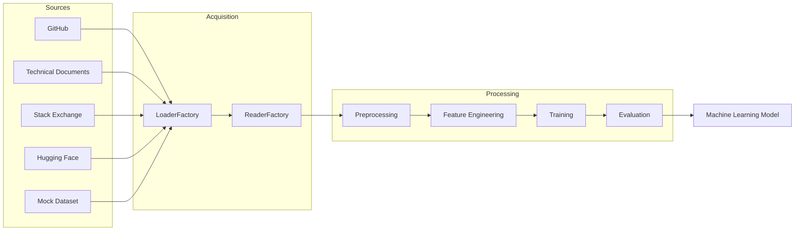
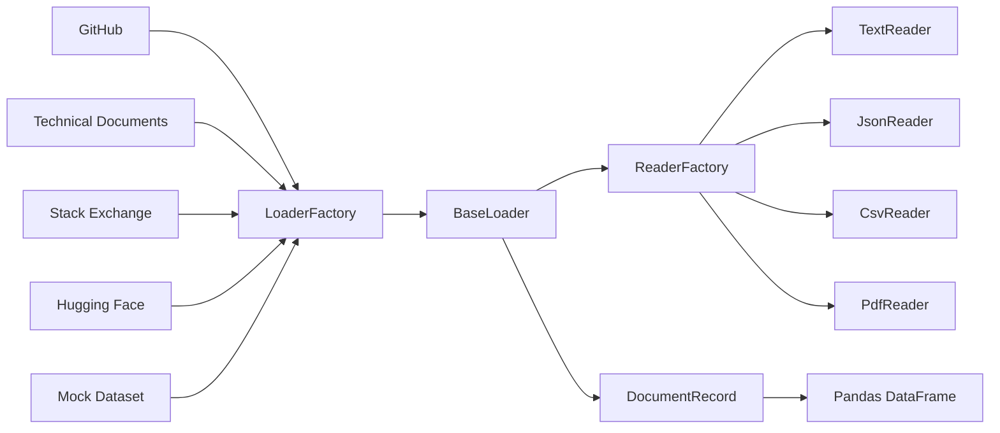

# 🧠 Componente Data Science

> Componente responsable de la adquisición, preparación y procesamiento de datos para el entrenamiento y evaluación de modelos de Machine Learning del proyecto **TechMind**.

---

# Objetivo

El componente de Ciencia de Datos tiene como finalidad construir un pipeline completo para la generación de datasets, entrenamiento de modelos y generación de predicciones.

Su diseño sigue una arquitectura modular que permite incorporar nuevas fuentes de información, algoritmos de procesamiento y modelos de Machine Learning sin afectar el resto del sistema.

Actualmente este componente forma parte del proyecto **TechMind – Organización Inteligente del Conocimiento Técnico**.

# 🧠 Componente Data Science

> Componente responsable de la adquisición, preparación y procesamiento de datos para el entrenamiento y evaluación de modelos de Machine Learning del proyecto **TechMind**.

---

# Objetivo

El componente de Ciencia de Datos tiene como finalidad construir un pipeline completo para la generación de datasets, entrenamiento de modelos y generación de predicciones.

Su diseño sigue una arquitectura modular que permite incorporar nuevas fuentes de información, algoritmos de procesamiento y modelos de Machine Learning sin afectar el resto del sistema.

Actualmente este componente forma parte del proyecto **TechMind – Organización Inteligente del Conocimiento Técnico**.

# Arquitectura General



# Estado del Desarrollo

| Sprint | Estado |
|---------|:------:|
| DS-01 – Arquitectura | ✅ |
| DS-02 – Readers | ✅ |
| DS-03 – Construcción del Dataset | ✅ |
| DS-04 – Preprocesamiento | ⏳ |
| DS-05 – Entrenamiento | ⏳ |
| DS-06 – Evaluación | ⏳ |
| DS-07 – Integración con Backend | ⏳ |

# Estructura

```text
data_science/
│
├── data/
├── loaders/
├── readers/
├── services/
├── models/
├── utils/
├── config.py
└── README.md
```

Cada módulo implementa una responsabilidad específica siguiendo el principio de responsabilidad única (SRP).

# Módulo de Adquisición de Datos

La construcción del dataset se realiza mediante una arquitectura basada en Readers y Loaders.



# Testing

Ejecutar todas las pruebas:

```bash
python -m pytest
```

Generar reporte de cobertura:

```bash
python -m pytest --cov=src --cov-report=term-missing
```

## Estado actual

- ✅ 61 pruebas automatizadas.
- ✅ Cobertura del componente: **98%**.

# Próximos Pasos

El siguiente objetivo del componente es implementar el pipeline de preprocesamiento de datos, que incluirá:

- Limpieza de texto.
- Normalización.
- Eliminación de stopwords.
- Tokenización.
- Lematización.
- Construcción de características para entrenamiento.

# Documentación Relacionada

La documentación completa del proyecto se encuentra en el directorio `docs/`.

- Architecture
- Software Design Specification (SDS)
- Architecture Decision Records (ADR)
- Engineering Standards
- Technical Roadmap

Para una visión general del proyecto consultar el `README.md` ubicado en la raíz del repositorio.